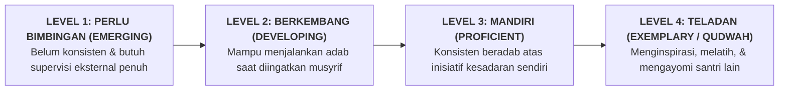

# SUB-BAB 3.1: STRUKTUR & LOGIKA 4 TINGKAT KEMAHIRAN RUBRIK (*LEVEL 1 S/D LEVEL 4*)

---

## 1. Menghindari Angka Kering: Membangun Rubrik Deskriptif Kualitatif

Memberi nilai angka kuantitatif pada adab santri (seperti *"Nilai Akhlak: 85"* atau *"Nilai Kedisiplinan: 70"*) adalah praktik yang tidak memberikan panduan operasional bagi santri untuk memperbaiki diri. Santri tidak tahu apa makna spesifik dari angka 85 dan apa yang harus dilakukannya agar nilainya naik menjadi 90.

Ekosistem TUMBUH merancang **Master Rubrik Perilaku Deskriptif 4 Tingkat Kemahiran (*4-Level Developmental Rubric*)**: [^1]

---

## 2. Prinsip Penyusunan Deskriptor: Berbasis Perilaku Teramati (*Observable Behaviors*)

Agar terbebas dari prasangka subjektif penilai (*Rater Bias*), setiap deskriptor dalam rubrik TUMBUH mematuhi **Tiga Syarat Baku**:
1. **Dapat Dilihat & Didengar (*Observable & Audible*)**: Menggunakan kata kerja konkret (misal: *"merapikan sprei kasur"*, *"mengetuk pintu sebelum masuk"*), bukan kata sifat yang kabur (misal: *"bersikap baik"*).
2. **Berorientasi Pertumbuhan Positif (*Strength-Based Language*)**: Mendeskripsikan apa yang harus dilakukan santri, bukan semata-mata mencantumkan daftar larangan.
3. **Kontekstual 24 Jam**: Mencakup situasi nyata di kelas pagi, serambi masjid, kamar mandi, lapangan olahraga, hingga kamar tidur malam.

---

### 📚 Catatan Kaki & Referensi Akademik:

[^1]: Stevens, D. D., & Levi, A. J. (2013). *Introduction to Rubrics: An Assessment Tool to Save Grading Time, Convey Effective Feedback, and Promote Student Learning* (2nd ed.). Sterling, VA: Stylus Publishing, hlm. 15–42.
[^2]: Brookhart, S. M. (2018). *How to Create and Use Rubrics for Formative Assessment and Grading*. Alexandria, VA: ASCD, hlm. 60–85.
