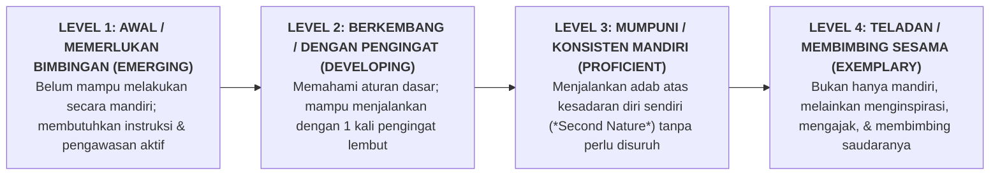

# SUB-BAB 3.1: STRUKTUR & LOGIKA 4 TINGKAT KEMAHIRAN RUBRIK PBIS

---

## 1. Menolak Angka Subjektif: Dari Skor Samar Menuju Deskriptor Nyata

Dalam evaluasi adab santri di madrasah konvensional, nilai rapor sering kali berupa skor angka tunggal yang sangat subjektif dan ambigu (misal: "Nilai Akhlak: 82"). Angka ini tidak memberikan petunjuk apa pun bagi orang tua maupun santri: *Mengapa bukan 85? Apa yang kurang dari perilaku anak? Dan apa persisnya yang harus diperbaiki?* [^1]

Ekosistem TUMBUH merombak angka samar ini dengan merumuskan **Master Rubrik Perilaku PBIS Berbasis 4 Tingkat Kemahiran (*Four-Tier Developmental Rubrics*)**:



---

## 2. Struktur Anatomi Setiap Master Rubrik Ekosistem TUMBUH

Setiap indikator karakter dalam 10 Muwashafat didekomposisi ke dalam 4 kolom deskriptor perilaku yang operasional, teramati (*observable*), dan terukur (*measurable*): [^2]

```
               STRUKTUR 4 KOLOM MASTER RUBRIK PERILAKU TUMBUH
  
  ┌─────────────────┬─────────────────┬─────────────────┬─────────────────┐
  │ LEVEL 1 (AWAL)  │ LEVEL 2 (BERKBG)│ LEVEL 3 (MUMPUNI│ LEVEL 4 (TELADAN│
  ├─────────────────┼─────────────────┼─────────────────┼─────────────────┤
  │ Masih terlambat │ Bangun tepat    │ Bangun mandiri  │ Bangun awal,    │
  │ bangun fajar;   │ waktu setelah   │ sebelum adzan;  │ qiyamul lail,   │
  │ butuh dibangun- │ dibangunkan     │ langsung wudhu  │ & membantu      │
  │ kan berulang    │ 1 kali secara   │ & ke masjid     │ membangunkan    │
  │ kali oleh staf. │ ramah.          │ mandiri.        │ kawan sekamar.  │
  └─────────────────┴─────────────────┴─────────────────┴─────────────────┘
```

Dengan struktur deskriptor yang objektif ini:
* Tidak ada lagi bias suka/tidak suka (*Halo Effect*) dari pihak penilai.
* Santri mengetahui dengan sangat jernih di level mana posisinya saat ini dan apa langkah konkret yang harus dilatihnya untuk naik ke level berikutnya.

---

### 📚 Catatan Kaki & Referensi Akademik:

[^1]: Brookhart, S. M. (2018). *How to Create and Use Rubrics for Formative Assessment and Grading*. Alexandria, VA: ASCD, hlm. 12–45.
[^2]: Popham, W. J. (1997). What's wrong—and what's right—with rubrics. *Educational Leadership*, 55(2), 72–75.
[^3]: Sugai, G., & Horner, R. H. (2006). A promising approach for expanding and sustaining school-wide positive behavior support. *School Psychology Review*, 35(2), 245–259.
