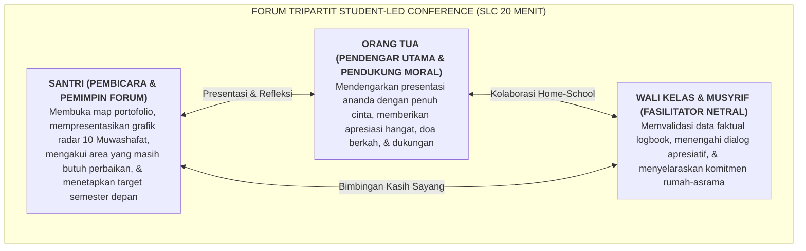

# SUB-BAB 4.1: STUDENT-LED CONFERENCE (SLC): FORUM TRIPARTIT SANTRI MEMPRESENTASIKAN PERKEMBANGAN DIRI

---

## 1. Merombak Pembagian Rapor Tradisional yang Pasif & Menakutkan

Dalam tradisi pembagian rapor di sekolah konvensional, santri sering kali ditempatkan dalam posisi objek pasif yang cemas dan tertekan: orang tua datang ke madrasah, duduk berhadapan dengan wali kelas untuk mendengarkan "daftar keluhan dan dosa-dosa santri", sementara sang santri menunggu di luar ruangan dengan penuh ketakutan. [^1]

Model pembagian rapor konvensional ini secara psikologis merusak rasa kepemilikan belajar (*Learner Agency*) dan sering memicu pertengkaran antara orang tua dan anak di rumah.

Ekosistem TUMBUH merombak total praktik ini melalui **Student-Led Conference (SLC / Konferensi Perkembangan yang Dipimpin Santri)**: sebuah forum tripartit di mana **sang santri sendiri yang bertindak sebagai pembicara utama (*Key Presenter*)** untuk mempresentasikan portofolio kemajuan adab, hafalan Al-Qur'an, dan karya akademiknya di hadapan orang tua dan guru pendamping.



---

## 2. Struktur 20 Menit Alur Pertemuan Student-Led Conference (SLC)

Sesi pertemuan SLC berlangsung selama 20 hingga 25 menit per keluarga di ruang kelas madrasah yang ditata hangat: [^2]

```
               RUNDOWN 20 MENIT SESI STUDENT-LED CONFERENCE (SLC)
  
  ┌─────────────────┬────────────────────────────────────────────────────────┐
  │ WAKTU           │ AKTIVITAS OPERASIONAL & PERAN PEMBICARA                │
  ├─────────────────┼────────────────────────────────────────────────────────┤
  │ Menit 01 - 03   │ **Penyambutan Santun & Pembukaan Doa**:                │
  │ (Pembukaan)     │ Santri menyambut ayah-ibu di pintu, mencium tangan     │
  │                 │ takzhim, mempersilakan duduk, & memimpin doa pembuka.  │
  ├─────────────────┼────────────────────────────────────────────────────────┤
  │ Menit 03 - 12   │ **Presentasi Portofolio Bukti Karakter (Oleh Santri)**:│
  │ (Inti Laporan)  │ Santri membuka map portofolionya dan mempresentasikan: │
  │                 │ • Kemajuan grafik radar 10 Muwashafat semester ini.    │
  │                 │ • Bukti foto kerapian kamar 5S (*Hospital Corner*).    │
  │                 │ • Capaian hafalan Al-Qur'an & kitab yang paling        │
  │                 │   membanggakan baginya.                                │
  │                 │ • Area tantangan yang masih ia hadapi (misal: "Saya    │
  │                 │   masih kadang mengantuk saat mudzakarah malam").      │
  │                 │ • Rencana konkret perbaikan dirinya untuk semester     │
  │                 │   depan (*My Growth Plan*).                            │
  ├─────────────────┼────────────────────────────────────────────────────────┤
  │ Menit 12 - 18   │ **Umpan Balik Kasih Sayang Orang Tua & Validasi Guru**:│
  │ (Apresiasi)     │ Orang tua menyampaikan rasa bangga atas kejujuran dan  │
  │                 │ perjuangan ananda; Wali Kelas/Musyrif memvalidasi      │
  │                 │ pertumbuhan adab santri di asrama 24 jam.              │
  ├─────────────────┼────────────────────────────────────────────────────────┤
  │ Menit 18 - 20   │ **Penandatanganan Komitmen & Doa Keberkahan**:         │
  │ (Penutup)       │ Santri, orang tua, & guru menandatangani Lembar        │
  │                 │ Komitmen Tripartit; ditutup dengan pelukan hangat.     │
  └─────────────────┴────────────────────────────────────────────────────────┘
```

---

## 3. Manfaat Pedagogis & Psikologis Metode SLC

1. **Menumbuhkan Akuntabilitas Diri (*Radical Self-Accountability*)**: Santri tidak lagi mencari kambing hitam atas kekurangannya; ia belajar mengakui kelemahan dan merumuskan solusinya sendiri secara ksatria.
2. **Melatih Keterampilan Komunikasi Publik (*Public Speaking & Oratory*)**: Santri terlatih berbicara sistematis, percaya diri, dan santun di hadapan orang dewasa.
3. **Mempererat Kelekatan Batin Keluarga (*Emotional Bonding*)**: Orang tua melihat langsung kedewasaan cara berpikir anaknya, melahirkan rasa syukur yang mendalam atas keberkahan mondok di pesantren.

---

### 📚 Catatan Kaki & Referensi Akademik:

[^1]: Borba, J. A., & Olvera, C. M. (2001). Student-led conferences: A growing trend in reporting student progress. *Clearing House*, 74(6), 333–336.
[^2]: Countryman, L. L., & Schroeder, M. (1996). When students lead parent-teacher conferences. *Educational Leadership*, 53(7), 64–68.
[^3]: Guskey, T. R. (2014). *On Your Mark: Challenging the Conventions of Grading and Reporting*. Bloomington, IN: Solution Tree Press.
