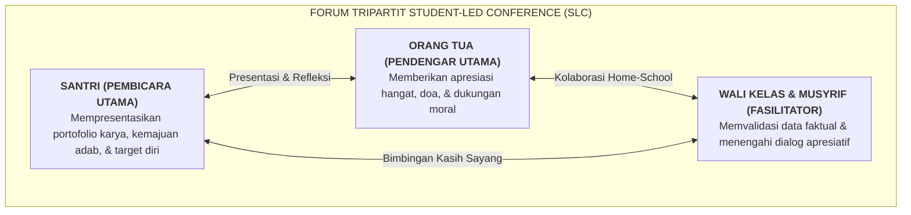

# SUB-BAB 4.1: STUDENT-LED CONFERENCE (SLC): SANTRI MEMPRESENTASIKAN PORTOFOLIONYA

---

## 1. Merombak Pembagian Rapor Tradisional

Dalam pembagian rapor konvensional, santri sering kali ditempatkan dalam posisi pasif dan cemas: orang tua datang ke madrasah, duduk berhadapan dengan wali kelas untuk mendengarkan "daftar keluhan dan dosa-dosa santri", sementara sang santri menunggu di luar ruangan dengan penuh ketakutan.

Ekosistem TUMBUH merombak total praktik ini melalui **Student-Led Conference (SLC / Konferensi yang Dipimpin Santri)**: [^1]

---

## 2. Struktur 20 Menit Sesi Student-Led Conference (SLC)

Sesi pertemuan SLC berlangsung selama 20–25 menit per keluarga dengan alur yang terstruktur:
1. **Menit 01–05 (Pembukaan & Sambutan Santri)**: Santri menyambut orang tuanya dengan santun, mencium tangan, dan memimpin doa pembuka.
2. **Menit 05–15 (Presentasi Portofolio Adab)**: Santri membuka map portofolionya dan mempresentasikan:
   * *Kemajuan adab 10 Muwashafat yang paling ia banggakan semester ini (disertai foto kamar 5S dan catatan apresiasi logbook).*
   * *Capaian hafalan Al-Qur'an dan kitab kuning.*
   * *Tantangan adab yang masih ia hadapi (misal: "Saya masih kadang menunda mencuci baju di akhir pekan") dan apa rencana konkret perbaikannya.*
3. **Menit 15–20 (Tanggapan Hangat Orang Tua & Fasilitasi Musyrif)**: Orang tua menyampaikan rasa bangga dan nasihat kasih sayang; musyrif memvalidasi perkembangan kemandirian santri di asrama.

Metode SLC melatih **akuntabilitas diri, keberanian berbicara di depan publik, dan kejujuran reflektif (*Muhasabah*)** pada diri santri sejak usia dini.

---

### 📚 Catatan Kaki & Referensi Akademik:

[^1]: Borba, J. A., & Olvera, C. M. (2001). Student-led conferences: A growing trend in reporting student progress. *Clearing House: A Journal of Educational Strategies, Issues and Ideas*, 74(6), 333–336.
[^2]: Countryman, L. L., & Schroeder, M. (1996). When students lead parent-teacher conferences. *Educational Leadership*, 53(7), 64–68.
