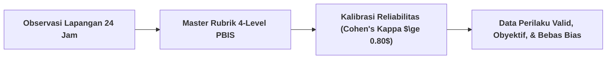
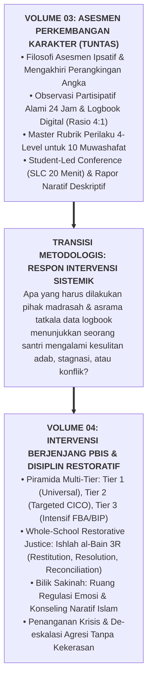

# SUB-BAB 4.3: VALIDASI PSIKOMETRIK, RELIABILITAS ANTAR-PENILAI, & JEMBATAN KE VOLUME 04

---

## 1. Menjamin Kredibilitas Ilmiah: Uji Reliabilitas Antar-Penilai (*Inter-Rater Reliability*)

Untuk memastikan bahwa Master Rubrik PBIS dan catatan logbook tidak terdistorsi oleh preferensi subjektif atau bias penilai (*Halo Effect, Horn Effect, atau Leniency Bias*), Ekosistem TUMBUH mewajibkan pelaksanaan **Proses Kalibrasi & Moderasi Penilai Berkala (*Rater Calibration & Moderation Sessions*)**. [^1]

Setiap awal semester, seluruh musyrif asrama, wali kelas, dan guru madrasah mengikuti sesi penyelarasan standar:
* **Uji Kesepakatan Penilai (Cohen's Kappa Coefficient)**: Pendidik mengamati video rekaman simulasi kasus perilaku santri yang sama dan memberikan skoring rubrik secara independen.
* Ambang batas kesepakatan antar-penilai harus mencapai skor minimal **$\kappa \ge 0.80$ (Kategori *Strong Agreement / Sangat Terkalibrasi*)**. [^2]
* Jika terjadi perbedaan interpretasi terhadap level deskriptor perilaku, diselenggarakan diskusi musyawarah ilmiah untuk menyamakan persepsi pemahaman.

---

## 2. Jembatan Konseptual & Metodologis Menuju Intervensi PBIS (Volume 04)

Dengan rampungnya perumusan instrumen asesmen dan bukti otentik dalam **Buku Panduan Volume 03**, pesantren kini telah memiliki instrumen diagnostik yang sangat tajam dan objektif:

Pertanyaan kritis yang harus dijawab berikutnya adalah:
* *Bagaimana merancang sistem intervensi berjenjang (Tier 1, Tier 2, Tier 3) agar tidak ada satu pun santri yang dibuang atau dikeluarkan secara gegabah?*
* *Bagaimana prosedur mediasi restoratif (Ishlah 3R) untuk menyelesaikan perselisihan santri tanpa meninggalkan dendam lanjutan?*
* *Bagaimana operasional Bilik Sakinah sebagai ruang de-eskalasi emosi yang aman?*

Seluruh panduan teknis intervensi ini dijabarkan secara rinci, mendalam, dan terstruktur dalam buku panduan berikutnya: **[Volume 04: Intervensi Berjenjang PBIS & Disiplin Restoratif](file:///c:/xampp/htdocs/tumbuh/BOOK%20Series%202/Volume-04-Intervensi-PBIS-dan-Disiplin-Restoratif)**.

---

### 📚 Catatan Kaki & Referensi Akademik:

[^1]: Cohen, J. (1960). A coefficient of agreement for nominal scales. *Educational and Psychological Measurement*, 20(1), 37–46.
[^2]: McHugh, M. L. (2012). Interrater reliability: The kappa statistic. *Biochemia Medica*, 22(3), 276–282.
[^3]: Sugai, G., & Horner, R. H. (2006). A promising approach for expanding and sustaining school-wide positive behavior support. *School Psychology Review*, 35(2), 245–259.
