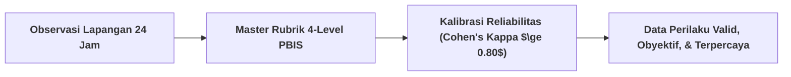
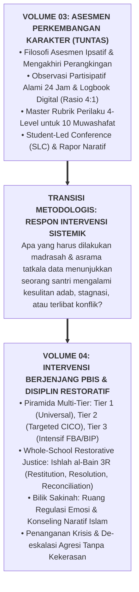

# SUB-BAB 4.3: VALIDASI PSIKOMETRIK, RELIABILITAS ANTAR-PENILAI, & JEMBATAN KE VOLUME 04

---

## 1. Menjamin Kredibilitas Ilmiah: Uji Reliabilitas Antar-Penilai (*Inter-Rater Reliability*)

Untuk memastikan bahwa Master Rubrik PBIS dan catatan logbook tidak terdistorsi oleh preferensi pribadi atau bias subjektif (*Halo Effect* atau *Leniency Bias*), Ekosistem TUMBUH mewajibkan **Proses Kalibrasi Penilai Berkala (*Rater Calibration & Moderation*)**. [^1]

Setiap semester, seluruh musyrif dan wali kelas mengikuti sesi standarisasi penilaian dengan mengamati rekaman simulasi kasus santri yang sama:
* **Uji Kesepakatan Penilai (Cohen's Kappa Coefficient)**: Skor kesepakatan antar-penilai harus mencapai ambang batas $\kappa \ge 0.80$ (kategori *Strong Agreement*).
* **Diskusi Penyelarasan Persepsi**: Jika terjadi perbedaan penilaian antara dua musyrif terhadap level adab santri, dilakukan diskusi musyawarah untuk menyamakan standar pemahaman deskriptor.

---

## 2. Jembatan Konseptual Menuju Sistem Intervensi PBIS (Volume 04)

Dengan rampungnya perumusan instrumen asesmen dalam **Buku Panduan Volume 03**, pesantren telah memiliki mekanisme pengumpulan bukti perkembangan karakter yang kokoh dan ilmiah:

Pertanyaan kritis yang harus dijawab berikutnya adalah:
* *Bagaimana merancang sistem intervensi berjenjang (Tier 1, Tier 2, Tier 3) agar tidak ada satu pun santri yang tertinggal atau dikeluarkan secara gegabah?*
* *Bagaimana prosedur mediasi restoratif (Ishlah 3R) untuk menyelesaikan perselisihan santri tanpa menimbulkan dendam lanjutan?*
* *Bagaimana operasional Bilik Sakinah sebagai ruang de-eskalasi emosi yang aman?*

Seluruh panduan teknis intervensi ini dijabarkan secara rinci dan terstruktur dalam buku panduan berikutnya: **[Volume 04: Intervensi Berjenjang PBIS & Disiplin Restoratif](file:///c:/xampp/htdocs/tumbuh/BOOK%20Series%202/Volume-04-Intervensi-PBIS-dan-Disiplin-Restoratif)**.

---

### 📚 Catatan Kaki & Referensi Akademik:

[^1]: Cohen, J. (1960). A coefficient of agreement for nominal scales. *Educational and Psychological Measurement*, 20(1), 37–46.
[^2]: McHugh, M. L. (2012). Interrater reliability: The kappa statistic. *Biochemia Medica*, 22(3), 276–282.
