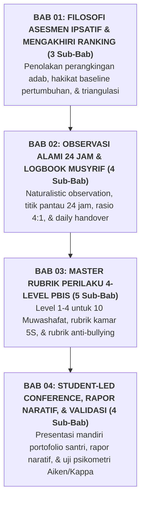

# BUKU PANDUAN VOLUME 03: SISTEM ASESMEN PERKEMBANGAN KARAKTER & EVALUASI BERBASIS BUKTI
## *Asesmen Ipsatif Non-Ranking, Observasi Alami 24 Jam, Portofolio Santri, dan Rapor Naratif*

---

**Nomor Panduan**: `BOOK-SERIES-2/VOL-03/2026`  
**Sasaran Pembaca**: Tim Asesmen Karakter, Guru Bimbingan Konseling (BK), Wali Kelas Madrasah, Musyrif Asrama, dan Pimpinan Pondok  
**Dewan Pakar Pengkaji**: Pakar Psikometri & Validasi Instrumen, Pakar Metodologi Riset TUMBUH, Pakar Pedagogi Master Guru, dan Pakar PBIS  

---

## 🧭 PETA STRUKTUR & DISTRIBUSI BAB VOLUME 03 (4 BAB ORGANIK)

---

## 📚 DAFTAR LENGKAP BAB DAN SUB-BAB VOLUME 03

### 🎯 [Bab 01: Filosofi Asesmen Ipsatif & Mengakhiri Ranking (3 Sub-Bab)](file:///c:/xampp/htdocs/tumbuh/BOOK%20Series%202/Volume-03-Sistem-Asesmen-Perkembangan-Karakter/Bab-01-Filosofi-Asesmen-Ipsatif)
* **Sub-Bab 1.1**: Mengapa Merangking Akhlak Merusak Motivasi Intrinsik Santri
* **Sub-Bab 1.2**: Konsep Dasar Asesmen Ipsatif (*Personal Growth Baseline*)
* **Sub-Bab 1.3**: Triangulasi Bukti: Penilaian Diri, Kawan Sebaya, dan Pengamatan Asatidz

### 👁️ [Bab 02: Observasi Alami 24 Jam & Logbook Digital Musyrif (4 Sub-Bab)](file:///c:/xampp/htdocs/tumbuh/BOOK%20Series%202/Volume-03-Sistem-Asesmen-Perkembangan-Karakter/Bab-02-Observasi-Alami-dan-Logbook)
* **Sub-Bab 2.1**: Metodologi Observasi Alami (*Naturalistic Observation*) di Pesantren
* **Sub-Bab 2.2**: Pemetaan 5 Titik Pantau: Masjid, Madrasah, Asrama, Meja Makan, & Lapangan
* **Sub-Bab 2.3**: Desain Aplikasi Logbook Musyrif & Rasio Emas Apresiasi 4:1
* **Sub-Bab 2.4**: Protokol Serah Terima Catatan Harian (*Daily Handover*) Walas-Musyrif

### 📊 [Bab 03: Master Rubrik Perilaku 4-Level PBIS (5 Sub-Bab)](file:///c:/xampp/htdocs/tumbuh/BOOK%20Series%202/Volume-03-Sistem-Asesmen-Perkembangan-Karakter/Bab-03-Master-Rubrik-PBIS)
* **Sub-Bab 3.1**: Struktur 4 Level Kompetensi Karakter (Perlu Bimbingan $\rightarrow$ Berkembang $\rightarrow$ Mandiri $\rightarrow$ Teladan)
* **Sub-Bab 3.2**: Deskriptor Operasional Rubrik untuk 10 Muwashafat Adab
* **Sub-Bab 3.3**: Rubrik Tata Graha Kamar Asrama Standar 5S
* **Sub-Bab 3.4**: Rubrik Interaksi Sosial, Empati, & Pencegahan Bullying
* **Sub-Bab 3.5**: Panduan Kalibrasi dan Penyeragaman Standar Nilai Antar-Musyrif

### 🗣️ [Bab 04: Student-Led Conference, Rapor Naratif, & Validasi (4 Sub-Bab)](file:///c:/xampp/htdocs/tumbuh/BOOK%20Series%202/Volume-03-Sistem-Asesmen-Perkembangan-Karakter/Bab-04-SLC-Rapor-dan-Validasi)
* **Sub-Bab 4.1**: Prosedur Pelaksanaan *Student-Led Conference (SLC)* Tiga Pihak
* **Sub-Bab 4.2**: Format Baku Rapor Naratif Deskriptif Perkembangan Santri
* **Sub-Bab 4.3**: Uji Validitas Konten (Aiken's V) & Reliabilitas Antar-Penilai (Cohen's Kappa)
* **Sub-Bab 4.4**: Analitik Tren Data Perilaku PBIS untuk Evaluasi Mutu Kelembagaan
