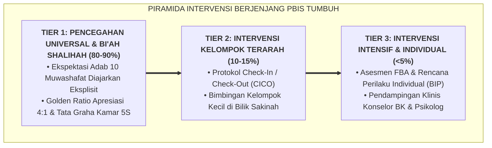

# SUB-BAB 1.1: LOGIKA PIRAMIDA MULTI-TIER: MENGAPA TIDAK BOLEH ADA SANTRI YANG DIBUANG

---

## 1. Menolak Budaya Pemecatan Santri (*Drop-Out*) Secara Gegabah

Di banyak pondok pesantren tradisional, mekanisme penanganan santri yang bermasalah sering kali berakhir pada jalan pintas yang fatal: **dikeluarkan dari pondok (*Drop-Out / Dikembalikan ke Orang Tua*)**. Ketika seorang santri berkali-kali melanggar aturan asrama atau terlibat pertikaian, pimpinan pondok mengambil keputusan sepihak untuk memecat santri tersebut demi "menjaga nama baik pondok".

Secara visi dakwah dan hakikat tarbiyah Islam, membuang santri yang sedang membutuhkan bimbingan adalah sebuah **kegagalan pedagogis lembaga**. Santri yang dipecat dari pesantren sering kali kembali ke lingkungan pergaulan bebas di luar dalam kondisi patah arang, menyimpan trauma dendam terhadap agama, dan akhirnya terjerumus ke dalam kemaksiatan yang lebih parah.

Ekosistem TUMBUH mengadopsi prinsip **"No Soul Left Behind" (Tidak Boleh Ada Satu pun Jiwa Santri yang Dibuang)** melalui penerapan **Arsitektur Multi-Tier PBIS (Positive Behavioral Interventions and Supports)**: [^1]

---

## 2. Logika Berjenjang: Respon Cepat Sebelum Krisis Membesar

Pendekatan Multi-Tier bekerja dengan logika diagnostik medis:
1. **Tier 1 (Universal - Pencegahan Primer)**: Seluruh $100\%$ santri mendapatkan pengajaran adab yang jelas, lingkungan asrama yang aman (CPTED), dan apresiasi positif harian.
2. **Tier 2 (Targeted - Pencegahan Sekunder)**: Jika ada $10\% - 15\%$ santri yang mulai menunjukkan penurunan kedisiplinan, sistem mendeteksinya sejak dini dan memberikan dukungan tambahan (CICO) sebelum perilakunya memburuk.
3. **Tier 3 (Intensive - Intervensi Tersier)**: Hanya kurang dari $5\%$ santri dengan masalah kompleks yang mendapatkan penanganan intensif individual (*wrap-around services*) bersama orang tua dan psikolog.

Dengan sistem ini, pesantren memiliki prosedur terstandarisasi untuk menyelamatkan dan memulihkan setiap santri tanpa perlu menjatuhkan sanksi pemecatan gegabah.

---

### 📚 Catatan Kaki & Referensi Akademik:

[^1]: Horner, R. H., Sugai, G., & Anderson, C. M. (2010). Examining the evidence base for school-wide positive behavior support. *Focus on Exceptional Children*, 42(8), 1–14.
[^2]: Sugai, G., & Horner, R. (2009). Responsiveness-to-intervention and school-wide positive behavior support: Integration of multi-tiered system. *Exceptionality*, 17(4), 223–237.
