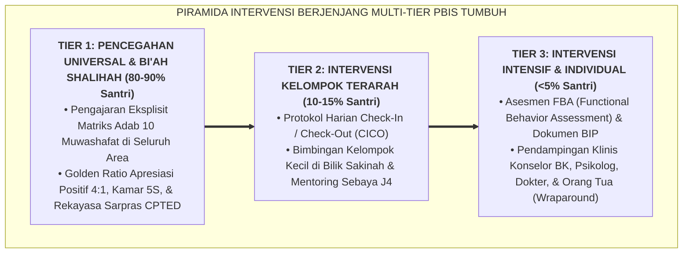

# SUB-BAB 1.1: LOGIKA PIRAMIDA MULTI-TIER: MENGAPA TIDAK BOLEH ADA SANTRI YANG DIBUANG

---

## 1. Menolak Budaya Pemecatan Santri (*Zero-Dropout Paradigm*)

Dalam sejarah panjang tata kelola pondok pesantren tradisional, mekanisme penanganan masalah pelanggaran santri sering kali terjebak dalam jalan pintas yang fatal dan simplistik: **memberikan hukuman fisik di awal, lalu mengeluarkan/memecat santri (*Drop-Out / Dikembalikan ke Orang Tua*) tatkala pelanggaran terus berulang**. [^1]

Tatkala seorang santri berkali-kali melanggar aturan asrama—seperti terlambat sholat, merokok sembunyi-sembunyi, bertengkar, atau kabur dari asrama—pimpinan pondok mengambil keputusan sepihak untuk memecat santri tersebut dengan dalih "menjaga kesucian nama baik pondok" atau "mencegah penyakit menular ke santri lain".

Secara hakikat dakwah Islam dan visi tarbiyah kenabian, **membuang santri yang sedang membutuhkan bimbingan adalah sebuah bentuk keputusasaan dan kegagalan pedagogis institusi**. 

Santri yang dipecat secara sepihak dari pesantren hampir selalu kembali ke lingkungan pergaulan bebas di luar dalam kondisi patah arang, membawa luka batin dan dendam terhadap simbol-simbol agama, serta merasa dicap sebagai "produk gagal yang ditolak oleh Allah dan Rasul-Nya". 

Ekosistem TUMBUH menegakkan prinsip **"No Soul Left Behind" (Tidak Boleh Ada Satu pun Jiwa Santri yang Dibuang)** melalui arsitektur ilmiah **School-Wide Positive Behavioral Interventions and Supports (SW-PBIS Multi-Tier)**:

---

## 2. Landasan Turats: Hakikat Kasih Sayang Nabi kepada Umat yang Berdosa

Rasulullah SAW diutus bukan untuk menghakimi dan menyingkirkan manusia yang keliru, melainkan untuk menyembuhkan jiwa mereka dengan limpahan rahmat dan kasih sayang (*Thabib al-Qulub*).

Kisah seorang pemuda yang datang kepada Nabi SAW meminta izin untuk berzina adalah bukti agung dari pendekatan multi-tier yang penuh rahmah: [^2]

> **عَنْ أَبِي أُمَامَةَ رَضِيَ اللَّهُ عَنْهُ قَالَ: إِنَّ فَتًى شَابًّا أَتَى النَّبِيَّ صَلَّى اللَّهُ عَلَيْهِ وَسَلَّمَ فَقَالَ: يَا رَسُولَ اللَّهِ، ائْذَنْ لِي بِالزِّنَا! فَأَقْبَلَ الْقَوْمُ عَلَيْهِ فَزَجَرُوهُ، وَقَالُوا: مَهْ مَهْ! فَقَالَ: «ادْنُهْ»، فَدَنَا مِنْهُ قَرِيبًا، فَجَلَسَ، قَالَ: «أَتُحِبُّهُ لِأُمِّكَ؟» قَالَ: لَا وَاللَّهِ، جَعَلَنِي اللَّهُ فِدَاكَ! قَالَ: «وَلَا النَّاسُ يُحِبُّونَهُ لِأُمَّهَاتِهِمْ...» ثُمَّ وَضَعَ يَدَهُ عَلَيْهِ وَقَالَ: «اللَّهُمَّ اغْفِرْ ذَنْبَهُ، وَطَهِّرْ قَلْبَهُ، وَحَصِّنْ فَرْجَهُ»، فَلَمْ يَكُنْ بَعْدَ ذَلِكَ الْفَتَى يَلْتَفِتُ إِلَى شَيْءٍ**
> 
> *Dari Abu Umamah RA, ia berkata: Sesungguhnya seorang pemuda mendatangi Nabi SAW lalu berkata: "Wahai Rasulullah, izinkanlah aku untuk berzina!" Maka para sahabat menghardiknya dan berkata: "Diam kamu! Diam kamu!" Namun Rasulullah SAW bersabda: "Mendekatlah kemari." Maka pemuda itu mendekat dan duduk di hadapan beliau. Rasulullah SAW bertanya dengan lembut: "Apakah engkau menyukai hal itu terjadi pada ibumu?" Pemuda itu menjawab: "Demi Allah tidak, wahai Rasulullah, semoga Allah menjadikan diriku tebusan bagimu." Beliau bersabda: "Demikian pula orang lain tidak menyukai hal itu terjadi pada ibu-ibu mereka..." Kemudian Rasulullah SAW meletakkan tangan beliau yang mulia di dada pemuda itu seraya berdoa: "Ya Allah, ampunilah dosanya, bersihkanlah hatinya, dan jagalah kemaluannya." Maka setelah peristiwa itu, tidak ada sesuatu yang lebih dibenci oleh pemuda tersebut daripada perbuatan zina.* (HR. Ahmad no. 22211, sanad shahih)

Hadits ini membuktikan bahwa tatkala seorang santri mengalami dorongan hawa nafsu atau penyimpangan perilaku, respon pertama pendidik bukanlah menghardik, memukul, atau mengusirnya, melainkan **merangkulnya mendekat (*Idnuh*), mengajak dialog logika fitrah yang menyentuh kalbu, meletakkan tangan kasih sayang, dan mendoakan kebaikan baginya**.

---

## 3. Logika Berjenjang: Respon Tepat Sebelum Krisis Membesar

Pendekatan Multi-Tier bekerja dengan filosofi intervensi dini (*Early Intervention Model*): [^3]
1. **Tier 1 (Universal Prevention - 80% hingga 90% Populasi)**: Seluruh santri tanpa kecuali mendapatkan pengajaran adab yang terstruktur, lingkungan fisik asrama yang bersih aman, dan apresiasi harian.
2. **Tier 2 (Targeted Support - 10% hingga 15% Populasi)**: Mendeteksi santri yang mulai goyah sebelum perilakunya menjadi kronis; memberikan dukungan tambahan CICO tanpa stigma.
3. **Tier 3 (Intensive Individualized Support - <5% Populasi)**: Menangani santri dengan masalah kompleks secara terpadu bersama tim multidisiplin (BK, Psikolog, Orang Tua).

Dengan arsitektur Multi-Tier ini, pesantren membuktikan diri sebagai rumah keselamatan yang memiliki kapasitas ilmiah untuk membimbing setiap santri menuju puncak kemuliaan adab.

---

### 📚 Catatan Kaki & Referensi Akademik:

[^1]: Horner, R. H., Sugai, G., & Anderson, C. M. (2010). Examining the evidence base for school-wide positive behavior support. *Focus on Exceptional Children*, 42(8), 1–14.
[^2]: Ahmad bin Hanbal. (2001). *Al-Musnad*. Ditahqiq oleh Syu'aib al-Arna'uth. Beirut: Mu'assasah ar-Risalah, Jilid XXXVI, Hadits no. 22211, hlm. 545–547.
[^3]: Sugai, G., & Horner, R. H. (2009). Responsiveness-to-intervention and school-wide positive behavior support: Integration of multi-tiered system. *Exceptionality*, 17(4), 223–237.
