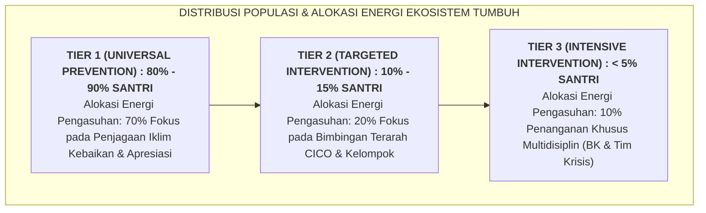

# SUB-BAB 1.2: DISTRIBUSI POPULASI SANTRI: PROPORSI SEHAT 80% - 15% - 5%

---

## 1. Patologi Paradoks Energi: Menghabiskan 80% Tenaga untuk 5% Pelanggar

Dalam tata kelola pesantren tradisional tanpa sistem PBIS berjenjang, sering kali terjadi **Ketimpangan Alokasi Sumber Daya (*Resource Misallocation Paradox*)**: para musyrif dan pimpinan pondok menghabiskan $80\%$ hingga $90\%$ waktu, energi emosional, dan perhatian mereka semata-mata untuk mengurusi, memarahi, dan menghukum kurang dari $5\%$ santri yang bermasalah berat. [^1]

Dampak sistemik yang sangat merusak dari ketimpangan ini antara lain:
* **Mayoritas yang Terabaikan (*The Neglected Majority*)**: Sebanyak $80\%$ santri yang beradab baik, rajin sholat, dan berprestasi sama sekali tidak pernah mendapatkan perhatian, sapaan hangat, atau apresiasi dari para ustadz karena energi staf sudah terkuras habis.
* **Kelompok Rentan yang Tergelincir (*The Slipping 15%*)**: Sekitar $10\% - 15\%$ santri yang sebenarnya hanya mengalami kesulitan adaptasi ringan (Tier 2) tidak tertangani sejak dini, sehingga lambat laun mereka tergelincir masuk menjadi pelanggar berat (Tier 3).
* **Burnout Massal Staf Pengasuhan**: Musyrif merasa frustrasi dan lelah lahir batin karena hari-hari mereka hanya dipenuhi oleh drama kemarahan, sidang pelanggaran, dan pencarian bukti kejahatan santri.

Ekosistem TUMBUH membalik piramida yang timpang ini menuju **Distribusi Proporsi Sehat Berbasis Data (80% - 15% - 5%)**:

---

## 2. Matriks Komparasi Karakteristik & Kebutuhan Santri di Tiga Tingkatan Tier

| Dimensi Parameter | Tier 1: Universal (80% - 90%) | Tier 2: Targeted (10% - 15%) | Tier 3: Intensive (< 5%) |
| :--- | :--- | :--- | :--- |
| **Karakteristik Santri** | Mampu mengatur diri mandiri, mengikuti jadwal 24 jam secara konsisten, jarang melanggar aturan. | Mulai menunjukkan 2–5 kali insiden pelanggaran ringan (terlambat, malas KBM, konflik kamar). | Mengalami masalah perilaku kronis berulang, agresivitas tinggi, trauma emosional, atau depresi. |
| **Bentuk Intervensi Utama** | • Pengajaran Matriks Adab Eksplisit. • Golden Ratio Apresiasi Positif $4:1$. • Standar Kamar 5S & CPTED Sarpras. | • Protokol Check-In / Check-Out (CICO). • Kartu Perkembangan Harian (DPR). • Bimbingan Kelompok di Bilik Sakinah. | • Asesmen FBA & Dokumen BIP Terpadu. • Terapi Naratif Islami Konselor BK. • *Wraparound Services* bersama Orang Tua. |
| **Pelaksana Penanggung Jawab** | Seluruh Guru Madrasah, Wali Kelas, & Musyrif Asrama 4 Shift. | Musyrif Pendamping Khusus & Mentor Sebaya Jenjang J4. | Tim Khusus: Kepala Madrasah, Guru BK, Psikolog, Dokter Poskestren, & Orang Tua. |
| **Evaluasi Perkembangan Data** | Rekapitulasi mingguan logbook adab & Rapor Naratif semesteran. | Evaluasi skor kartu DPR setiap sore & review kelulusan dwi-mingguan. | Evaluasi intensif dokumen BIP setiap pekan & pemantauan krisis 24 jam. |

---

## 3. Menjaga Keseimbangan Sistem: Indikator Kesehatan Lembaga

Sebuah pesantren dinyatakan memiliki ekosistem pembinaan yang sehat apabila proporsi data perilaku santrinya memenuhi kaidah: [^2]
* Minimal **$80\%$ santri berhasil merespons intervensi primer (Tier 1)** tanpa memerlukan bantuan khusus.
* Tidak lebih dari **$15\%$ santri yang membutuhkan intervensi sekunder (Tier 2)**.
* Kurang dari **$5\%$ santri yang memerlukan penanganan individual intensif (Tier 3)**.

Jika data menunjukkan bahwa santri yang bermasalah di Tier 2 melebihi $20\%$ atau Tier 3 melebihi $10\%$, hal itu menandakan bahwa **sistem pencegahan universal Tier 1 di pesantren tersebut sedang mengalami kerusakan struktural** (misal: pengajaran adab tidak jelas, lingkungan asrama kotor, atau musyrif kurang istirahat), sehingga pimpinan harus segera memperbaiki kualitas intervensi Tier 1.

---

### 📚 Catatan Kaki & Referensi Akademik:

[^1]: Lewis, T. J., & Sugai, G. (1999). Effective behavior support: A systems approach to proactive schoolwide management. *Focus on Exceptional Children*, 31(6), 1–24.
[^2]: Walker, H. M., et al. (1996). Integrated approaches to preventing antisocial behavior patterns among school-age children and youth. *Journal of Emotional and Behavioral Disorders*, 4(4), 194–209.
[^3]: Sugai, G., & Horner, R. H. (2006). A promising approach for expanding and sustaining school-wide positive behavior support. *School Psychology Review*, 35(2), 245–259.
