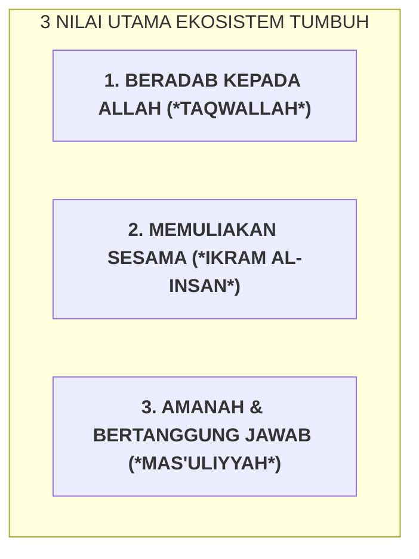

# SUB-BAB 1.3: MATRIKS EKSPEKTASI PERILAKU PESANTREN TERPADU (*UNIFIED MATRIX*)

---

## 1. Menyatukan Standar: Menghilangkan Kontradiksi Antar-Area

Salah satu sumber kebingungan santri adalah **ketidakjelasan aturan atau kontradiksi standar antara ruang kelas (madrasah) dan asrama**. Guru madrasah menuntut santri tenang duduk di kursi, namun di asrama tidak ada panduan jelas mengenai bagaimana merapikan sandal atau cara antre wudhu.

Ekosistem TUMBUH merumuskan **Matriks Ekspektasi Perilaku Terpadu (*School-Wide Unified Matrix*)** yang dipajang secara visual di seluruh penjuru pondok: [^1]

---

## 2. Matriks Terpadu Lintas 5 Area Utama Pesantren

| Lokasi / Area | 1. Beradab kepada Allah (*Taqwallah*) | 2. Memuliakan Sesama (*Ikram*) | 3. Bertanggung Jawab (*Mas'uliyyah*) |
| :--- | :--- | :--- | :--- |
| **Masjid & Tempat Wudhu** | Sholat khusyuk; thuma'ninah; zikir ba'da sholat. | Rapatkan shaf tanpa dorong; tenang saat iqamah. | Hemat air kran; susun sandal rapi di rak luar. |
| **Ruang Kelas & Perpustakaan** | Niat ikhlas menuntut ilmu; doa sebelum belajar. | Dengarkan guru & kawan; angkat tangan jika bertanya. | Rawat meja, kursi, & buku; tuntaskan tugas tepat waktu. |
| **Kamar Tidur Asrama** | Baca doa tidur & bangun; qiyamul lail sukarela. | Matikan lampu jam 21:45; hargai waktu tidur kawan. | Pasang sprei kencang 5S; rapikan lemari pakaian mandiri. |
| **Ruang Makan / Kantin** | Baca basmalah; makan sambil duduk & tangan kanan. | Tertib antre makanan (*no line cutting*); berbagi lauk. | Cuci piring sendiri bersih; buang sisa ke tempat sampah. |
| **Lapangan & Lorong** | Tundukkan pandangan (*Ghadhul Bashar*); jaga aurat. | Ucapkan salam berpapasan; gunakan kata santun. | Jaga kebersihan lantai; kembalikan alat olahraga ke rak. |

---

### 📚 Catatan Kaki & Referensi Akademik:

[^1]: Horner, R. H., et al. (2004). School-wide positive behavior support: An alternative approach to discipline. *State of the Art in School-Wide Discipline*, 14(2), 11–26.
[^2]: Sugai, G., & Horner, R. H. (2002). The evolution of discipline practices: School-wide positive behavior supports. *Child & Family Behavior Therapy*, 24(1-2), 23–50.
