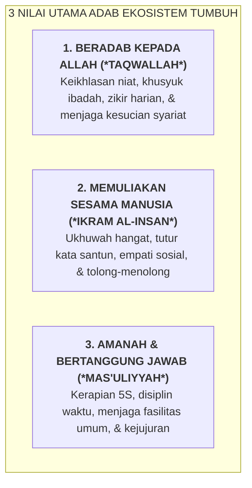

# SUB-BAB 1.3: MATRIKS EKSPEKTASI PERILAKU PESANTREN TERPADU (*UNIFIED MATRIX*)

---

## 1. Menghilangkan Kontradiksi Standar: Mengapa Dibutuhkan Matriks Terpadu?

Salah satu kebingungan moral terbesar yang dialami oleh para santri baru adalah **terjadinya inkonsistensi dan kontradiksi standar aturan antara berbagai ruang di dalam pesantren**. [^1]

Di ruang kelas madrasah, guru menuntut santri untuk bersuara lantang saat membaca kitab dan duduk tegak di kursi. Namun di masjid, ustadz melarang santri bersuara keras. Di asrama, tidak ada aturan tertulis yang jelas mengenai bagaimana tata cara antre wudhu atau bagaimana meletakkan sandal di rak, sehingga musyrif yang berbeda menegur dengan standar yang berbeda-beda tergantung suasana hatinya.

Ekosistem TUMBUH merumuskan **Matriks Ekspektasi Perilaku Pesantren Terpadu (*School-Wide Unified Behavior Matrix*)**: sebuah tabel visual yang menjabarkan **3 Nilai Inti Adab** ke dalam perilaku operasional konkret di **5 Area Utama Kehidupan Pesantren**.

---

## 2. Tabel Lengkap Matriks Ekspektasi Perilaku Lintas 5 Area Pesantren

Matriks ini dipasang dalam bentuk poster visual berdesain elegan dan berukuran besar di setiap sudut madrasah, asrama, masjid, kantin, dan lapangan: [^2]

| Area / Lokasi Pesantren | 1. Beradab Kepada Allah (*Taqwallah*) | 2. Memuliakan Sesama (*Ikram*) | 3. Bertanggung Jawab (*Mas'uliyyah*) |
| :--- | :--- | :--- | :--- |
| **1. Masjid Utama & Tempat Wudhu** | • Berwudhu tertib tanpa boros air. • Masuk dengan kaki kanan & doa masjid. • Sholat tahiyyatul masjid & sholat khusyuk. • Berzikir tenang ba'da sholat tanpa bergurau. | • Merapatkan & meluruskan barisan shaf tanpa dorong. • Berbicara pelan; tidak melangkahi pundak jamaah. • Memberikan tempat duduk lapang bagi kawan/asatidz. | • Meletakkan sandal di rak alas kaki menghadap ke luar. • Menutup kran air wudhu rapat setelah selesai. • Mengembalikan mushaf Al-Qur'an ke lemari rak semula. |
| **2. Ruang Kelas Madrasah & Lab** | • Mengikhlaskan niat menuntut ilmu lillahi ta'ala. • Membaca doa awal & akhir majelis bersama. • Menjaga kesucian adab terhadap guru (*Ta'zhim*). | • Mendengarkan penjelasan guru & kawan dengan seksama. • Mengangkat tangan santun sebelum bertanya. • Menghargai perbedaan pendapat dalam diskusi halaqah. | • Menjaga kebersihan meja, kursi, papan tulis, & lab 5S. • Mengumpulkan tugas KBM mandiri tepat waktu. • Mengembalikan buku perpustakaan dalam kondisi utuh. |
| **3. Kamar Tidur Asrama (Hunian)** | • Menjaga aurat & etika tidur Islami (miring ke kanan). • Membaca doa tidur, istighfar, & QS. Al-Mulk. • Bangun fajar santun dengan basmalah & zikir fajar. | • Mematikan lampu utama jam 21:45; hening total. • Menghargai hak istirahat tidur kawan sekamar. • Berbagi ruang gerak kamar secara adil & saling menyapa. | • Memasang sprei kencang standar *Hospital Corner*. • Menyusun pakaian rapi sesuai Zonasi Lemari 3 Rak. • Melaksanakan piket harian menyapu & mengepel lantai. |
| **4. Ruang Makan & Dapur Pondok** | • Mencuci tangan bersih sebelum makan. • Membaca basmalah & doa makan dengan khusyuk. • Makan sambil duduk menggunakan tangan kanan. | • Tertib antre mengambil makanan (*No Line Cutting*). • Mengambil porsi makanan secukupnya (tidak berlebih). • Berbagi lauk pauk dengan kawan yang membutuhkan. | • Menghabiskan seluruh makanan di piring (*Zero Waste*). • Mencuci piring & sendok sendiri hingga bersih licin. • Membuang sisa sampah organik ke tempat sampah. |
| **5. Lapangan, Koridor, & Taman** | • Menundukkan pandangan (*Ghadhul Bashar*). • Menjaga adab berpakaian sopan menutup aurat. • Menghentikan aktivitas saat adzan berkumandang. | • Mengucapkan salam (*Afssyus Salam*) saat berpapasan. • Menjunjung sportivitas dalam olahraga (anti-kasar). • Bertutur kata santun bebas kata kotor/sarkasme. | • Membuang sampah pada tempat pilah sampah 5S. • Merawat tanaman & keasrian lingkungan pondok. • Mengembalikan alat olahraga (bola, panah) ke raknya. |

---

## 3. Protokol Pengajaran Eksplisit di Pekan Orientasi Santri

Matriks ekspektasi ini tidak dibiarkan menjadi pajangan mati, melainkan diajarkan secara intensif pada **Pekan Orientasi Adab Santri (*Ta'rif al-Bi'ah*)**:
* Setiap kelas dan kamar dipandu oleh musyrif dan kakak asuh jenjang J4 untuk berkeliling ke 5 lokasi (*Station-to-Station Walkthrough*).
* Di setiap lokasi, santri mempraktikkan langsung gerakan adab yang tercantum dalam matriks (misal: simulasi antre wudhu, simulasi memasang sprei kasur *hospital corner*, dan simulasi cuci piring mandiri).

---

### 📚 Catatan Kaki & Referensi Akademik:

[^1]: Horner, R. H., et al. (2004). School-wide positive behavior support: An alternative approach to discipline. *State of the Art in School-Wide Discipline*, 14(2), 11–26.
[^2]: Sugai, G., & Horner, R. H. (2002). The evolution of discipline practices: School-wide positive behavior supports. *Child & Family Behavior Therapy*, 24(1-2), 23–50.
[^3]: Al-Ghazali, Abu Hamid Muhammad bin Muhammad. (2004). *Ihya' 'Ulumiddin*. Beirut: Dar al-Kutub al-'Ilmiyyah, Jilid II, Kitab *Adab al-Akl*, hlm. 3–20.
