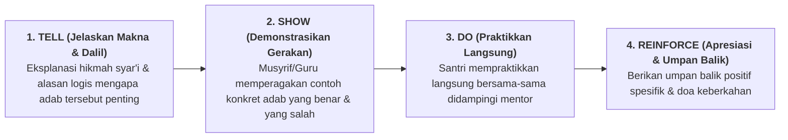

# SUB-BAB 2.1: PENGAJARAN EKSPLISIT ADAB (*EXPLICIT ADAB INSTRUCTION*): MENGAJARKAN SEBELUM MENUNTUT

---

## 1. Menolak Paradigma Asumsi: Santri Tidak Otomatis Menguasai Adab

Di banyak institusi pesantren konvensional, pelanggaran adab sehari-hari kerap direspons oleh para pembina dengan ledakan amarah yang bernada sarkastis: *"Kalian ini sudah mondok berbulan-bulan, masa melipat sarung, mencuci piring, dan antre wudhu saja tidak bisa?!"*. [^1]

Respon reaktif ini bertumpu pada asumsi keliru bahwa seorang santri baru yang masuk ke pondok secara otomatis telah mengetahui dan menguasai seluruh standar perilaku beradab yang diharapkan lembaga. Kenyataannya, santri baru datang dari ratusan latar belakang keluarga yang sangat majemuk:
* Ada santri yang di rumahnya memiliki asisten rumah tangga sehingga tidak pernah mencuci piring sendiri atau merapikan kasurnya seumur hidup.
* Ada santri yang berasal dari lingkungan keluarga permisif di mana berbicara dengan nada tinggi dan memotong pembicaraan orang tua dianggap hal yang lumrah.
* Ada santri yang belum pernah diajari secara teknis bagaimana cara bersuci (*Istinja'* dan *Wudhu*) sesuai sunnah yang shahih.

Kaidah dasar pedagogi PBIS (*Positive Behavioral Interventions and Supports*) menetapkan prinsip emas: [^2]

> **"Jika seorang anak tidak bisa membaca, kita mengajarinya.**  
> **Jika seorang anak tidak bisa berenang, kita melatihnya.**  
> **Jika seorang anak tidak bisa berhitung, kita membimbingnya.**  
> **Maka jika seorang anak belum beradab... KITA WAJIB MENGAJARKANNYA TERLEBIH DAHULU SECARA EKSPLISIT, bukan langsung menghukumnya!"**

---

## 2. Model 4 Langkah Pengajaran Eksplisit Adab (*Tell, Show, Do, Reinforce*)

Untuk menanamkan setiap indikator dalam Matriks Ekspektasi Perilaku, pendidik menggunakan kerangka **Pengajaran Eksplisit Terstruktur**: [^3]

### 📖 1. Tell (Menjelaskan Makna & Landasan Syar'i)
* Pendidik tidak sekadar mendiktekan aturan, melainkan membimbing santri memahami hikmah spiritual dan rasional di balik adab tersebut.
* *Contoh*: Tatkala mengajarkan adab merapikan sandal menghadap ke luar di rak masjid, ustadz menjelaskan hadits tentang keindahan, kepedulian terhadap kenyamanan kawan, dan filosofi kesiapsiagaan melangkah.

### 🎭 2. Show (Mendemonstrasikan Contoh Positif & Non-Contoh)
* Pendidik memperagakan langsung di depan santri:
  - **Contoh Benar (*Exemplar*)**: Musyrif memperagakan cara menarik sprei kasur sudut 45 derajat (*Hospital Corner*) hingga kencang tanpa kerutan.
  - **Contoh Salah (*Non-Exemplar*)**: Musyrif memperagakan sprei yang hanya diselipkan asal-asalan dan menjelaskan mengapa hal itu membuat kamar tampak semrawut dan tidak nyaman ditiduri.

### 🤲 3. Do (Praktik Terbimbing & Pengulangan Mandiri)
* Seluruh santri mempraktikkan gerakan adab tersebut secara serempak di bawah pengawasan langsung musyrif dan kakak asuh jenjang J4.
* Santri yang masih canggung atau keliru dibimbing secara sabar dan ramah hingga mampu melakukannya dengan sempurna tanpa rasa malu.

### 🌟 4. Reinforce (Penguatan Positif Spesifik & Doa)
* Musyrif memberikan umpan balik verbal yang menguatkan: *"Masya Allah, luar biasa Fatih! Sudut kasur antum sangat kencang dan rapi. Barakallahu fiik, ini adalah cermin ketertiban jiwa seorang penuntut ilmu."*
* Catatan apresiasi diinput ke dalam aplikasi logbook digital PBIS.

Dengan metode pengajaran eksplisit ini, tidak ada lagi ruang bagi kesalahpahaman atau asumsi kosong; santri melangkah di atas peta jalan adab yang sangat terang benderang.

---

### 📚 Catatan Kaki & Referensi Akademik:

[^1]: Colvin, G. (2004). *Managing the Cycle of Acting-Out Behavior in the Classroom*. Eugene, OR: Behavior Associates, hlm. 18–42.
[^2]: Archer, A. L., & Hughes, C. A. (2011). *Explicit Instruction: Effective and Efficient Teaching*. New York: Guilford Press, hlm. 1–35.
[^3]: Sugai, G., & Horner, R. H. (2002). The evolution of discipline practices: School-wide positive behavior supports. *Child & Family Behavior Therapy*, 24(1-2), 23–50.
