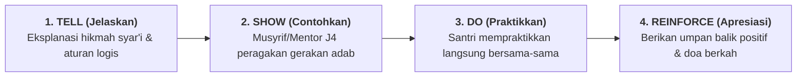

# SUB-BAB 2.1: PENGAJARAN EKSPLISIT ADAB (*EXPLICIT ADAB INSTRUCTION*): MENGAJARKAN SEBELUM MENUNTUT

---

## 1. Menolak Asumsi Keliru: Santri Tidak Otomatis Menguasai Adab

Di banyak pesantren, pelanggaran adab sering kali direspons dengan amarah musyrif: *"Kalian ini sudah mondok berbulan-bulan, masa melipat sarung dan mencuci piring saja tidak bisa?!"*.

Respon ini didasarkan pada asumsi keliru bahwa santri secara otomatis telah mengetahui standar adab yang diharapkan. Kenyataannya, santri baru datang dari ratusan latar belakang keluarga yang berbeda: ada yang di rumahnya tidak pernah mencuci piring sendiri, ada yang terbiasa tidur larut malam, dan ada yang belum pernah diajari cara antre yang benar.

Kaidah pedagogis PBIS menegaskan: **"Jika seorang anak tidak bisa membaca, kita mengajarinya. Jika seorang anak tidak bisa berenang, kita melatihnya. Jika seorang anak belum beradab, kita WAJIB MENGAJARKANNYA terlebih dahulu, bukan langsung menghukumnya."** [^1]

---

## 2. Model 4 Langkah Pengajaran Eksplisit Adab (*Tell, Show, Do, Reinforce*)

Pada pekan-pekan awal semester (Orientasi Santri J1), musyrif dan guru madrasah mengajarkan adab secara eksplisit:
1. **Tell (Menjelaskan)**: Menjelaskan mengapa adab tersebut penting dari sudut pandang dalil syariat dan kenyamanan bersama (misal: mengapa sandal harus menghadap ke luar di rak).
2. **Show (Mendemonstrasikan)**: Musyrif memperagakan langsung di depan kamar cara memegang kain sprei, menarik sudut kasur 45 derajat (*hospital corner*), dan melipat selimut.
3. **Do (Praktik Terbimbing)**: Setiap santri mencoba melakukannya sendiri di kasurnya masing-masing, didampingi oleh kakak asuh J4.
4. **Reinforce (Penguatan & Apresiasi)**: Musyrif memberikan pujian spesifik dan mencatat apresiasi positif di aplikasi logbook.

Dengan diajarkan secara eksplisit, santri memiliki gambaran mental yang sangat jelas mengenai apa yang dimaksud dengan perilaku beradab.

---

### 📚 Catatan Kaki & Referensi Akademik:

[^1]: Colvin, G. (2004). *Managing the Cycle of Acting-Out Behavior in the Classroom*. Eugene, OR: Behavior Associates, hlm. 18–35.
[^2]: Archer, A. L., & Hughes, C. A. (2011). *Explicit Instruction: Effective and Efficient Teaching*. New York: Guilford Press, hlm. 1–22.
