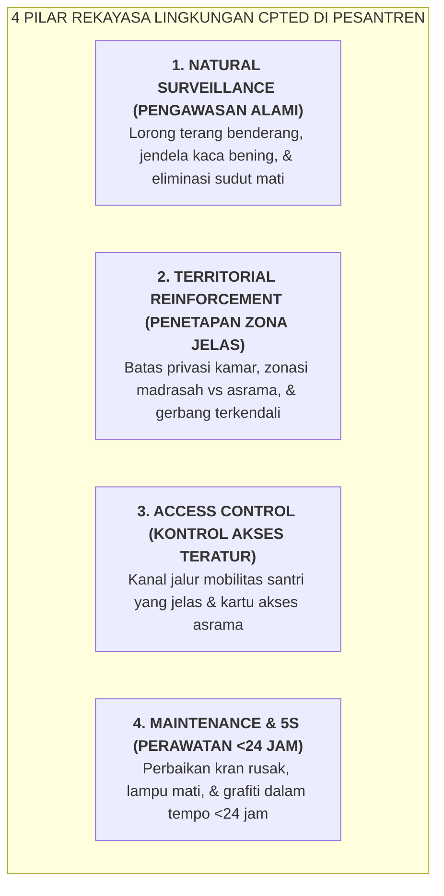

# SUB-BAB 2.2: REKAYASA LINGKUNGAN FISIK CPTED & ELIMINASI SUDUT BUTA (*BLIND SPOTS*)

---

## 1. Peran Strategis Sarpras: Membentuk Bi'ah Shalihah Melalui Arsitektur

Lingkungan fisik bukanlah benda mati yang netral; desain tata ruang secara langsung membentuk dan mempengaruhi perilaku manusia (*Environmental Psychology*). Sudut-sudut asrama yang gelap, lorong buntu yang tidak terpantau, dan kamar mandi yang terisolasi sering kali menjadi **titik rawan terjadinya perundungan (*bullying*), pencurian, atau pelanggaran moral**.

Ekosistem TUMBUH memposisikan **Wakil Kepala Bidang Sarana & Prasarana (Wakamad Sarpras)** sebagai pilar arsitektural *Bi'ah Shalihah* melalui penerapan metodologi **CPTED (Crime Prevention Through Environmental Design)**: [^1]

---

## 2. Memutus *Broken Windows Effect* di Pesantren

George Kelling dan James Q. Wilson dalam *Broken Windows Theory* membuktikan bahwa kerusakan kecil pada fasilitas fisik (seperti kaca jendela yang pecah atau dinding yang dicoret-coret) jika dibiarkan berhari-hari tanpa diperbaiki, akan mengirimkan sinyal psikologis bahwa **"lingkungan ini tidak ada yang merawat dan mengawasi"**. Hal ini memicu percepatan pelanggaran moral yang jauh lebih besar. [^2]

Ekosistem TUMBUH menetapkan **SOP Respon Cepat Sarpras (<24 Jam)**:
* Lampu lorong yang mati wajib diganti dalam waktu maksimal 6 jam.
* Kran air wudhu atau pintu toilet yang rusak wajib diperbaiki dalam waktu maksimal 24 jam.
* Dinding yang tergores atau dicoret wajib dicat ulang seketika.

Dengan lingkungan fisik yang senantiasa bersih, terang, rapi, dan terawat sempurna, santri secara bawah sadar terdorong untuk menjaga kemuliaan adab dan kesucian asrama.

---

### 📚 Catatan Kaki & Referensi Akademik:

[^1]: Crowe, T. D. (2000). *Crime Prevention Through Environmental Design: Applications of Architectural Design and Space Management Concepts* (2nd ed.). Oxford: Butterworth-Heinemann, hlm. 35–68.
[^2]: Wilson, J. Q., & Kelling, G. L. (1982). Broken windows: The police and neighborhood safety. *The Atlantic Monthly*, 249(3), 29–38.
