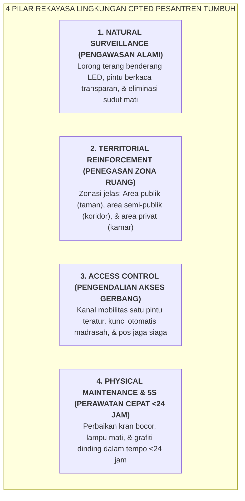

# SUB-BAB 2.2: REKAYASA LINGKUNGAN FISIK CPTED & ELIMINASI SUDUT BUTA (*BLIND SPOTS*)

---

## 1. Psikologi Lingkungan: Ruang Fisik Membentuk Perilaku Jiwa

Dalam teori psikologi lingkungan (*Environmental Psychology*), arsitektur tata ruang dan kondisi fisik sebuah bangunan tidak pernah bersifat netral; ia secara aktif mengirimkan pesan-pesan bawah sadar yang mengarahkan perilaku orang-orang yang berada di dalamnya. [^1]

Di banyak pondok pesantren lama, desain bangunan asrama sering kali tidak mempertimbangkan aspek psikologi pengawasan dan keselamatan:
* Lorong-lorong asrama yang temaram dan gelap.
* Sudut-sudut buntu di belakang gedung atau bawah tangga yang tidak terpantau oleh musyrif (*Hidden Blind Spots*).
* Ruang-ruang kamar yang tertutup rapat dengan pintu masif tanpa jendela kaca visibilitas.
* Kamar mandi yang terisolasi jauh di sudut terpencil.

Kondisi tata ruang yang rapuh ini secara kriminologis menciptakan **Peluang Terjadinya Kejahatan & Perundungan (*Crime & Bullying Opportunities*)**. Mayoritas kasus kekerasan senioritas, pelecehan moral, perusakan fasilitas, dan pencurian barang santri selalu terjadi di sudut-sudut buta yang tidak terpantau tersebut.

Ekosistem TUMBUH memposisikan **Wakamad Sarpras** sebagai perancang lingkungan aman melalui penerapan metodologi **CPTED (Crime Prevention Through Environmental Design - Pencegahan Perilaku Menyimpang Melalui Desain Lingkungan)**:

---

## 2. Memutus *Broken Windows Theory* di Pesantren

George Kelling dan James Q. Wilson dalam *Broken Windows Theory* membuktikan bahwa kerusakan kecil pada sarana fisik (seperti kaca jendela yang retak, kran air yang patah, atau dinding yang dicoret) jika dibiarkan berhari-hari tanpa diperbaiki, akan memancarkan sinyal psikologis bahwa **"lingkungan ini tidak ada yang merawat, mengawasi, dan peduli"**. [^2] Sinyal pembiaran ini mengundang terjadinya pelanggaran disiplin dan kerusakan moral yang jauh lebih masif dalam waktu singkat.

Ekosistem TUMBUH menetapkan **SOP Respon Cepat Sarpras (<24 Jam Respon Reparasi Mutlak)**:
* Lampu lorong atau kamar mandi yang mati wajib diganti oleh teknisi Sarpras dalam waktu maksimal **6 Jam**.
* Kran air wudhu yang bocor atau pintu toilet yang rusak wajib diperbaiki tuntas dalam waktu maksimal **24 Jam**.
* Coreton di dinding asrama wajib dicat ulang dan dihilangkan seketika pada hari yang sama.

---

## 3. Matriks Rekayasa Sarpras Bebas Sudut Buta (*Zero Blind-Spot Matrix*)

| Lokasi / Titik Rawan | Risiko Potensial | Rekayasa Arsitektur CPTED Ekosistem TUMBUH |
| :--- | :--- | :--- |
| **Pintu Masuk Kamar Tidur** | Pembatasan visibilitas; potensi sidang malam tertutup. | Pintu kamar dipasang panel kaca bening (*Vision Panel Glass*) setinggi dada orang dewasa; dilarang menutup kaca dengan koran/stiker. |
| **Lorong Koridor & Tangga** | Lorong gelap memicu perundungan / pemalakan santri. | Pemasangan lampu LED terang benderang 300 Lux yang menyala otomatis saat senja; eliminasi sekat-sekat liar. |
| **Area Jemuran & Belakang Gedung** | Sudut sepi memicu pencurian atau merokok sembunyi-sembunyi. | Penataan area jemuran terbuka di atap (*Rooftop Open Laundry Area*) dengan pencahayaan penuh dan akses terpantau CCTV publik. |
| **Bilik Sakinah & Ruang Konseling** | Kecurigaan fitnah / rasa tidak aman saat konseling privat. | Dinding semi-kaca dengan tirai transparan, pintu tidak terkunci dari luar, dan visibilitas penuh dari pos musyrif (*Two-Adult Rule*). |

Dengan lingkungan fisik yang senantiasa bersih, terang, rapi, dan terawat sempurna, ekosistem pesantren memancarkan wibawa *Bi'ah Shalihah* yang secara alami membimbing santri untuk menjaga kemuliaan adab dan kesucian asrama.

---

### 📚 Catatan Kaki & Referensi Akademik:

[^1]: Gifford, R. (2014). *Environmental Psychology: Principles and Practice* (5th ed.). Colville, WA: Optimal Books.
[^2]: Wilson, J. Q., & Kelling, G. L. (1982). Broken windows: The police and neighborhood safety. *The Atlantic Monthly*, 249(3), 29–38.
[^3]: Crowe, T. D. (2000). *Crime Prevention Through Environmental Design: Applications of Architectural Design and Space Management Concepts* (2nd ed.). Oxford: Butterworth-Heinemann, hlm. 45–82.
