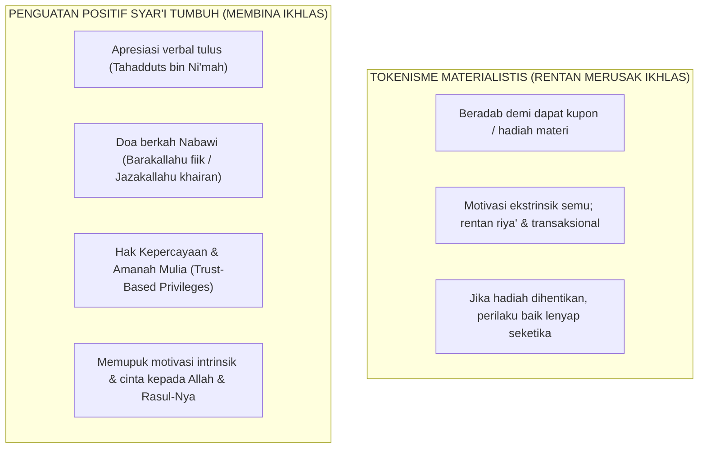

# SUB-BAB 2.3: BUDAYA PENGUATAN POSITIF & SISTEM APRESIASI SYAR'I TANPA TOKENISME

---

## 1. Bahaya Tokenisme Transaksional dalam Pembentukan Karakter Mukhlis

Dalam penerapan School-Wide PBIS di dunia Barat, sistem penguatan positif (*Positive Reinforcement*) sering kali bertumpu pada **Ekonomi Token (Token Economy)**: para siswa diberikan kupon kertas, koin plastik, atau poin bintang setiap kali mereka menaati aturan, yang nantinya dapat ditukarkan dengan hadiah materiil berupa mainan, makanan ringan, atau voucher belanja. [^1]

Penerapan sistem ekonomi token materialistis yang berlebihan di lingkungan pesantren berisiko fatal: **dapat merusak kemurnian niat (*Ikhlasun Niyyah*) dan mengikis motivasi intrinsik santri**. 

Santri dapat terbiasa dengan mentalitas transaksional-pragmatis: mereka sholat berjamaah tepat waktu, membaca Al-Qur'an, atau membersihkan masjid semata-mata demi mengejar kupon hadiah dan pujian materi, bukan karena rasa cinta dan takwa kepada Allah SWT (*Lillahi Ta'ala*). Tatkala hadiah materiil tersebut dihentikan, kebiasaan baik tersebut runtuh seketika.

Ekosistem TUMBUH merumuskan **Sistem Penguatan Positif Berbasis Syar'i (*Faith-Based Intrinsic Reinforcement*)**:

---

## 2. Landasan Turats: Hadits-Hadits Pujian & Doa Keberkahan

Rasulullah SAW adalah teladan teragung dalam memberikan apresiasi positif yang tulus (*Qudwah Hasanah fi at-Tasyji'*). Tatkala melihat sahabatnya melakukan kebaikan, beliau tidak memberikan koin hadiah, melainkan memberikan **apresiasi verbal yang membangkitkan kemuliaan jiwa dan mengiringinya dengan doa keberkahan**: [^2]

1. **Apresiasi Rasulullah kepada Abdullah bin Umar RA**:
   > **نِعْمَ الرَّجُلُ عَبْدُ اللَّهِ، لَوْ كَانَ يُصَلِّي مِنَ اللَّيْلِ**
   > *"Sebaik-baik pemuda adalah Abdullah (bin Umar), seandainya ia senantiasa menunaikan sholat malam."* (HR. Al-Bukhari no. 1122 dan Muslim no. 2479)
   *Pujian indah ini menggetarkan jiwa Ibnu Umar muda, sehingga sejak saat itu ia tidak pernah meninggalkan qiyamul lail sepanjang hidupnya.*
2. **Apresiasi Rasulullah kepada Abu Musa Al-Asy'ari RA**:
   > **لَقَدْ أُوتِيتَ مِزْمَارًا مِنْ مَزَامِيرِ آلِ دَاوُدَ**
   > *"Sungguh engkau telah dianugerahi suara merdu laksana seruling-seruling keluarga Nabi Dawud."* (HR. Al-Bukhari no. 5048)

---

## 3. Empat Bentuk Penguatan Positif Syar'i di Ekosistem TUMBUH

Ekosistem TUMBUH menerapkan penguatan positif melalui 4 instrumen mulia: [^3]

1. **Apresiasi Berbasis Doa Nabawi (*Du'a-Centered Praise*)**:
   * Pendidik mengiringi apresiasinya dengan doa tulus di hadapan santri: *"Masya Allah, barakallahu fiik ananda Salman, ustadz sangat terharu melihat inisiatif antum merapikan mushaf di masjid tadi. Semoga Allah memakaikan mahkota kemuliaan bagi kedua orang tua antum di akhirat kelak."*
2. **Pemberian Hak Kepercayaan (*Trust-Based Privileges*)**:
   * Santri yang menunjukkan kematangan adab Level 3–4 (Mumpuni/Mandiri) diberikan amanah kehormatan yang membanggakan, seperti: menjadi imam rawatib sholat fardhu, memegang kunci perpustakaan malam, atau menjadi ketua regu delegasi lomba pesantren.
3. **Surat Cinta Apresiasi ke Rumah (*Home Commendation Notes*)**:
   * Musyrif mengirimkan kartu apresiasi digital singkat kepada orang tua di rumah: *"Alhamdulillah, ananda Fatih pekan ini menunjukkan kepedulian yang luar biasa merawat kawan sekamarnya yang sedang demam."* Orang tua di rumah merasa bahagia dan semakin memotivasi anaknya.
4. **Pemberian Amanah Membimbing Adik Tingkat (*Mentorship Privilege*)**:
   * Menjadikan santri beradab sebagai kakak asuh (*Peer-Mentor*) bagi santri jenjang J1, yang melatih jiwa kepemimpinan pelayan (*Sayyidul Qaum Khadimuhum*).

Dengan penguatan positif syar'i ini, santri belajar berbuat kebaikan bukan karena mengharap imbalan receh duniawi, melainkan karena rindu pada rida Allah dan cinta pada kemuliaan akhlak Islam.

---

### 📚 Catatan Kaki & Referensi Akademik:

[^1]: Kohn, A. (1993). *Punished by Rewards: The Trouble with Gold Stars, Incentive Plans, A's, Praise, and Other Bribes*. Boston: Houghton Mifflin, hlm. 68–110.
[^2]: Al-Bukhari, Muhammad bin Isma'il. (2002). *Shahih al-Bukhari*. Ditahqiq oleh Muhammad Zuhair an-Nashir. Beirut: Dar Thawq an-Najah, Kitab *Fadha'il Ash-hab an-Nabi SAW*, Hadits no. 3738 & no. 5048.
[^3]: Deci, E. L., & Ryan, R. M. (2000). The "what" and "why" of goal pursuits: Human needs and the self-determination of behavior. *Psychological Inquiry*, 11(4), 227–268.
