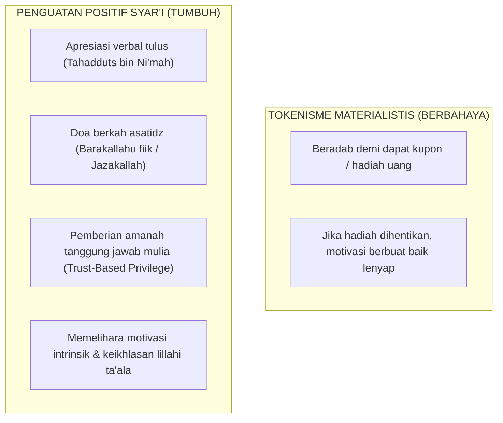

# SUB-BAB 2.3: BUDAYA PENGUATAN POSITIF & SISTEM APRESIASI SYAR'I TANPA TOKENISME

---

## 1. Bahaya Tokenisme Transaksional dalam Pembinaan Akhlak

Dalam implementasi School-Wide PBIS di dunia Barat, sistem penghargaan sering kali menggunakan **Token Economy (Ekonomi Token)**—di mana siswa diberi kupon, poin bintang, atau hadiah materiil setiap kali berbuat baik. 

Penerapan tokenisme materiil yang berlebihan di pesantren beresiko **merusak keikhlasan niat beribadah (*Ikhlasun Niyyah*)**. Santri dapat terjebak dalam mentalitas transaksional: sholat berjamaah atau membersihkan masjid semata-mata demi mengumpulkan stempel poin hadiah, bukan karena mencari rida Allah SWT.

Ekosistem TUMBUH merumuskan **Sistem Penguatan Positif Berbasis Syar'i (*Faith-Based Positive Reinforcement*)**: [^1]

---

## 2. Bentuk-Bentuk Penguatan Positif Syar'i di Pesantren

1. **Apresiasi Doa & Keberkahan (*Du'a-Centered Praise*)**: Mengiringi apresiasi dengan doa kebaikan: *"Masya Allah, barakallahu fiik ananda Fatih, semoga Allah menjadikan antum pemimpin umat yang bertakwa."*
2. **Hak Kepercayaan (*Trust-Based Privileges*)**: Santri yang menunjukkan kematangan adab Level 3-4 diberikan amanah istimewa, seperti memegang kunci perpustakaan malam, menjadi imam rawatib, atau memimpin delegasi santri.
3. **Surat Apresiasi Cinta ke Rumah (*Letters of Commendation*)**: Mengirimkan surat apresiasi singkat dari pihak pondok kepada orang tua di rumah yang menceritakan kemajuan adab sang anak, sehingga mempererat kelekatan emosional keluarga.

---

### 📚 Catatan Kaki & Referensi Akademik:

[^1]: Kohn, A. (1993). *Punished by Rewards: The Trouble with Gold Stars, Incentive Plans, A's, Praise, and Other Bribes*. Boston: Houghton Mifflin, hlm. 68–95.
[^2]: Al-Ghazali, Abu Hamid Muhammad bin Muhammad. (2004). *Ihya' 'Ulumiddin*. Beirut: Dar al-Kutub al-'Ilmiyyah, Jilid IV, Kitab *al-Ikhlas wa ash-Shidq*, hlm. 370–395.
