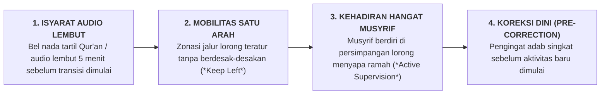

# SUB-BAB 2.4: STANDARDISASI RUTINITAS TRANSISI 24 JAM (BANGUN, MAKAN, BELAJAR, TIDUR)

---

## 1. Menertibkan Titik Rawan: Manajemen Waktu Transisi

Dalam riset manajemen kelas dan psikologi perilaku asrama (*Dormitory Behavioral Dynamics*), **titik perpindahan aktivitas (*Transitions Between Routines*)** adalah titik rawan paling rentan yang menyumbang lebih dari $70\%$ terjadinya insiden kegaduhan, keterlambatan massal, perselisihan fisik, dan kecelakaan santri. [^1]

Titik-titik transisi kritis dalam ritme 24 jam di pesantren mencakup:
* *Transisi 1 (03:30 - 04:15)*: Bangun fajar $\rightarrow$ Wudhu $\rightarrow$ Berjalan menuju shaf masjid.
* *Transisi 2 (06:30 - 07:15)*: Selesai tahfidz $\rightarrow$ Sarapan pagi $\rightarrow$ Berangkat ke gedung madrasah.
* *Transisi 3 (12:00 - 13:15)*: Pulang KBM sesi 1 $\rightarrow$ Sholat Dzuhur $\rightarrow$ Makan $\rightarrow$ Masuk Qailulah.
* *Transisi 4 (15:30 - 16:15)*: Pulang KBM sesi 2 $\rightarrow$ Sholat Ashar $\rightarrow$ Menuju lapangan olahraga.
* *Transisi 5 (17:15 - 18:00)*: Selesai olahraga $\rightarrow$ Antrean mandi sore $\rightarrow$ Masuk masjid Maghrib.
* *Transisi 6 (21:15 - 21:45)*: Selesai mudzakarah malam $\rightarrow$ Muhasabah kamar $\rightarrow$ Padam lampu tidur.

Jika prosedur perpindahan antar-aktivitas ini dibiarkan berjalan tanpa standardisasi yang jelas, koridor-koridor asrama akan berubah menjadi zona kacau balau, gaduh, saling dorong, dan memicu stres kortisol pada seluruh santri dan staf.

---

## 2. Empat Protokol Baku Transisi Teratur Ekosistem TUMBUH

Ekosistem TUMBUH merumuskan **4 Protokol Baku Manajemen Transisi**: [^2]

1. **Isyarat Audio Lembut & Estetis (*Aesthetic Audio Cues*)**:
   * Mengganti bel lonceng manual atau sirine nyaring yang memekakkan telinga dengan lantunan ayat suci Al-Qur'an tartil atau nada lembut berfrekuensi menenangkan 5 menit sebelum waktu transisi dimulai. Santri secara refleks bersiap merapikan aktivitas sebelumnya.
2. **Koreksi Awal Proaktif (*Pre-Correction Strategy*)**:
   * Musyrif atau ketua kamar mengingatkan ekspektasi adab sebelum santri melangkah keluar: *"Ikhwah sekalian, mari kita melangkah menuju masjid dengan tenang, berwudhu tertib, letakkan sandal menghadap ke luar di rak, dan langsung menunaikan sholat tahiyyatul masjid."*
3. **Kehadiran Fisik Aktif Musyrif di Titik Persimpangan (*Active Strategic Supervision*)**:
   * Musyrif tidak duduk di kantor tertutup, melainkan berdiri tegak dengan senyuman hangat di persimpangan koridor, menyapa santri, mengarahkan arus langkah, dan mengapresiasi santri yang berjalan tertib.
4. **Zonasi Mobilitas Arus Satu Arah (*One-Way Traffic Flow*)**:
   * Tangga dan koridor asrama diberi marka pemisah visual: lajur kiri untuk santri yang naik/berjalan ke masjid, dan lajur kanan untuk santri yang turun/berjalan ke kamar, mencegah tabrakan dan saling senggol.

Dengan menata rutinitas transisi secara presisi, seluruh denyut kehidupan pesantren mengalir tenang, anggun, tertib, dan mencerminkan kedalaman adab Islam yang mempesona.

---

### 📚 Catatan Kaki & Referensi Akademik:

[^1]: Colvin, G., Sugai, G., Good, R. H., & Lee, Y. (1997). Using components of social skills training and proactive teaching to manage transition behavior. *Education and Treatment of Children*, 20(4), 388–404.
[^2]: McIntosh, K., & MacSuga-Gage, A. S. (2020). *Proactive Transition Strategies in MTSS*. New York: Guilford Press, hlm. 55–85.
[^3]: Simonsen, B., et al. (2008). Evidence-based practices in classroom management: Considerations for research to practice. *Education and Treatment of Children*, 31(3), 351–380.
