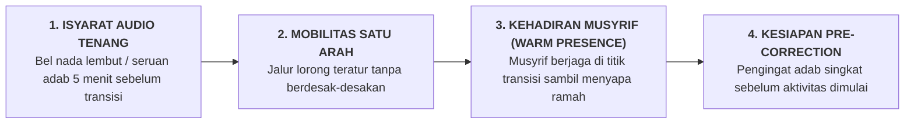

# SUB-BAB 2.4: STANDARDISASI RUTINITAS TRANSISI 24 JAM (BANGUN, MAKAN, BELAJAR, TIDUR)

---

## 1. Menertibkan Titik Rawan: Manajemen Jam Transisi

Dalam psikologi manajemen kelas dan asrama, **titik transisi (perpindahan dari satu aktivitas ke aktivitas lain)** menyumbang lebih dari $70\%$ kasus keributan, keterlambatan, dan perkelahian santri. Contoh jam transisi kritis di pesantren:
* *Transisi 1 (03:45 - 04:30)*: Bangun tidur $\rightarrow$ Wudhu $\rightarrow$ Menuju masjid.
* *Transisi 2 (06:30 - 07:00)*: Sarapan pagi $\rightarrow$ Berangkat ke kelas madrasah.
* *Transisi 3 (16:00 - 16:30)*: Pulang madrasah $\rightarrow$ Olahraga sore $\rightarrow$ Mandi sore.
* *Transisi 4 (21:00 - 21:45)*: Selesai mudzakarah malam $\rightarrow$ Masuk kamar tidur.

Jika prosedur transisi tidak distandarisasi, lorong-lorong asrama akan menjadi kacau, gaduh, dan memicu ketegangan emosi.

---

## 2. Empat Protokol Baku Transisi Teratur

1. **Isyarat Audio Lembut (*Gentle Transition Cues*)**: Mengganti bel lonceng manual yang memekakkan telinga dengan lantunan ayat Al-Qur'an tartil atau nada lembut 5 menit sebelum transisi dimulai.
2. **Koreksi Awal (*Pre-Correction Protocol*)**: Musyrif atau ketua regu santri mengingatkan ekspektasi adab sebelum santri bergerak: *"Ikhwah sekalian, mari melangkah menuju masjid dengan tertib, sandal di rak, dan langsung sholat tahiyyatul masjid."*
3. **Kehadiran Hangat Musyrif di Lorong Transisi**: Musyrif tidak duduk di kantor, melainkan berdiri menyambut santri di persimpangan lorong dengan senyuman dan sapaan berkah.
4. **Waktu Buffer yang Manusiawi**: Menyediakan rentang waktu transisi yang cukup (15–20 menit) agar santri tidak tergesa-gesa berlari yang membahayakan keselamatan fisik.

Dengan menata rutinitas transisi, ritme kehidupan asrama mengalir tenang laksana detak jam yang presisi, menenangkan jiwa seluruh santri dan asatidz.

---

### 📚 Catatan Kaki & Referensi Akademik:

[^1]: Colvin, G., Sugai, G., Good, R. H., & Lee, Y. (1997). Using components of social skills training and proactive teaching to manage transition behavior. *Education and Treatment of Children*, 20(4), 388–404.
[^2]: McIntosh, K., & MacSuga-Gage, A. S. (2020). *Proactive Transition Strategies in MTSS*. New York: Guilford Press, hlm. 55–78.
