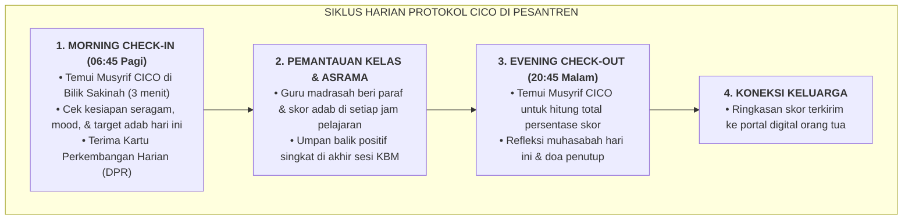

# SUB-BAB 3.1: PROTOKOL CHECK-IN / CHECK-OUT (CICO): PENDAMPINGAN HARIAN TERSTRUKTUR

---

## 1. Menyelamatkan Santri yang Mulai Goyah (*Early Intervention*)

Ketika data logbook mingguan menunjukkan seorang santri mengalami penurunan kedisiplinan berulang (misal: 3x terlambat sholat atau kerap lupa membawa buku pelajaran), santri tersebut tidak langsung dihukum. Sistem secara otomatis memasukkan santri tersebut ke dalam **Intervensi Tier 2: Protokol Check-In / Check-Out (CICO)** selama 4 hingga 6 pekan. [^1]

CICO adalah intervensi perilaku terbukti secara ilmiah (*Evidence-Based Practice*) yang memberikan **dosis perhatian positif dan umpan balik terstruktur yang lebih sering** kepada santri dari seorang pendidik yang dipercaya (*CICO Facilitator / Musyrif Pendamping*).

---

## 2. Mengapa CICO Sangat Efektif di Pesantren?

1. **Memberikan Titik Sentuh Kasih Sayang (*High-Frequency Touchpoints*)**: Santri yang tadinya merasa diabaikan kini memiliki sosok pembina yang secara khusus menanyakan kabarnya setiap pagi dan malam.
2. **Umpan Balik Cepat Tanpa Menunggu Semester Berakhir**: Santri langsung mengetahui capaian perilakunya setiap jam pelajaran, sehingga ia termotivasi untuk segera memperbaiki diri jika jam sebelumnya sempat kurang fokus.
3. **Bebas dari Stigma Hukuman**: Program CICO dibingkai sebagai *"Program Penguatan Ksatria"*, bukan hukuman yang memalukan. Santri merasa dibantu dan diperhatikan, bukan divonis bersalah.

---

### 📚 Catatan Kaki & Referensi Akademik:

[^1]: Crone, D. A., Hawken, L. S., & Horner, R. H. (2010). *Responding to Problem Behavior in Schools: The Behavior Education Program* (2nd ed.). New York: Guilford Press, hlm. 15–48.
[^2]: Mitchell, B. S., Stormont, M., & Gage, N. A. (2011). Tier two interventions in school-wide positive behavior support: A review of the evidence for check-in/check-out. *Preventing School Failure*, 55(2), 77–84.
