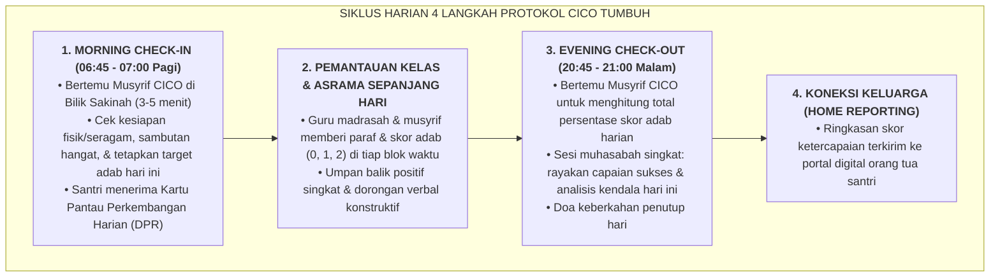

# SUB-BAB 3.1: PROTOKOL CHECK-IN / CHECK-OUT (CICO): PENDAMPINGAN HARIAN TERSTRUKTUR

---

## 1. Menyelamatkan Santri yang Mulai Goyah (*Targeted Secondary Prevention*)

Tatkala data analitik logbook mingguan menunjukkan bahwa seorang santri mulai menunjukkan tren penurunan kedisiplinan berulang—misalnya: tercatat 3 kali terlambat sholat Subuh dalam sepekan, sering lupa membawa buku madrasah, atau mulai menarik diri dari pergaulan kamar—pendekatan konvensional biasanya langsung menjatuhkan sanksi hukum atau memanggil santri untuk dimarahi. [^1]

Dalam Ekosistem TUMBUH, tanda-tanda awal kemunduran perilaku ini dipandang sebagai **sinyal diagnostik bahwa santri tersebut membutuhkan dosis dukungan dan perhatian positif ekstra (*Tier 2 Targeted Support*)**.

Sistem secara otomatis memasukkan santri tersebut ke dalam **Program Penguatan Ksatria: Protokol Check-In / Check-Out (CICO)** selama 4 hingga 6 pekan:

---

## 2. Mengapa CICO Sangat Efektif Secara Ilmiah & Syar'i?

Riset empiris dalam School-Wide PBIS menunjukkan bahwa program CICO memiliki tingkat keberhasilan lebih dari **$80\%$ dalam mengembalikan perilaku siswa ke zona hijau (Tier 1)**. [^2] Keberhasilan ini didorong oleh 3 faktor kunci:

1. **Frekuensi Sentuhan Kasih Sayang yang Tinggi (*High-Frequency Touchpoints*)**:
   * Santri yang tadinya merasa "tidak ada yang peduli" kini memiliki figur pembina khusus yang menyambutnya setiap pagi dengan senyuman dan menanyakan kabarnya setiap malam.
2. **Umpan Balik Cepat & Real-Time (*Immediate Behavioral Feedback*)**:
   * Santri tidak perlu menunggu hingga akhir semester untuk mengetahui apakah perilakunya membaik. Ia mendapatkan konfirmasi skor di setiap jam pelajaran, sehingga jika pada jam ke-1 ia sempat kurang fokus, ia langsung termotivasi memperbaikinya pada jam ke-2.
3. **Bebas dari Label Hukuman (*Dignified Framing*)**:
   * Program CICO dibingkai secara terhormat sebagai *"Program Pendampingan Ksatria / Mentoring Khusus"*, bukan hukuman yang memalukan. Santri merasa dibantu untuk menjadi pribadi unggul.

---

### 📚 Catatan Kaki & Referensi Akademik:

[^1]: Crone, D. A., Hawken, L. S., & Horner, R. H. (2010). *Responding to Problem Behavior in Schools: The Behavior Education Program* (2nd ed.). New York: Guilford Press, hlm. 15–55.
[^2]: Mitchell, B. S., Stormont, M., & Gage, N. A. (2011). Tier two interventions in school-wide positive behavior support: A review of the evidence for check-in/check-out. *Preventing School Failure*, 55(2), 77–84.
[^3]: Todd, A. W., et al. (2008). A structured approach to implementing Check-In/Check-Out. *Beyond Behavior*, 18(1), 11–20.
