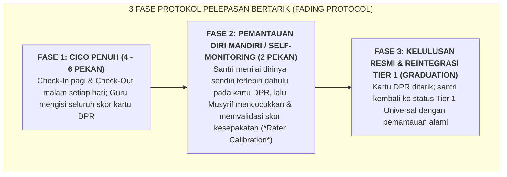

# SUB-BAB 3.3: KRITERIA KELULUSAN (*FADING PROTOCOL*) & REINTEGRASI PENUH KE TIER 1

---

## 1. Menghindari Ketergantungan Eksternal: Logika Pelepasan Mandiri (*Fading*)

Tujuan akhir dari setiap intervensi perilaku dalam Ekosistem TUMBUH bukanlah untuk menciptakan ketergantungan abadi pada kartu pantau atau pengawasan ustadz, melainkan untuk **membangun kapasitas regulasi diri mandiri (*Internal Self-Management*)** pada diri santri. [^1]

Jika seorang santri terus-menerus membawa kartu DPR hingga bertahun-tahun, program tersebut telah gagal mengembangkan motivasi intrinsik santri. Oleh karena itu, sistem merancang **Protokol Pelepasan Bertahap (*Gradual Fading Protocol*)**:

---

## 2. Kriteria Objektif Kelulusan Program CICO

Santri dinyatakan resmi lulus (*Graduated*) dari intervensi Tier 2 apabila memenuhi 3 parameter terukur: [^2]

1. **Konsistensi Skor Tinggi**: Memperoleh skor ketercapaian harian $\ge 80\%$ selama **4 pekan berturut-turut**.
2. **Ketiadaan Pelanggaran Berat**: Nol catatan rujukan insiden pelanggaran berat (Tier 3) selama masa intervensi.
3. **Validasi Konsensus Tim Pendidik**: Kesepakatan bulat antara Wali Kelas, Musyrif Kamar, dan Konselor BK bahwa santri telah menunjukkan kestabilan emosi dan kemandirian adab yang kokoh.

---

## 3. Upacara Kelulusan Bermartabat (*Celebration of Growth*)

Momentum kelulusan dari program CICO dirayakan secara penuh kemuliaan:
* Pimpinan pondok atau musyrif pendamping menyerahkan **Sertifikat Keberhasilan Ksatria (*Certificate of Character Growth*)** dalam majelis kamar/halaqah.
* Musyrif menyampaikan testimoni bangga atas perjuangan santri: *"Antum telah membuktikan bahwa seorang penuntut ilmu mampu mengalahkan godaan hawa nafsu dan bangkit menjadi teladan bagi kawan-kawan sekamar."*
* Mengirimkan surat kabar gembira resmi kepada orang tua di rumah, memulihkan rasa percaya diri anak dan mempererat kelekatan keluarga.

---

### 📚 Catatan Kaki & Referensi Akademik:

[^1]: Campbell, A., & Anderson, C. M. (2011). Check-in/check-out: A systematic evaluation and component analysis. *Journal of Applied Behavior Analysis*, 44(2), 315–326.
[^2]: Crone, D. A., et al. (2010). *Responding to Problem Behavior in Schools: The Behavior Education Program*. New York: Guilford Press, hlm. 95–118.
[^3]: Briesch, A. M., & Daniels, B. (2013). Using self-management interventions to address challenging behaviors in schools. *Psychology in the Schools*, 50(4), 366–381.
