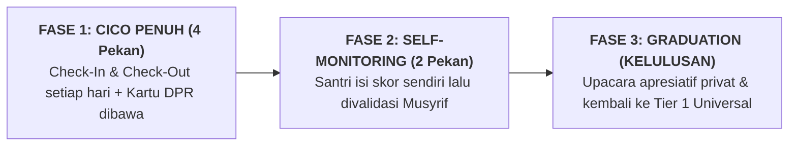

# SUB-BAB 3.3: KRITERIA KELULUSAN (*FADING PROTOCOL*) & REINTEGRASI PENUH KE TIER 1

---

## 1. Menghindari Ketergantungan: Protokol Pelepasan Mandiri (*Fading*)

Tujuan akhir dari intervensi Tier 2 (CICO) bukanlah untuk membuat santri terus-menerus membawa kartu DPR hingga lulus pondok, melainkan untuk **membangun kemandirian regulasi diri (*Internal Self-Management*)** sehingga santri dapat kembali berfungsi penuh di Tier 1 universal. [^1]

Ekosistem TUMBUH menetapkan **Protokol Kelulusan Bertahap (*Fading Protocol*)**:

---

## 2. Kriteria Baku Kelulusan Tier 2

Santri dinyatakan resmi lulus dari program CICO jika memenuhi parameter objektif:
* **Konsistensi Skor**: Memperoleh skor harian $\ge 80\%$ selama **4 pekan berturut-turut**.
* **Ketiadaan Pelanggaran Berat**: Nol catatan pelanggaran berat (Tier 3) selama masa intervensi.
* **Validasi Positif Musyrif & Guru**: Kesepakatan dalam rapat mingguan bahwa santri telah menunjukkan kestabilan adab mandiri.

Santri yang lulus diberikan sertifikat penghargaan kelulusan dan apresiasi doa berkah di hadapan musyrif kamar, memulihkan harga dirinya sebagai santri yang tangguh dan mampu berubah menuju kemuliaan.

---

### 📚 Catatan Kaki & Referensi Akademik:

[^1]: Campbell, A., & Anderson, C. M. (2011). Check-in/check-out: A systematic evaluation and component analysis. *Journal of Applied Behavior Analysis*, 44(2), 315–326.
[^2]: Crone, D. A., et al. (2010). *Responding to Problem Behavior in Schools*. New York: Guilford Press, hlm. 95–112.
