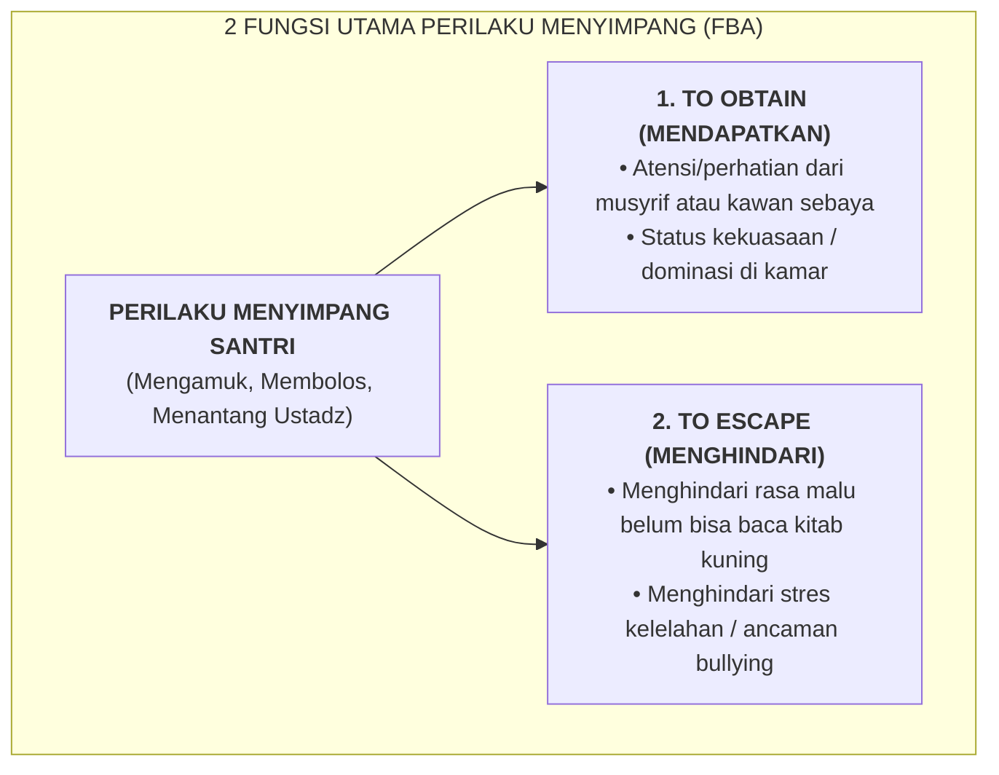

# SUB-BAB 4.1: PRINSIP FUNCTIONAL BEHAVIOR ASSESSMENT (FBA): MENCARI FUNGSI DI BALIK PERILAKU

---

## 1. Menolak Penghakiman Dangkal: Setiap Perilaku Memiliki Fungsi

Ketika seorang santri melakukan pelanggaran berat berulang—seperti membolos sholat Subuh, kabur dari asrama, atau mengamuk membanting pintu—pendekatan konvensional sering kali langsung mencap anak tersebut sebagai "anak rusak", "keras kepala", atau "kesurupan jin".

Ekosistem TUMBUH menolak penghakiman dangkal ini dan menerapkan **Functional Behavior Assessment (FBA / Asesmen Fungsi Perilaku)**. [^1]

Prinsip dasar FBA menetapkan bahwa **tidak ada perilaku manusia yang terjadi secara acak (*behavior is purposeful*)**. Setiap tindakan menyimpang merupakan upaya maladaptif santri untuk memenuhi salah satu dari dua fungsi psikologis utama:
1. **Mendapatkan Sesuatu (*To Obtain / Access*)**: Mendapatkan perhatian musyrif/teman (*attention*), mendapatkan status penerimaan kelompok, atau mendapatkan objek materi.
2. **Menghindari Sesuatu (*To Escape / Avoid*)**: Menghindari tugas akademik yang terlalu sulit (*academic frustration*), menghindari rasa malu karena belum lancar membaca kitab, atau menghindari kecemasan sosial akibat perundungan tersembunyi.

---

## 2. Mengobati Akar Penyakit, Bukan Sekadar Menekan Gejala

Imam Al-Ghazali dalam *Ihya' 'Ulumiddin* menegaskan kaidah pengobatan jiwa (*'Ilaj Amradh an-Nafs*): *"Ketahuilah bahwa penyakit batin tidak akan pernah sembuh kecuali dengan mengetahui sebab-sebab kemunculannya (*ma'rifatu asbabiha*), lalu mencabut akar penyebab tersebut hingga tuntas."* [^2]

Jika kita hanya menghukum gejala luar (misal: memukul santri yang membolos), fungsi perilaku santri untuk "menghindari rasa malu" belum terselesaikan. Santri akan mencari cara menyimpang lain yang lebih berbahaya untuk memenuhi fungsi tersebut. FBA memungkinkan tim pendidik mengetahui akar masalah sesungguhnya dan merancang intervensi yang menyembuhkan.

---

### 📚 Catatan Kaki & Referensi Akademik:

[^1]: O'Neill, R. E., et al. (2015). *Functional Assessment and Program Development for Problem Behavior: A Practical Handbook* (3rd ed.). Stamford, CT: Cengage Learning, hlm. 12–45.
[^2]: Al-Ghazali, Abu Hamid Muhammad bin Muhammad. (2004). *Ihya' 'Ulumiddin*. Beirut: Dar al-Kutub al-'Ilmiyyah, Jilid III, Kitab *Riyadhat an-Nafs wa Mu'alajat Amradh al-Qalb*, hlm. 62–70.
