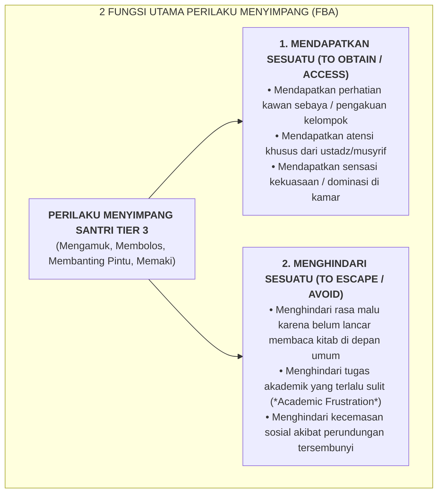

# SUB-BAB 4.1: PRINSIP FUNCTIONAL BEHAVIOR ASSESSMENT (FBA): MENCARI FUNGSI DI BALIK PERILAKU

---

## 1. Menolak Penghakiman Dangkal: Memahami Fungsi Psikologis Perilaku

Tatkala seorang santri menunjukkan masalah perilaku yang sangat berat dan kronis—seperti mengamuk di asrama, merusak fasilitas madrasah, membolos halaqah Al-Qur'an secara persisten, atau menantang ustadz dengan kata-kata kasar—pendekatan konvensional hampir selalu langsung memberikan label penghakiman moral yang merendahkan: *"anak ini keras kepala", "anak nakal turunan", "tidak punya adab", atau "kemasukan jin jahat"*. [^1]

Penghakiman dangkal ini secara metodologis adalah sebuah kekeliruan besar. Ekosistem TUMBUH menegakkan prinsip **Functional Behavior Assessment (FBA / Asesmen Fungsi Perilaku)**: sebuah metodologi diagnostik ilmiah yang memandang bahwa **setiap perilaku manusia tidak pernah terjadi secara acak atau tanpa tujuan (*Behavior is Purposeful & Functional*)**.

Setiap tindakan menyimpang seorang santri merupakan **upaya maladaptif bawah sadar anak untuk memenuhi salah satu dari dua fungsi psikologis mendasar**:

---

## 2. Landasan Turats: Kaidah Pengobatan Jiwa Imam Al-Ghazali

Konsep FBA berpadu selaras dengan ajaran agung Hujjatul Islam Imam Al-Ghazali dalam *Ihya' 'Ulumiddin* (Kitab *Riyadhat an-Nafs wa Mu'alajat Amradh al-Qalb*). Beliau menegaskan bahwa penyakit batin dan penyimpangan akhlak tidak akan pernah dapat disembuhkan jika seorang pendidik hanya melihat gejala luar tanpa mencari sebab musabab kemunculannya: [^2]

> **اعْلَمْ أَنَّ الْعِلَاجَ لَا يَكُونُ إِلَّا بِضِدِّ السَّبَبِ، فَمَنْ لَمْ يَعْرِفِ السَّبَبَ لَمْ يَقْدِرْ عَلَى الْعِلَاجِ، وَأَسْبَابُ هَذِهِ الْأَمْرَاضِ لَا تُعْرَفُ إِلَّا بِتَفَقُّدِ أَحْوَالِ النَّفْسِ وَتَتَبُّعِ دَقَائِقِ أَفْعَالِهَا فِي مَظَانِّهَا**
> 
> *"Ketahuilah bahwa pengobatan suatu penyakit tidak akan terwujud kecuali dengan menghilangkan sebab kemunculannya. Maka barang siapa yang tidak mengetahui sebabnya, niscaya ia tidak akan pernah mampu mengobatinya. Dan sebab-sebab penyakit jiwa ini tidak akan dapat diketahui kecuali dengan meneliti secara mendalam keadaan-keadaan jiwa dan melacak detail-detail perilakunya pada situasi di mana perilaku tersebut muncul."*

Jika kita hanya menghukum gejala luar (misalnya memukul santri yang membolos halaqah), fungsi perilaku anak untuk "menghindari rasa malu karena belum bisa membaca nahwu" belum terselesaikan. Akibatnya, santri akan mencari pelampiasan perilaku menyimpang lain yang lebih berbahaya untuk memenuhi fungsi tersebut. 

FBA memungkinkan Tim BK dan Musyrif mencabut akar masalahnya hingga tuntas dengan pendekatan yang ilmiah dan penuh kasih sayang.

---

### 📚 Catatan Kaki & Referensi Akademik:

[^1]: O'Neill, R. E., et al. (2015). *Functional Assessment and Program Development for Problem Behavior: A Practical Handbook* (3rd ed.). Stamford, CT: Cengage Learning, hlm. 12–50.
[^2]: Al-Ghazali, Abu Hamid Muhammad bin Muhammad. (2004). *Ihya' 'Ulumiddin*. Beirut: Dar al-Kutub al-'Ilmiyyah, Jilid III, Kitab *Riyadhat an-Nafs*, hlm. 62–75.
[^3]: Cooper, J. O., Heron, T. E., & Heward, W. L. (2020). *Applied Behavior Analysis* (3rd ed.). Hoboken, NJ: Pearson.
