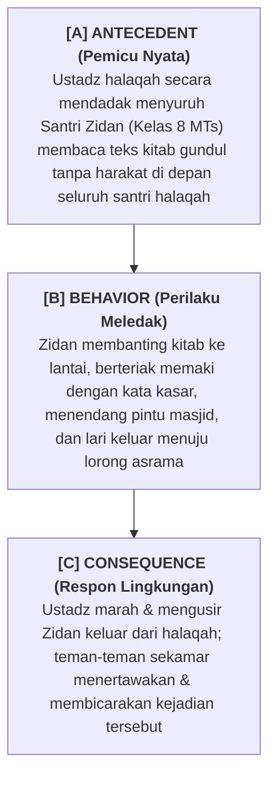

# SUB-BAB 4.2: ANALISIS RANTAI ABC (*ANTECEDENT - BEHAVIOR - CONSEQUENCE*) DI ASRAMA

---

## 1. Anatomi Rantai Perilaku Tiga Elemen (ABC)

Dalam metodologi Analisis Perilaku Terapan (*Applied Behavior Analysis - ABA*), setiap insiden perilaku manusia selalu terjadi dalam sebuah rangkaian sebab-akibat tiga elemen yang saling mengunci: **Antecedent (Pemicu Awal), Behavior (Bentuk Perilaku Teramati), dan Consequence (Konsekuensi Respon yang Mengikuti)**. [^1]

```
                     RANTAI ANALISIS PERILAKU TIGA ELEMEN (ABC)
  
  ┌──────────────────┬───────────────────────────────────────────────────────┐
  │ ELEMEN RANTAI    │ DEFINISI & PERTANYAAN KUNCI DIAGNOSTIK                │
  ├──────────────────┼───────────────────────────────────────────────────────┤
  │ [A] ANTECEDENT   │ Apa kondisi lingkungan, waktu, lokasi, orang terlibat,│
  │     (Pemicu Awal)│ atau tuntutan tugas yang memicu perilaku sebelum aksi?│
  ├──────────────────┼───────────────────────────────────────────────────────┤
  │ [B] BEHAVIOR     │ Apa persisnya tindakan motorik / kata-kata terukur    │
  │     (Perilaku)   │ yang dilakukan santri? (Deskripsi faktual tanpa opini)│
  ├──────────────────┼───────────────────────────────────────────────────────┤
  │ [C] CONSEQUENCE  │ Apa yang terjadi segera setelah santri bertindak?      │
  │     (Konsekuensi)│ Bagaimana respon kawan/ustadz yang memperkuat perilaku?│
  └──────────────────┴───────────────────────────────────────────────────────┘
```

---

## 2. Studi Kasus Lapangan: Analisis ABC Kasus Santri Mengamuk di Halaqah Kitab

Untuk memahami cara kerja analisis ABC di lingkungan pesantren, perhatikan studi kasus nyata berikut: [^2]



### 🔍 Bedah Diagnostik Tim FBA:
1. **Analisis Fungsi Perilaku**:
   * Zidan sebenarnya mengalami kesulitan membaca bahasa Arab gundul (*Academic Frustration*). Ia merasa cemas luar biasa (*Acute Anxiety*) dan takut dipermalukan di hadapan kawan-kawannya.
   * Fungsi perilakunya adalah **Menghindari Rasa Malu / Tugas yang Terlalu Sulit (*Escape / Avoidance Function*)**.
2. **Kelemahan Respon Konvensional**:
   * Tindakan ustadz mengusir Zidan keluar dari masjid justru **memberikan Penguatan Negatif (*Negative Reinforcement*)** yang memuaskan fungsi perilaku Zidan: *Zidan berhasil terbebas dari keharusan membaca kitab!* Akibatnya, di waktu mendatang Zidan akan mengulangi mengamuk setiap kali disuruh membaca kitab.

---

## 3. Solusi Intervensi Berbasis Rantai ABC

Berdasarkan analisis ABC, Tim Intervensi Tier 3 merancang solusi:
* **Modifikasi Antecedent (Mencegah Pemicu)**: Ustadz tidak lagi menyuruh Zidan membaca secara mendadak di depan umum, melainkan memberikan teks bahan ajar satu hari sebelumnya dan membimbingnya membaca privat terlebih dahulu.
* **Pengajaran Perilaku Pengganti (*Replacement Behavior*)**: Melatih Zidan menggunakan kartu *"Minta Waktu Latihan Privat"* secara santun tatkala merasa ragu dengan bacaannya.
* **Modifikasi Konsekuensi**: Menghilangkan respons pengusiran; mendampingi Zidan di Bilik Sakinah untuk menenangkan diri dan melatih kembali bacaan secara empatik.

---

### 📚 Catatan Kaki & Referensi Akademik:

[^1]: Cooper, J. O., Heron, T. E., & Heward, W. L. (2020). *Applied Behavior Analysis* (3rd ed.). Hoboken, NJ: Pearson, hlm. 285–315.
[^2]: Iwata, B. A., et al. (1994). Toward a functional analysis of self-injury. *Journal of Applied Behavior Analysis*, 27(2), 197–209.
[^3]: O'Neill, R. E., et al. (2015). *Functional Assessment and Program Development for Problem Behavior*. Stamford, CT: Cengage Learning.
