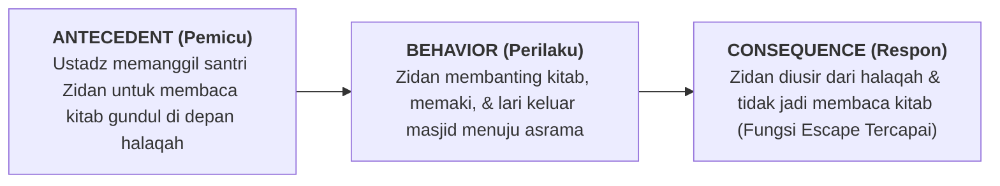

# SUB-BAB 4.2: ANALISIS RANTAI ABC (*ANTECEDENT - BEHAVIOR - CONSEQUENCE*) DI ASRAMA

---

## 1. Anatomi Rantai Perilaku ABC

Untuk membedah fungsi perilaku secara objektif, Tim Intervensi Tier 3 (Guru BK dan Musyrif) menggunakan instrumen observasi **Rantai ABC (*Antecedent - Behavior - Consequence*)**: [^1]

```
                     RANTAI ANALISIS PERILAKU ABC DI PESANTREN
                     
  [A: ANTECEDENT]       ──► Pemicu awal sebelum perilaku terjadi
                            (Waktu, lokasi, orang yang terlibat, tuntutan tugas)
                            
  [B: BEHAVIOR]         ──► Bentuk perilaku spesifik yang teramati
                            (Apa persisnya yang dilakukan/dikatakan santri)
                            
  [C: CONSEQUENCE]      ──► Apa yang terjadi segera setelah perilaku dilakukan
                            (Bagaimana respon kawan/musyrif yang memperkuat perilaku)
```

---

## 2. Studi Kasus Lapangan: Analisis ABC Santri Membolos Halaqah



* **Analisis Tim FBA**:
  - Pemicu utama bukan "benci masjid", melainkan **rasa cemas luar biasa (*anxiety*) karena Zidan belum lancar nahwu** dan takut ditertawakan teman-temannya saat salah membaca harakat di depan halaqah.
  - Sanksi lama (mengusir keluar) justru **memberikan penguatan negatif (*negative reinforcement*)**, karena Zidan berhasil mencapai tujuannya: *terbebas dari keharusan membaca kitab*.

* **Solusi Berbasis ABC**:
  - *Modifikasi Antecedent*: Ustadz tidak langsung menyuruh Zidan membaca di depan umum, melainkan membimbingnya membaca privat terlebih dahulu.
  - *Pengajaran Replacement Behavior*: Mengajari Zidan mengangkat tangan dan berkata santun: *"Ustadz, mohon izin saya butuh bimbingan kata ini terlebih dahulu"*.

---

### 📚 Catatan Kaki & Referensi Akademik:

[^1]: Cooper, J. O., Heron, T. E., & Heward, W. L. (2020). *Applied Behavior Analysis* (3rd ed.). Hoboken, NJ: Pearson, hlm. 280–310.
[^2]: Iwata, B. A., et al. (1994). Toward a functional analysis of self-injury. *Journal of Applied Behavior Analysis*, 27(2), 197–209.
