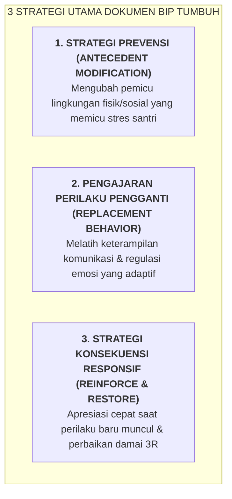

# SUB-BAB 4.3: DESAIN RENCANA INTERVENSI PERILAKU INDIVIDUAL (*BEHAVIOR INTERVENTION PLAN - BIP*)

---

## 1. Dari Asesmen Menuju Rencana Aksi Terpadu (BIP)

Setelah fungsi perilaku diidentifikasi melalui FBA, Tim Intervensi Tier 3 menyusun dokumen resmi **Behavior Intervention Plan (BIP / Rencana Intervensi Perilaku Individual)**. [^1]

BIP adalah dokumen komitmen bersama antara santri, wali kelas, musyrif kamar, guru BK, dan orang tua yang memuat tiga strategi inti:



---

## 2. Struktur Dokumen Standar BIP di Pesantren

```
             DOKUMEN RENCANA INTERVENSI PERILAKU INDIVIDUAL (BIP)
  Nama Santri: Zidan Al-Faruq (Kelas 8 MTs)        Kasus: Ledakan Emosi saat Halaqah
  Fungsi Perilaku Teridentifikasi: Escape/Avoidance (Cemas gagal baca nahwu di depan umum)
  
  1. MODIFIKASI ANTECEDENT:
     • Ustadz halaqah memberikan materi teks 1 hari sebelumnya untuk latihan privat.
     • Tempat duduk diposisikan dekat ustadz pendamping agar merasa aman.
     
  2. REPLACEMENT BEHAVIOR (PERILAKU PENGGANTI):
     • Santri dilatih menggunakan kartu 'Minta Bantuan Privat' saat merasa macet.
     • Latihan teknik pernapasan lambat 4-7-8 di Bilik Sakinah sebelum halaqah dimulai.
     
  3. PENGUATAN & RESPON:
     • Apresiasi verbal langsung setiap kali santri berhasil membaca 1 baris mandiri.
     • Jika terjadi luapan emosi, musyrif mendampingi santri ke Bilik Sakinah (de-eskalasi).
```

Dengan dokumen BIP yang tertulis dan terukur, penanganan santri Tier 3 berjalan konsisten, profesional, dan penuh kasih sayang tanpa melibatkan emosi kemarahan staf.

---

### 📚 Catatan Kaki & Referensi Akademik:

[^1]: Horner, R. H., Sugai, G., Todd, A. W., & Lewis-Palmer, T. (2005). School-wide positive behavior support. Dalam L. Bambara & L. Kern (Eds.), *Individualized Supports for Students with Problem Behaviors*. New York: Guilford Press, hlm. 359–381.
[^2]: Kern, L., & Manz, P. (2004). A look at current validity issues of function-based behavior support. *Behavioral Disorders*, 30(1), 47–59.
