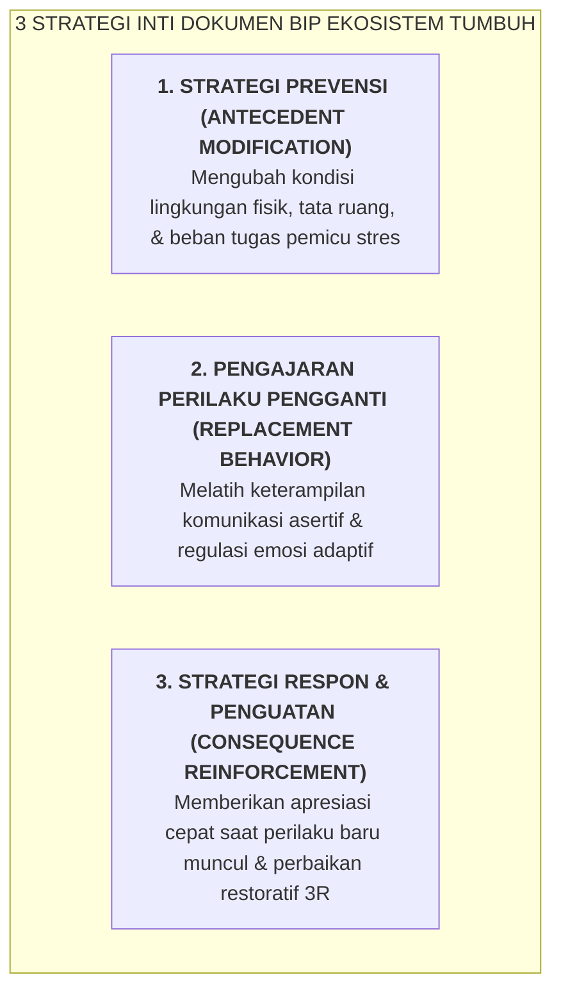

# SUB-BAB 4.3: DESAIN RENCANA INTERVENSI PERILAKU INDIVIDUAL (*BEHAVIOR INTERVENTION PLAN - BIP*)

---

## 1. Dari Diagnosa Menuju Kontrak Pemulihan Tertulis

Setelah fungsi perilaku santri diidentifikasi melalui FBA dan rantai ABC, Tim Intervensi Tier 3 menyusun dokumen resmi **Behavior Intervention Plan (BIP / Rencana Intervensi Perilaku Individual)**. [^1]

Dokumen BIP bukanlah vonis penghakiman, melainkan sebuah **Kontrak Pemulihan Bersama (*Collaborative Restoration Contract*)** yang ditandatangani oleh Santri, Wali Kelas, Musyrif Kamar, Guru BK, dan Orang Tua. Dokumen ini memuat tiga strategi intervensi inti:



---

## 2. Format Lengkap Standar Dokumen BIP di Pesantren

```
             DOKUMEN RENCANA INTERVENSI PERILAKU INDIVIDUAL (BIP)
  Nama Santri : Zidan Al-Faruq (Kelas 8 MTs)       Kamar: Ibnu Khaldun 2
  Konselor BK : Ustadz Ahmad, M.Pd., Kons.         Tanggal Berlaku: 1 Bulan
  Fungsi Perilaku : Escape/Avoidance (Cemas gagal membaca nahwu di depan halaqah)
  
  ┌──────────────────────────────────────────────────────────────────────────┐
  │ 1. STRATEGI PREVENSI (MODIFIKASI ANTECEDENT)                             │
  │ • Ustadz halaqah memberikan teks bacaan 1 hari sebelum jadwal talaqqi.   │
  │ • Posisi duduk santri ditempatkan dekat ustadz pendamping agar aman.     │
  │ • Memberikan jeda waktu 10 menit menenangkan diri di Bilik Sakinah       │
  │   sebelum halaqah dimulai.                                               │
  ├──────────────────────────────────────────────────────────────────────────┤
  │ 2. PENGAJARAN PERILAKU PENGGANTI (FUNCTIONALLY EQUIVALENT REPLACEMENT)   │
  │ • Melatih santri mengangkat kartu 'Konsultasi Privat' tatkala merasa     │
  │   kesulitan harakat, alih-alih melempar kitab.                           │
  │ • Melatih teknik pernapasan lambat 4-7-8 untuk menurunkan detak jantung  │
  │   tatkala merasakan kecemasan (*Down-Regulating Amygdala*).              │
  ├──────────────────────────────────────────────────────────────────────────┤
  │ 3. STRATEGI PENGUATAN & RESPON KONSEKUENSI                               │
  │ • Apresiasi doa verbal langsung setiap kali santri berhasil membaca      │
  │   1 baris mandiri tanpa luapan emosi.                                    │
  │ • Jika terjadi luapan emosi, musyrif mendampingi santri secara tenang ke │
  │   Bilik Sakinah (SOP De-Eskalasi Krisis tanpa bentakan).                 │
  └──────────────────────────────────────────────────────────────────────────┘
  Tanda Tangan Komitmen: [Santri] [Wali Kelas] [Musyrif] [Guru BK] [Orang Tua]
```

---

## 3. Akuntabilitas & Pemantauan Perkembangan Mingguan

Keberhasilan dokumen BIP ditinjau setiap pekan dalam Rapat Koordinasi Tier 3:
* Jika data menunjukkan penurunan frekuensi ledakan emosi $>50\%$ dalam 2 pekan, rencana intervensi dipertahankan.
* Jika tidak ada perubahan, tim melakukan evaluasi ulang terhadap FBA: apakah ada pemicu tersembunyi lain yang belum teridentifikasi (misal: masalah keluarga di rumah atau gangguan pola tidur).

---

### 📚 Catatan Kaki & Referensi Akademik:

[^1]: Horner, R. H., Sugai, G., Todd, A. W., & Lewis-Palmer, T. (2005). School-wide positive behavior support. Dalam L. Bambara & L. Kern (Eds.), *Individualized Supports for Students with Problem Behaviors*. New York: Guilford Press, hlm. 359–381.
[^2]: Kern, L., & Manz, P. (2004). A look at current validity issues of function-based behavior support. *Behavioral Disorders*, 30(1), 47–59.
[^3]: Blood, E., & Neel, R. S. (2007). From FBA to BIP: Eight steps to effective behavior intervention plans. *Teaching Exceptional Children*, 40(1), 42–49.
