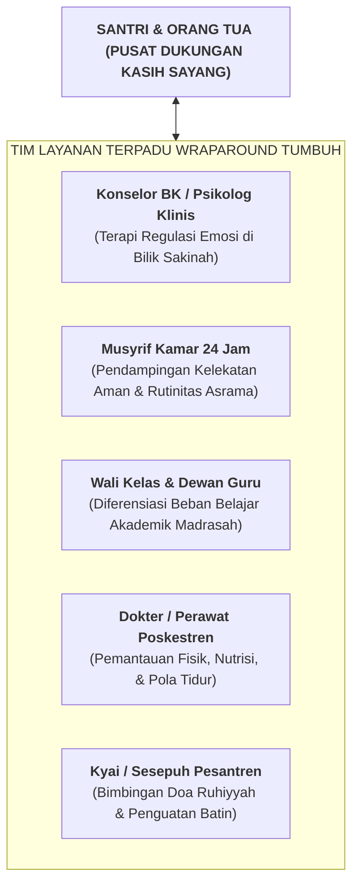

# SUB-BAB 4.4: LAYANAN TERPADU (*WRAP-AROUND SERVICES*): KOLABORASI LINTAS PILAR

---

## 1. Filosofi Wraparound: Membalut Santri dengan Sistem Dukungan Utuh

Untuk kasus-kasus Tier 3 yang sangat kompleks—seperti santri yang mengalami kedukaan mendalam akibat wafatnya orang tua, trauma kekerasan masa lalu di rumah (*Adverse Childhood Experiences - ACEs*), depresi klinis, atau kecenderungan menyakiti diri sendiri (*Self-Harm*)—penanganan individual oleh musyrif kamar saja tidak akan pernah cukup. [^1]

Diperlukan **Layanan Terpadu Lintas Disiplin (*Wraparound Services Model*)**: sebuah pendekatan komprehensif yang memosisikan santri dan keluarganya di pusat lingkaran dukungan, yang "dibalut rapat" (*wrapped around*) oleh seluruh jejaring pendukung di pesantren:

---

## 2. Empat Prinsip Kerja Tim Wraparound di Pesantren

1. **Berbasis Kekuatan Fitrah (*Strength-Based Focus*)**:
   * Tim tidak memandang santri dari "daftar dosanya", melainkan memetakan apa kekuatan fitrah dan potensi positif yang masih dimiliki santri (misal: memiliki suara merdu, pintar menggambar khat, atau sangat setia kawan). Kekuatan ini dijadikan pintu masuk pemulihan.
2. **Kemitraan Sejajar dengan Orang Tua (*Family as Full Partners*)**:
   * Orang tua tidak dipanggil untuk dimarahi atau dihakimi, melainkan diajak duduk melingkar sebagai mitra utama pemulihan ananda.
3. **Penyelarasan Beban Fleksibel (*Academic Accommodations*)**:
   * Selama santri menjalani pemulihan emosional intensif, pihak madrasah memberikan penyesuaian beban tugas akademik sementara agar energi psikologis santri fokus pada pemulihan diri.
4. **Pertemuan Kasus Dwi-Mingguan Terjadwal (*Bi-Weekly Case Conference*)**:
   * Tim bertemu setiap 2 pekan sekali untuk meninjau efektivitas BIP, mencocokkan data observasi, dan merayakan setiap kemajuan kecil yang dicapai santri.

Dengan pendekatan *Wraparound* ini, pesantren membuktikan diri sebagai rumah peradaban yang memeluk, merawat, dan menyelamatkan setiap anak kaum muslimin dengan cinta yang utuh.

---

### 📚 Catatan Kaki & Referensi Akademik:

[^1]: Eber, L., Nelson, C. M., & Miles, P. (1997). School-based wraparound for students with emotional and behavioral challenges. *Journal of Emotional and Behavioral Disorders*, 5(3), 174–186.
[^2]: Walker, J. S., & Bruns, E. J. (2006). Building on practice-based evidence: Using alternative methods to define the wraparound process. *Psychiatric Services*, 57(9), 1288–1293.
[^3]: Felitti, V. J., et al. (1998). Relationship of childhood abuse and household dysfunction to many of the leading causes of death in adults: The Adverse Childhood Experiences (ACE) Study. *American Journal of Preventive Medicine*, 14(4), 245–258.
