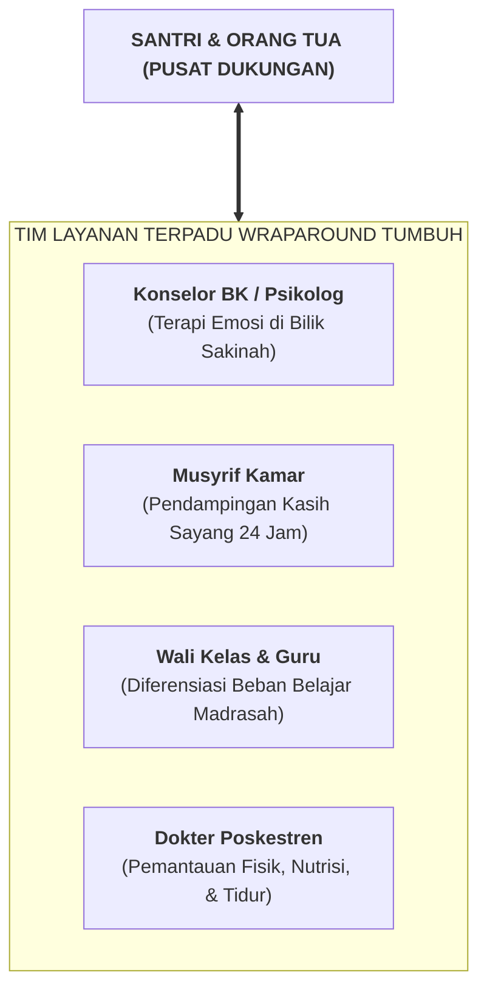

# SUB-BAB 4.4: LAYANAN TERPADU (*WRAP-AROUND SERVICES*): KOLABORASI LINTAS PILAR

---

## 1. Filosofi Wraparound: Membalut Santri dengan Sistem Dukungan Utuh

Untuk kasus-kasus Tier 3 yang sangat kompleks (seperti trauma keluarga berat, depresi klinis, kecenderungan menyakiti diri sendiri, atau kedukaan mendalam), pendekatan individual musyrif saja tidak akan cukup. Diperlukan **Layanan Terpadu Lintas Disiplin (*Wraparound Services*)**. [^1]

Filosofi *Wraparound* memosisikan santri dan orang tua di pusat lingkaran dukungan, yang "dibalut" secara rapat oleh seluruh pemangku kepentingan pondok:

---

## 2. Empat Prinsip Kerja Tim Wraparound di Pesantren

1. **Berbasis Kekuatan (*Strength-Based Approach*)**: Memulai perencanaan dengan mengidentifikasi apa potensi dan kebaikan yang masih dimiliki santri (misal: bakat seni khat atau hafalan juz 30), bukan terpaku pada kesalahannya.
2. **Kemitraan Sejajar dengan Orang Tua**: Orang tua tidak dipanggil untuk dimarahi atau dihakimi, melainkan diajak duduk melingkar sebagai mitra utama pemulihan ananda.
3. **Penyelarasan Beban Santri**: Jika santri sedang mengalami krisis emosional berat, pihak madrasah memberikan dispensasi beban tugas akademik sementara agar energi psikologis santri fokus pada pemulihan diri.
4. **Evaluasi Perkembangan Dwi-Mingguan**: Tim bertemu setiap dua pekan untuk meninjau efektivitas dokumen BIP dan merayakan setiap kemajuan yang diraih santri.

Dengan pendekatan *Wraparound* ini, pesantren membuktikan diri sebagai rumah peradaban yang melindungi dan menyembuhkan setiap anak kaum muslimin.

---

### 📚 Catatan Kaki & Referensi Akademik:

[^1]: Eber, L., Nelson, C. M., & Miles, P. (1997). School-based wraparound for students with emotional and behavioral challenges. *Journal of Emotional and Behavioral Disorders*, 5(3), 174–186.
[^2]: Walker, J. S., & Bruns, E. J. (2006). Building on practice-based evidence: Using alternative methods to define the wraparound process. *Psychiatric Services*, 57(9), 1288–1293.
