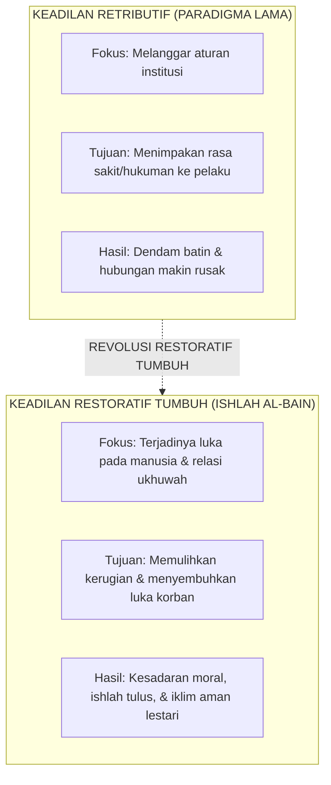

# SUB-BAB 5.1: FILOSOFI KEADILAN RESTORATIF ISLAM: REKONSTRUKSI DOKTRIN ISHLAH AL-BAIN

---

## 1. Menolak Keadilan Retributif: Dari Pembalasan Menuju Pemulihan

Dalam sistem disiplin sekolah konvensional yang menganut **Keadilan Retributif (Pembalasan Dendam Hukum)**, setiap pelanggaran dipandang sebagai "pelanggaran terhadap aturan abstrak lembaga", sehingga fokus utamanya adalah: *Siapa yang melanggar? Aturan nomor berapa yang dilanggar? Dan hukuman derita apa yang pantas dijatuhkan kepada pelaku?* [^1]

Dalam sistem retributif ini:
* Korban yang dirugikan diabaikan perasaannya (*the victim is forgotten*).
* Pelaku dihukum (misal: push-up atau dicukur botak), namun di dalam hatinya tumbuh rasa dendam benci kepada pelapor.
* Kerusakan relasi sosial di antara santri tidak pernah disembuhkan (*unhealed relationships*).

Ekosistem TUMBUH merombak total paradigma ini dengan menegakkan **Keadilan Restoratif Islami (*Whole-School Restorative Justice / Ishlah al-Bain*)**. [^2]

---

## 2. Landasan Turats: Keutamaan Agung *Ishlah Dzat al-Bain*

Dalam ajaran Islam, mendamaikan perselisihan antarsesama memiliki derajat pahala yang melampaui ibadah sunnah ritual.

Rasulullah SAW bersabda dalam sebuah hadits agung:

> **أَلَا أُخْبِرُكُمْ بِأَفْضَلَ مِنْ دَرَجَةِ الصِّيَامِ وَالصَّلَاةِ وَالصَّدَقَةِ؟ قَالُوا: بَلَى، قَالَ: إِصْلَاحُ ذَاتِ الْبَيْنِ، فَإِنَّ فَسَادَ ذَاتِ الْبَيْنِ هِيَ الْحَالِقَةُ، لَا أَقُولُ تَحْلِقُ الشَّعَرَ، وَلَكِنْ تَحْلِقُ الدِّينَ**
> 
> *"Maukah kalian aku kabarkan tentang suatu amalan yang derajatnya lebih utama daripada derajat puasa (sunnah), sholat (sunnah), dan sedekah?" Para sahabat menjawab: "Tentu, wahai Rasulullah." Rasulullah SAW bersabda: "Yaitu mendamaikan perselisihan di antara sesama (Ishlah Dzat al-Bain). Karena sesungguhnya rusaknya hubungan persaudaraan di antara sesama adalah al-Haliqah (pemotong/perusak); aku tidak mengatakan ia memotong rambut, tetapi ia memotong (merusak) agama."* (HR. Abu Dawud no. 4919 dan At-Tirmidzi no. 2509, sanad shahih) [^3]

Allah SWT juga berfirman:

> **إِنَّمَا الْمُؤْمِنُونَ إِخْوَةٌ فَأَصْلِحُوا بَيْنَ أَخَوَيْكُمْ ۚ وَاتَّقُوا اللَّهَ لَعَلَّكُمْ تُرْحَمُونَ**
> 
> *"Sesungguhnya orang-orang mukmin itu bersaudara, karena itu damaikanlah antara kedua saudaramu (yang berselisih) dan bertakwalah kepada Allah agar kamu mendapat rahmat."* (QS. Al-Hujurat [49]: 10) [^4]

Disiplin restoratif di pesantren bukan berarti "membiarkan kesalahan tanpa konsekuensi" (*permissiveness*), melainkan memastikan bahwa konsekuensi yang dijalani pelaku berorientasi langsung pada **tanggung jawab memperbaiki kerugian yang ditimbulkannya (*Restitution*) dan memulihkan ukhuwah (*Reconciliation*)**.

---

### 📚 Catatan Kaki & Referensi Akademik:

[^1]: Zehr, H. (2015). *The Little Book of Restorative Justice: Revised and Updated*. Intercourse, PA: Good Books, hlm. 12–38.
[^2]: Hopkins, B. (2004). *Just Schools: A Whole School Approach to Restorative Justice*. London: Jessica Kingsley Publishers, hlm. 25–60.
[^3]: Abu Dawud, Sulaiman bin al-Asy'ats. (2009). *Sunan Abi Dawud*. Ditahqiq oleh Syu'aib al-Arna'uth. Beirut: Dar ar-Risalah al-'Alamiyyah, Kitab *al-Adab*, Hadits no. 4919; At-Tirmidzi, Kitab *Shifat al-Qiyamah*, Hadits no. 2509.
[^4]: Tafsir Ibnu Katsir. (2000). *Tafsir Al-Qur'an al-'Azhim*. Riyadh: Dar Thayyibah, Jilid VII, hlm. 372–375.
