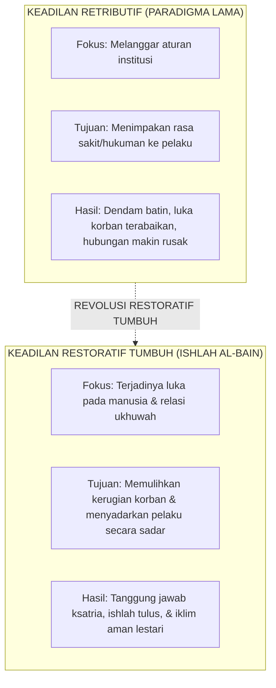

# SUB-BAB 5.1: FILOSOFI KEADILAN RESTORATIF ISLAM: REKONSTRUKSI DOKTRIN ISHLAH AL-BAIN

---

## 1. Menolak Keadilan Retributif: Dari Pembalasan Menuju Pemulihan

Dalam sistem penegakan disiplin konvensional yang mengadopsi paradigma **Keadilan Retributif (Pembalasan Sanksi Hukum)**, setiap pelanggaran adab dipandang semata-mata sebagai "pelanggaran terhadap aturan abstrak kelembagaan". [^1]

Akibatnya, fokus penanganan kasus selalu terjebak pada tiga pertanyaan mekanistik:
1. *Siapa yang bersalah melanggar aturan?*
2. *Pasal tata tertib nomor berapa yang dilanggar?*
3. *Sanksi rasa sakit atau derita apa yang harus ditimpakan kepada pelaku agar ia jera?*

Dalam sistem retributif ini:
* **Korban Terlupakan (*The Victim is Forgotten*)**: Korban yang terluka perasaannya, barangnya dirusak, atau dirugikan secara materiil sama sekali tidak pernah diajak bicara atau dipulihkan haknya.
* **Pelaku Menyimpan Dendam (*Resentment & Defensiveness*)**: Pelaku dihukum secara fisik (misal: push-up 100 kali, dicukur botak, atau dijemur), namun di dalam hatinya ia tidak pernah menyadari dampak perbuatannya terhadap orang lain. Ia hanya merasa dendam kepada pelapor dan belajar cara melanggar yang lebih rapi agar tidak tertangkap lagi di kemudian hari.
* **Kerusakan Ukhuwah yang Dibiarkan Menganga**: Hubungan persaudaraan antarsantri di kamar asrama tetap rusak dan penuh ketegangan tersembunyi.

Ekosistem TUMBUH merombak total paradigma pembalasan ini dan menegakkan **Keadilan Restoratif Islami (*Whole-School Restorative Justice / Ishlah Dzat al-Bain*)**:

---

## 2. Landasan Turats: Keutamaan Agung *Ishlah Dzat al-Bain* Melampaui Ibadah Sunnah

Dalam ajaran Islam, mendamaikan perselisihan antarsesama memiliki derajat pahala yang melampaui ibadah sunnah ritual mahdhah.

Rasulullah SAW bersabda dalam sebuah hadits shahih yang agung: [^2]

> **عَنْ أَبِي الدَّرْدَاءِ رَضِيَ اللَّهُ عَنْهُ قَالَ: قَالَ رَسُولُ اللَّهِ صَلَّى اللَّهُ عَلَيْهِ وَسَلَّمَ: «أَلَا أُخْبِرُكُمْ بِأَفْضَلَ مِنْ دَرَجَةِ الصِّيَامِ وَالصَّلَاةِ وَالصَّدَقَةِ؟» قَالُوا: بَلَى، قَالَ: «إِصْلَاحُ ذَاتِ الْبَيْنِ، فَإِنَّ فَسَادَ ذَاتِ الْبَيْنِ هِيَ الْحَالِقَةُ، لَا أَقُولُ تَحْلِقُ الشَّعَرَ، وَلَكِنْ تَحْلِقُ الدِّينَ»**
> 
> *Dari Abu Darda' RA, ia berkata: Rasulullah SAW bersabda: "Maukah kalian aku kabarkan tentang suatu amalan yang derajatnya lebih utama daripada derajat puasa (sunnah), sholat (sunnah), dan sedekah (sunnah)?" Para sahabat menjawab: "Tentu, wahai Rasulullah." Rasulullah SAW bersabda: "Yaitu mendamaikan perselisihan di antara sesama (Ishlah Dzat al-Bain). Karena sesungguhnya rusaknya hubungan persaudaraan di antara sesama adalah al-Haliqah (pemotong/perusak); aku tidak mengatakan ia memotong rambut, tetapi ia memotong (merusak) agama."* (HR. Abu Dawud no. 4919 dan At-Tirmidzi no. 2509, sanad shahih)

Allah SWT juga berfirman dalam Kitab Suci Al-Qur'an:

> **إِنَّمَا الْمُؤْمِنُونَ إِخْوَةٌ فَأَصْلِحُوا بَيْنَ أَخَوَيْكُمْ ۚ وَاتَّقُوا اللَّهَ لَعَلَّكُمْ تُرْحَمُونَ**
> 
> *"Sesungguhnya orang-orang mukmin itu bersaudara, karena itu damaikanlah antara kedua saudaramu (yang berselisih) dan bertakwalah kepada Allah agar kamu mendapat rahmat."* (QS. Al-Hujurat [49]: 10) [^3]

Disiplin restoratif di pesantren bukan berarti "membiarkan kesalahan tanpa konsekuensi" (*permissiveness*), melainkan memastikan bahwa konsekuensi yang dijalani pelaku berorientasi langsung pada **tanggung jawab memperbaiki kerugian yang ditimbulkannya (*Restitution*) dan memulihkan ukhuwah (*Reconciliation*)**.

---

### 📚 Catatan Kaki & Referensi Akademik:

[^1]: Zehr, H. (2015). *The Little Book of Restorative Justice: Revised and Updated*. Intercourse, PA: Good Books, hlm. 12–45.
[^2]: Abu Dawud, Sulaiman bin al-Asy'ats. (2009). *Sunan Abi Dawud*. Ditahqiq oleh Syu'aib al-Arna'uth. Beirut: Dar ar-Risalah al-'Alamiyyah, Kitab *al-Adab*, Hadits no. 4919; At-Tirmidzi, Kitab *Shifat al-Qiyamah*, Hadits no. 2509.
[^3]: Tafsir Ibnu Katsir. (2000). *Tafsir Al-Qur'an al-'Azhim*. Riyadh: Dar Thayyibah, Jilid VII, hlm. 372–375.
[^4]: Hopkins, B. (2004). *Just Schools: A Whole School Approach to Restorative Justice*. London: Jessica Kingsley Publishers.
