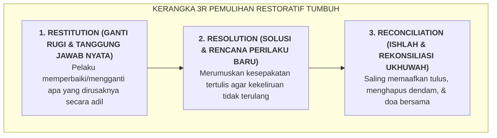

# SUB-BAB 5.2: KERANGKA 3R: RESTITUTION (GANTI RUGI), RESOLUTION (SOLUSI), RECONCILIATION (DAMAI)

---

## 1. Tiga Pilar Pemulihan Restoratif di Pesantren TUMBUH

Ekosistem TUMBUH merumuskan **Kerangka 3R Pemulihan Restoratif (*The 3R Restorative Framework*)** sebagai panduan baku penyelesaian masalah perilaku: [^1]

---

## 2. Eksplanasi Operasional Tiga Langkah 3R

### 🛠️ 1. Restitution (Ganti Rugi Materiil & Moral)
* Jika seorang santri mematahkan kran air wudhu atau merusak kitab milik temannya, bentuk sanksinya bukanlah dihukum push-up 100 kali (yang tidak memperbaiki kran), melainkan: **Pelaku bertanggung jawab mengganti kran/kitab tersebut (menggunakan tabungan uang sakunya) dan ikut membantu memasangnya bersama staf Sarpras**.
* Jika pelanggarannya berupa kata-kata kasar atau ejekan fisik, restitusinya adalah **permohonan maaf privat secara tulus (*verbal restitution*)** dan melakukan tindakan kebaikan nyata untuk memulihkan kehormatan korban.

### 📜 2. Resolution (Solusi & Rencana Pencegahan)
* Musyrif mengajak pelaku menganalisis apa pemicu yang membuatnya kehilangan kendali.
* Pelaku menyusun **Perjanjian Perilaku Baru (*Resolution Contract*)**: apa yang akan ia lakukan jika di kemudian hari ia kembali merasakan emosi serupa (misal: langsung mengambil wudhu atau pergi ke Bilik Sakinah).

### 🤝 3. Reconciliation (Ishlah Hakiki & Menghapus Dendam)
* Korban dan pelaku dipertemukan dalam suasana damai. Korban menyampaikan apa dampak perasaan yang dialaminya, dan pelaku menyampaikan penyesalan batinnya.
* Keduanya bersalaman, saling mendoakan keberkahan, dan sepakat menutup masa lalu tanpa mengungkitnya kembali (*Shafhun Jamil*).

Dengan model 3R ini, keadilan ditegakkan secara proporsional, luka korban disembuhkan, dan pelaku dilatih memikul tanggung jawab orang dewasa.

---

### 📚 Catatan Kaki & Referensi Akademik:

[^1]: Gossen, D. C. (1996). *Restitution: Restructuring School Discipline* (2nd ed.). Chapel Hill, NC: New View Publications, hlm. 22–55.
[^2]: Morrison, B. (2007). *Restoring Safe School Communities: A Whole School Approach to Bullying, Prosocial Behaviour and Youth Justice*. Sydney: Federation Press, hlm. 85–115.
