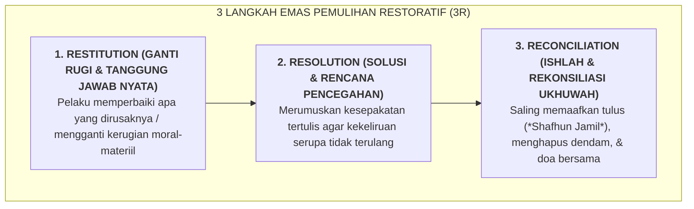

# SUB-BAB 5.2: KERANGKA 3R: RESTITUTION (GANTI RUGI), RESOLUTION (SOLUSI), RECONCILIATION (DAMAI)

---

## 1. Tiga Pilar Pemulihan Restoratif di Pesantren TUMBUH

Ekosistem TUMBUH merumuskan **Kerangka 3R Pemulihan Restoratif (*The 3R Restorative Framework*)** sebagai panduan operasional baku bagi seluruh musyrif, guru, dan tim penegak disiplin dalam menyelesaikan setiap insiden pelanggaran adab dan konflik antarsantri: [^1]

---

## 2. Eksplanasi Operasional & Praktik Tiga Langkah 3R

### 🛠️ 1. Restitution (Ganti Rugi Materiil & Moral yang Nyata)
* **Kompensasi Nyata Bukan Sekadar Hukuman Simbolik**: Jika seorang santri mematahkan kran air wudhu atau merusak kitab milik kawannya, bentuk sanksinya bukanlah dihukum push-up 100 kali atau lari keliling lapangan (yang sama sekali tidak memperbaiki kran yang rusak). 
* Bentuk restitusinya adalah: **Pelaku bertanggung jawab mengganti kran/kitab tersebut menggunakan tabungan uang sakunya sendiri, dan ikut membantu teknisi Sarpras memasangnya hingga berfungsi normal kembali**.
* Jika pelanggarannya berupa kata-kata kasar atau ejekan yang melukai martabat korban, bentuk restitusinya adalah **Permohonan Maaf Tulus Secara Privat (*Verbal Restitution*)** dan melakukan tindakan kebaikan nyata untuk memuliakan kembali kehormatan korban.

### 📜 2. Resolution (Solusi & Rencana Pencegahan Bersama)
* Musyrif mendampingi pelaku untuk menganalisis apa akar pemicu yang membuatnya kehilangan kendali emosi.
* Pelaku menyusun dan menandatangani **Kontrak Komitmen Resolusi (*Resolution Agreement*)**: rencana aksi konkret mengenai apa yang akan ia lakukan apabila di kemudian hari ia kembali menghadapi situasi pemicu yang serupa (misalnya: langsung mengambil wudhu, menarik napas dalam, atau berjalan ke Bilik Sakinah).

### 🤝 3. Reconciliation (Ishlah Hakiki & Membuka Lembaran Baru)
* Korban dan pelaku dipertemukan dalam suasana damai yang terfasilitasi. Korban diberi ruang aman untuk menyampaikan apa dampak perasaan yang dialaminya, dan pelaku menyampaikan penyesalan batinnya secara tulus.
* Keduanya bersalaman, saling mendoakan keberkahan, dan sepakat menutup masa lalu tanpa mengungkitnya kembali (*Shafhun Jamil*), memulihkan rasa aman dan ikatan ukhuwah sekamar.

---

## 3. Matriks Perbandingan Sanksi Punitif vs Solusi 3R Restoratif

| Kasus Pelanggaran Santri | Respon Sanksi Punitif (Dilarang Mutlak) | Solusi 3R Restoratif Ekosistem TUMBUH |
| :--- | :--- | :--- |
| **Menumpahkan makanan kawan saat bercanda kasar.** | Disuruh berdiri dengan 1 kaki di depan ruang makan selama 30 menit. | **Restitution**: Membersihkan tumpahan makanan hingga bersih licin & membelikan porsi makan baru untuk kawannya. **Resolution**: Sepakat tidak bercanda fisik saat jam makan. **Reconciliation**: Makan bersama kembali secara hangat. |
| **Meminjam sandal kawan tanpa izin (*ghasab*) lalu hilang.** | Sandal pelaku disita dan disuruh berjalan tanpa alas kaki. | **Restitution**: Mengganti sandal baru yang setara dari uang tabungan sendiri. **Resolution**: Menulis komitmen izin sebelum meminjam barang kawan. **Reconciliation**: Menyerahkan sandal baru disertai doa jazakallahu khairan. |

---

### 📚 Catatan Kaki & Referensi Akademik:

[^1]: Gossen, D. C. (1996). *Restitution: Restructuring School Discipline* (2nd ed.). Chapel Hill, NC: New View Publications, hlm. 22–65.
[^2]: Morrison, B. (2007). *Restoring Safe School Communities: A Whole School Approach to Bullying, Prosocial Behaviour and Youth Justice*. Sydney: Federation Press, hlm. 85–120.
[^3]: Hopkins, B. (2004). *Just Schools: A Whole School Approach to Restorative Justice*. London: Jessica Kingsley Publishers.
