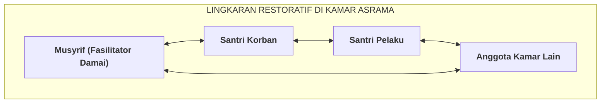

# SUB-BAB 5.3: FASILITASI LINGKARAN RESTORATIF (*RESTORATIVE CIRCLE*) DI KAMAR ASRAMA

---

## 1. Menghidupkan Tradisi Syura: Mengapa Berbentuk Lingkaran?

Ketika terjadi gesekan sosial atau ketegangan emosi di dalam sebuah kamar asrama, musyrif memfasilitasi forum **Lingkaran Restoratif (*Restorative Circle / Majelis Ishlah Kamar*)**. [^1]

Bentuk duduk melingkar di atas karpet lantai memiliki makna filosofis dan psikologis yang mendalam:
* **Kesetaraan Bermartabat (*Equality of Dignity*)**: Tidak ada orang yang duduk di posisi "hakim tinggi" atau berada di balik meja yang mengintimidasi. Seluruh santri dan musyrif berada dalam level ketinggian mata yang sama.
* **Visibilitas Emosi Penuh**: Setiap santri dapat melihat ekspresi wajah dan bahasa tubuh kawannya secara utuh, yang secara neurobiologis mengaktifkan *Mirror Neurons* dan rasa empati.

---

## 2. Lima Pertanyaan Restoratif Baku (*The 5 Restorative Questions*)

Musyrif memandu dialog dengan memegang benda giliran bicara (*Talking Piece / Mushaf Kecil*). Santri hanya boleh berbicara ketika memegang benda tersebut. Musyrif mengajukan **5 Pertanyaan Restoratif**: [^2]

1. *Kepada Pelaku*: *"Apa yang sebenarnya terjadi menurut pandangan antum?"*
2. *Kepada Pelaku*: *"Apa yang antum pikirkan dan rasakan saat kejadian tersebut berlangsung?"*
3. *Kepada Korban & Teman Sekamar*: *"Bagaimana peristiwa tersebut mempengaruhi perasaan dan kenyamanan antum di kamar ini?"*
4. *Kepada Korban*: *"Bagian mana yang paling berat atau menyakitkan bagi antum?"*
5. *Kepada Pelaku & Seluruh Kamar*: *"Apa yang harus kita lakukan bersama saat ini agar kerugian tersebut dapat diperbaiki dan kamar kita kembali damai?"*

Metode ini mengikis habis sikap defensif dan melatih santri mendengarkan suara hati saudaranya secara tulus.

---

### 📚 Catatan Kaki & Referensi Akademik:

[^1]: Boyes-Watson, C., & Pranis, K. (2015). *Circle Forward: Building a Restorative School Community*. St. Paul, MN: Living Justice Press, hlm. 35–70.
[^2]: O'Connell, T., Wachtel, B., & Wachtel, T. (1999). *Conferencing Handbook: The New Real Justice Training Manual*. Pipersville, PA: The Piper's Press, hlm. 18–35.
