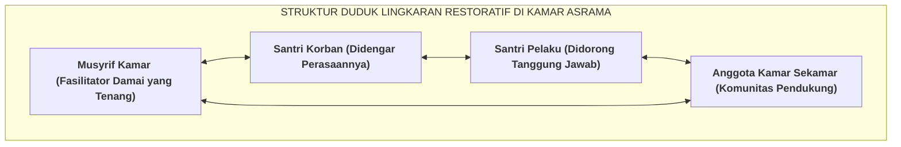

# SUB-BAB 5.3: FASILITASI LINGKARAN RESTORATIF (*RESTORATIVE CIRCLE*) DI KAMAR ASRAMA

---

## 1. Menghidupkan Tradisi Syura: Mengapa Duduk Melingkar?

Tatkala terjadi gesekan sosial, perselisihan antarsantri, atau ketegangan emosi di dalam sebuah kamar asrama, musyrif memfasilitasi forum musyawarah damai yang disebut **Lingkaran Restoratif Asrama (*Restorative Circle / Majelis Ishlah Kamar*)**. [^1]

Bentuk duduk melingkar di atas karpet lantai bukan sekadar pilihan posisi fisik yang kebetulan, melainkan memiliki makna filosofis, neurobiologis, dan psikologis yang sangat mendalam:
* **Kesetaraan Martabat Kemanusiaan (*Equality of Human Dignity*)**: Tidak ada orang yang duduk di posisi "hakim tinggi di balik meja kekuasaan". Seluruh peserta (Musyrif, Korban, Pelaku, dan seluruh anggota kamar) berada pada level ketinggian mata yang sama (*Eye-Level Equality*).
* **Visibilitas Emosi Penuh & Empati Cermin (*Mirror Neurons Activation*)**: Setiap santri dapat melihat ekspresi wajah, tatapan mata, dan desah napas kawannya secara utuh, yang secara alami mengaktifkan empati dan meredakan dorongan agresi.



---

## 2. Lima Pertanyaan Restoratif Baku (*The 5 Restorative Questions*)

Musyrif memandu dialog menggunakan benda giliran bicara (*Talking Piece / Mushaf Kecil*). Santri hanya boleh berbicara tatkala memegang benda tersebut, melatih seluruh peserta untuk mendengarkan secara aktif tanpa memotong pembicaraan. 

Musyrif mengajukan **5 Pertanyaan Restoratif Universal**: [^2]

```
               5 PERTANYAAN RESTORATIF BAKU EKOSISTEM TUMBUH
  
  ┌──────────────────────────────────────────────────────────────────────────┐
  │ 1. KEPADA PELAKU:                                                        │
  │    "Apa yang sebenarnya terjadi menurut pandangan antum secara jujur?"   │
  ├──────────────────────────────────────────────────────────────────────────┤
  │ 2. KEPADA PELAKU:                                                        │
  │    "Apa yang antum pikirkan dan rasakan saat peristiwa itu terjadi,      │
  │     dan apa yang antum rasakan sekarang setelah merenungkannya?"         │
  ├──────────────────────────────────────────────────────────────────────────┤
  │ 3. KEPADA KORBAN & ANGGOTA KAMAR:                                        │
  │    "Bagaimana peristiwa tersebut mempengaruhi perasaan, rasa aman,       │
  │     dan kenyamanan antum di kamar ini?"                                  │
  ├──────────────────────────────────────────────────────────────────────────┤
  │ 4. KEPADA KORBAN:                                                        │
  │    "Bagian mana dari kejadian tersebut yang paling berat/menyakitkan?"   │
  ├──────────────────────────────────────────────────────────────────────────┤
  │ 5. KEPADA PELAKU & SELURUH ANGGOTA KAMAR:                                │
  │    "Apa yang harus kita lakukan bersama saat ini agar kerugian tersebut  │
  │     dapat diperbaiki dan kamar kita kembali damai penuh kasih sayang?"   │
  └──────────────────────────────────────────────────────────────────────────┘
```

Metode dialog 5 pertanyaan ini mengikis habis sikap defensif atau kebohongan santri, membimbing pelaku menyadari dampak perbuatannya terhadap orang lain, dan menyatukan kembali ikatan persaudaraan kamar yang sempat retak.

---

### 📚 Catatan Kaki & Referensi Akademik:

[^1]: Boyes-Watson, C., & Pranis, K. (2015). *Circle Forward: Building a Restorative School Community*. St. Paul, MN: Living Justice Press, hlm. 35–85.
[^2]: O'Connell, T., Wachtel, B., & Wachtel, T. (1999). *Conferencing Handbook: The New Real Justice Training Manual*. Pipersville, PA: The Piper's Press, hlm. 18–45.
[^3]: Hopkins, B. (2004). *Just Schools: A Whole School Approach to Restorative Justice*. London: Jessica Kingsley Publishers.
