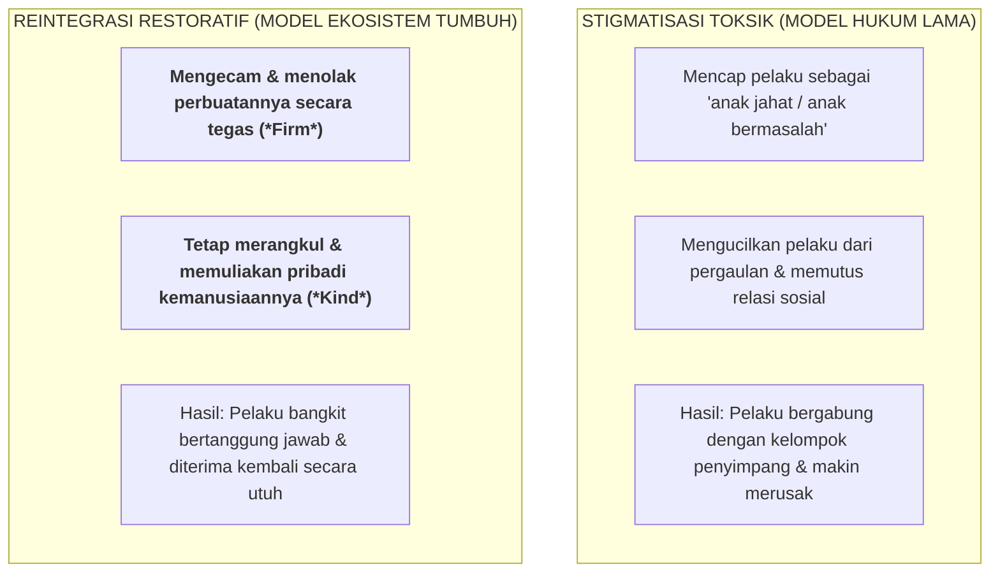

# SUB-BAB 5.4: PROTOKOL PEMULIHAN KORBAN & REINTEGRASI PELAKU TANPA STIGMA

---

## 1. Perlindungan Mutlak & Pemulihan Korban (*Victim-Centered Restoration*)

Dalam setiap insiden pelanggaran atau konflik di asrama, prioritas pertama dan utama yang tidak boleh diabaikan adalah **pemulihan rasa aman, kesehatan fisik, dan martabat korban (*Victim Safeguarding & Healing*)**. [^1]

Protokol penanganan korban di Ekosistem TUMBUH menetapkan standar perlindungan ketat:
* **Larangan Memaksa Korban Memaafkan Secara Prematur**: Korban tidak boleh dipaksa oleh musyrif untuk "langsung memaafkan dan bersalaman" saat kondisi emosionalnya masih syok, marah, atau trauma. Pemaafan difasilitasi secara bertahap tatkala korban telah merasa siap, tenang, dan divalidasi perasaannya.
* **Jaminan Beban Nol bagi Korban (*Zero Burden Policy*)**: Korban tidak boleh dibebani kewajiban membersihkan kerusakan atau menanggung biaya ganti rugi apa pun atas insiden yang menimpanya.
* **Perlindungan dari Ancaman Balasan (*Anti-Retaliation Safeguards*)**: Musyrif memastikan tidak ada intimidasi, tatapan dingin, atau pengucilan lanjutan dari teman-teman pelaku terhadap korban.

---

## 2. Reintegrasi Sosial Pelaku Tanpa Stigma (*Reintegrative Shaming Theory*)

John Braithwaite (1989) dalam karya monumentalnya *Crime, Shame and Reintegration* membedakan dua jenis respon sosial terhadap pelanggar norma: [^2]

Ekosistem TUMBUH menegakkan deklarasi penerimaan kembali santri yang telah menuntaskan proses perbaikan:

> *"Kekeliruan yang antum lakukan kemarin adalah perbuatan salah yang tidak kita benarkan, namun diri antum tetaplah saudara kami yang mulia di jalan Allah SWT. Setelah antum menuntaskan tanggung jawab perbaikan ini, pintu ukhuwah terbuka lebar, dan kita melangkah bersama sebagai satu keluarga besar tanpa prasangka masa lalu."*

Dengan protokol reintegrasi ini, santri yang pernah berbuat salah tidak kehilangan masa depannya; mereka bangkit kembali dengan jiwa yang lebih matang, beradab, dan penuh kesyukuran.

---

### 📚 Catatan Kaki & Referensi Akademik:

[^1]: Zehr, H. (2015). *The Little Book of Restorative Justice*. Intercourse, PA: Good Books, hlm. 25–48.
[^2]: Braithwaite, J. (1989). *Crime, Shame and Reintegration*. Cambridge: Cambridge University Press, hlm. 54–105.
[^3]: Ahmed, E., et al. (2001). *Shame Management through Reintegration*. Cambridge: Cambridge University Press.
