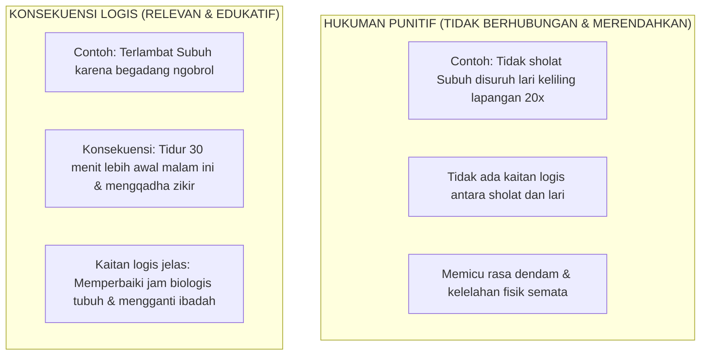

# SUB-BAB 5.5: KONSEKUENSI LOGIS EDUKATIF VS HUKUMAN PUNITIF

---

## 1. Membedakan Konsekuensi Logis dari Hukuman Punitif

Banyak praktisi pendidikan keliru mengira bahwa disiplin positif berarti meniadakan segala bentuk konsekuensi. Dalam Ekosistem TUMBUH, disiplin ditegakkan melalui **Konsekuensi Logis Edukatif (*Logical Consequences*)**, yang dibedakan secara tegas dari **Hukuman Punitif (*Punitive Punishment*)**: [^1]

---

## 2. Prinsip 4R Konsekuensi Logis Jane Nelsen

Agar sebuah konsekuensi bersifat mendidik dan tidak berubah menjadi hukuman punitif terselubung, ia wajib memenuhi kriteria **4R Jane Nelsen**: [^2]

1. **Related (Relevan/Terkait)**: Konsekuensi harus memiliki hubungan sebab-akibat langsung dengan perilaku yang dilakukan.
2. **Respectful (Santun & Menghormati Martabat)**: Diberikan dengan nada suara tenang tanpa teriakan, makian, atau penghinaan pribadi (*Firm & Kind*).
3. **Reasonable (Wajar & Proporsional)**: Beban konsekuensi tidak berlebihan atau melampaui kemampuan anak.
4. **Revealed in Advance (Telah Disepakati Sebelumnya)**: Konsekuensi telah tercantum dalam Piagam Kamar atau aturan pondok yang dipahami santri sejak awal.

| Kasus Pelanggaran Santri | Hukuman Punitif (Dilarang Mutlak) | Konsekuensi Logis 4R (TUMBUH) |
| :--- | :--- | :--- |
| **Menumpahkan kuah sayur di meja makan karena bercanda.** | Disuruh push-up 50x di depan kantin. | Mengambil kain lap, membersihkan meja hingga bersih, dan meminta maaf pada petugas dapur. |
| **Meminjam sandal kawan tanpa izin (*ghasab*).** | Sandalnya disita dan disuruh jalan kaki telanjang kaki. | Mengembalikan sandal, mencucinya hingga bersih, dan meletakkannya rapi di rak pemiliknya. |
| **Terlambat masuk kelas karena mengobrol.** | Dilarang masuk kelas dan dijemur di lapangan. | Mempelajari materi yang terlewat secara mandiri di perpustakaan saat jam istirahat. |

Dengan konsekuensi logis, santri belajar memahami hukum kausalitas moral: bahwa setiap pilihan tindakan memiliki konsekuensi alami yang harus dipertanggungjawabkan secara sadar.

---

### 📚 Catatan Kaki & Referensi Akademik:

[^1]: Nelsen, J. (2006). *Positive Discipline* (4th ed.). New York: Ballantine Books, hlm. 72–98.
[^2]: Dreikurs, R., & Cassel, P. (1972). *Discipline Without Tears*. New York: Hawthorn Books, hlm. 45–65.
