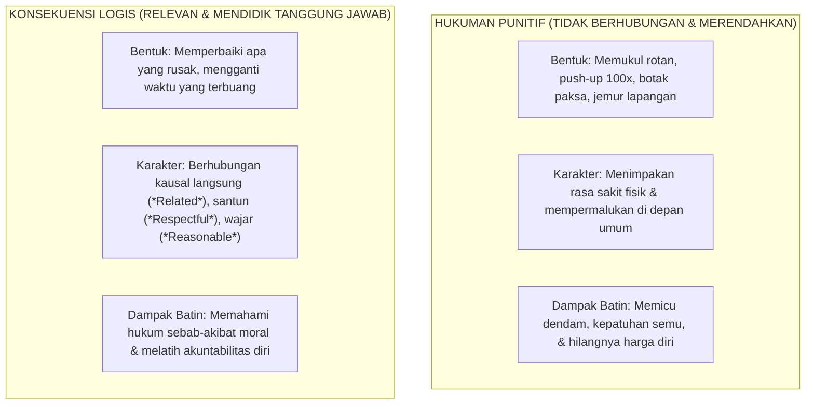

# SUB-BAB 5.5: KONSEKUENSI LOGIS EDUKATIF VS HUKUMAN PUNITIF

---

## 1. Membedakan Konsekuensi Logis dari Hukuman Punitif

Banyak praktisi pendidikan pesantren yang keliru memahami konsep disiplin positif: mereka mengira bahwa menghapus hukuman fisik berarti meniadakan segala bentuk konsekuensi atas pelanggaran (*Permissive Laissez-Faire*). [^1]

Dalam Ekosistem TUMBUH, disiplin ditegakkan secara sangat tegas melalui **Konsekuensi Logis Edukatif (*Logical Consequences*)**, yang dibedakan secara fundamental dari **Hukuman Punitif (*Punitive Punishment*)**:

---

## 2. Prinsip 4R Jane Nelsen dalam Merumuskan Konsekuensi Logis

Agar sebuah konsekuensi bersifat mendidik dan tidak tergelincir menjadi hukuman punitif terselubung, ia wajib memenuhi kriteria **4R Jane Nelsen**: [^2]

1. **Related (Berhubungan/Relevan Langsung)**:
   * Konsekuensi harus memiliki keterkaitan sebab-akibat yang nyata dengan bentuk pelanggaran yang dilakukan.
2. **Respectful (Santun & Menghormati Martabat)**:
   * Diberikan dengan nada suara rendah, tenang, dan bersahabat (*Firm & Kind*), tanpa teriakan, makian, atau bahasa tubuh mengancam.
3. **Reasonable (Wajar & Proporsional)**:
   * Beban konsekuensi tidak berlebihan atau melampaui kapasitas kemampuan fisik dan usia perkembangan santri.
4. **Revealed in Advance (Telah Disepakati Sejak Awal)**:
   * Konsekuensi telah tercantum dalam Piagam Adab Kamar yang disepakati bersama sejak awal semester, sehingga santri memahami konsekuensi atas pilihannya.

---

## 3. Matriks Komparatif Kasus Pelanggaran Santri

| Bentuk Pelanggaran Santri | Hukuman Punitif (Dilarang Mutlak di TUMBUH) | Konsekuensi Logis 4R (Standar Ekosistem TUMBUH) |
| :--- | :--- | :--- |
| **Terlambat bangun sholat Subuh karena begadang ngobrol.** | Disiram air dingin di kasur lalu disuruh lari keliling lapangan 15 putaran. | **Related**: Jam tidur dimajukan 30 menit lebih awal malam ini untuk menstabilkan jam biologis, dan mengqadha zikir pagi ma'tsurat secara mandiri. |
| **Mencoret-coret meja belajar kelas madrasah.** | Dikeluarkan dari kelas dan disuruh berdiri di depan tiang bendera seharian. | **Related**: Mengambil amplas dan cat pernis bersama tim Sarpras untuk membersihkan dan mengecat ulang meja belajar hingga kembali mulus. |
| **Membuang bungkus makanan sembarangan di lorong asrama.** | Dihukum push-up 50 kali di depan santri lain. | **Related**: Mengambil sapu dan kantong sampah untuk membersihkan lorong asrama tersebut selama 15 menit. |

Dengan penegakan konsekuensi logis, santri belajar memahami hukum kausalitas moral: bahwa setiap pilihan tindakan membawa konsekuensi alami yang harus dipertanggungjawabkan secara sadar dan bermartabat.

---

### 📚 Catatan Kaki & Referensi Akademik:

[^1]: Nelsen, J. (2006). *Positive Discipline* (4th ed.). New York: Ballantine Books, hlm. 72–105.
[^2]: Dreikurs, R., & Cassel, P. (1972). *Discipline Without Tears*. New York: Hawthorn Books, hlm. 45–70.
[^3]: Kohn, A. (1996). *Beyond Discipline: From Compliance to Community*. Alexandria, VA: ASCD.
