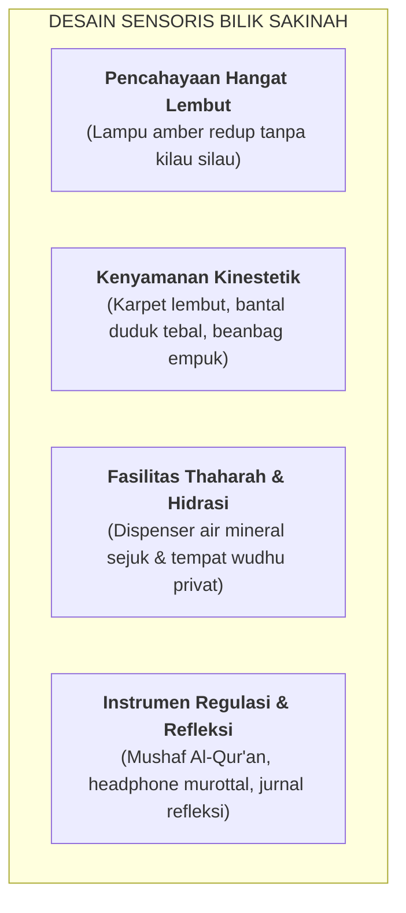

# SUB-BAB 6.1: KONSEP & DESAIN BILIK SAKINAH: RUANG REGULASI EMOSI YANG AMAN

---

## 1. Menolak Ruang Isolasi Punitif: Menghadirkan Ruang Ketenangan

Di sebagian sekolah berasrama konvensional, santri yang mengalami ledakan emosi atau melanggar aturan berat sering kali dikurung di sebuah ruangan gelap yang sempit ("kamar isolasi / sel pondok") sebagai bentuk hukuman. Praktik pengurungan ini secara neurosains memicu kepanikan amigdala yang akut, memperparah trauma psikologis, dan memicu kebencian mendalam.

Ekosistem TUMBUH merombak konsep isolasi tersebut menjadi **Bilik Sakinah (*The Sensory Calming & De-escalation Sanctuary*)**. [^1]

Bilik Sakinah bukanlah ruang hukuman (*not a detention room*), melainkan **ruang perlindungan sensoris (*sensory-safe environment*)** yang dirancang khusus untuk membantu santri menurunkan ketegangan sistem saraf otonomnya (*down-regulating sympathetic nervous system*) agar kembali tenang dan mampu berpikir jernih.

---

## 2. Aturan Baku Penggunaan Bilik Sakinah

1. **Akses Sukarela & Terfasilitasi**: Santri yang merasa emosinya mulai meluap dapat meminta izin untuk menenangkan diri di Bilik Sakinah selama 15–20 menit (*Voluntary Sensory Break*).
2. **Pintu Tidak Terkunci dari Luar**: Pintu Bilik Sakinah memiliki jendela kaca visibilitas dan tidak pernah dikunci dari luar, menjamin rasa aman dan terhindar dari klaustrofobia.
3. **Didampingi Konselor BK / Musyrif Terlatih**: Staf hadir mendampingi secara tenang di sudut ruangan tanpa memaksa santri langsung berbicara sebelum emosinya stabil.

---

### 📚 Catatan Kaki & Referensi Akademik:

[^1]: Champagne, T., & Stromberg, E. (2004). Sensory approaches in inpatient psychiatric settings: Innovative alternatives to seclusion and restraint. *Journal of Psychosocial Nursing and Mental Health Services*, 42(9), 34–44.
[^2]: Porges, S. W. (2011). *The Polyvagal Theory: Neurophysiological Foundations of Emotions, Attachment, Communication, and Self-regulation*. New York: W. W. Norton & Company, hlm. 150–185.
