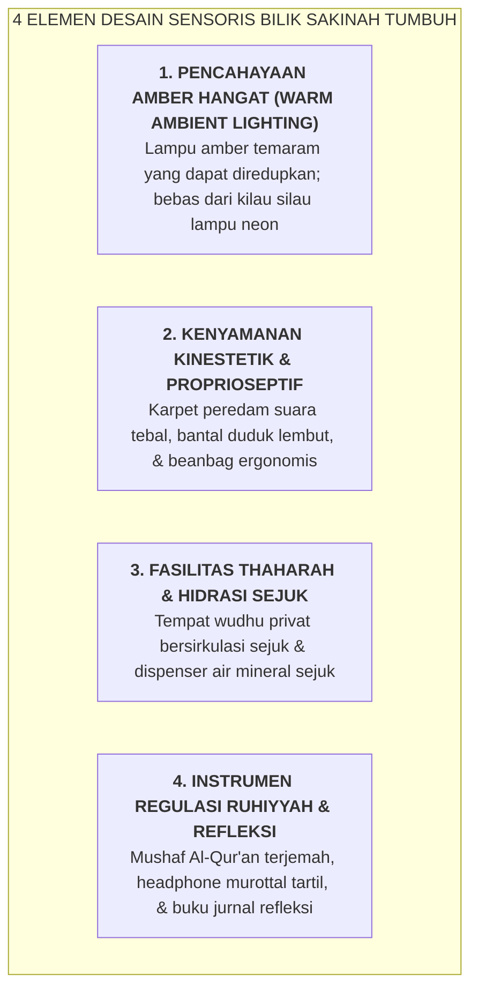

# SUB-BAB 6.1: KONSEP & DESAIN BILIK SAKINAH: RUANG REGULASI EMOSI YANG AMAN

---

## 1. Menolak Ruang Isolasi Punitif: Menghadirkan Ruang Ketenangan Jiwa

Di sebagian pondok pesantren lama, santri yang mengalami krisis histeria emosi atau melakukan pelanggaran berat kerap kali dikurung di sebuah ruangan gelap yang sempit dan berdebu ("kamar isolasi / sel gelap pondok") sebagai bentuk hukuman penjeraan. [^1]

Secara neurobiologi dan teori trauma (*Polyvagal Theory*), tindakan pengurungan paksa di ruang gelap ini secara instan memicu **Kepanikan Amigdala Akut (*Sympathetic Overdrive & Dissociative Freeze Response*)**. Pengurungan tidak membuat santri jera, melainkan memperparah trauma psikologis anak, memicu klaustrofobia berat, dan menanamkan kebencian batin yang mendalam terhadap institusi pesantren.

Ekosistem TUMBUH merombak total konsep kamar isolasi tersebut dan mendirikan **Bilik Sakinah (*The Sensory Calming & De-Escalation Sanctuary*)**: sebuah ruang perlindungan sensoris (*sensory-safe room*) yang dirancang khusus untuk membantu santri menurunkan ketegangan sistem saraf otonomnya (*down-regulating hyperarousal*) agar kembali mencapai zona tenang batin (*Ventral Vagal State*).

---

## 2. Standar Operasional Desain Fisik & Visibilitas Aman Bilik Sakinah

Wakamad Sarpras dan Tim Konseling BK memastikan standar fisik Bilik Sakinah memenuhi kriteria keselamatan: [^2]

1. **Pintu Kaca Visibilitas & Bebas Kunci Luar (*Safety First*)**:
   * Pintu Bilik Sakinah dilengkapi panel kaca transparan dan **dilarang keras dikunci dari luar**. Santri memiliki kebebasan membuka pintu kapan pun ia merasa telah tenang, menghilangkan rasa terkekang atau klaustrofobia.
2. **Akses Sukarela & Terfasilitasi (*Voluntary Sensory Break*)**:
   * Santri yang merasa emosinya mulai memuncak atau kewalahan (*emotional overwhelm*) dapat meminta izin kepada musyrif/guru untuk menenangkan diri di Bilik Sakinah selama 15–20 menit sebelum kembali mengikuti aktivitas.
3. **Pendampingan Tenang Staf Terlatih (*Silent Calming Presence*)**:
   * Staf konselor atau musyrif terlatih hadir menemani santri di sudut ruangan secara tenang tanpa memaksa santri langsung berbicara sebelum kondisi fisiologisnya stabil.

---

### 📚 Catatan Kaki & Referensi Akademik:

[^1]: Porges, S. W. (2011). *The Polyvagal Theory: Neurophysiological Foundations of Emotions, Attachment, Communication, and Self-regulation*. New York: W. W. Norton & Company, hlm. 150–195.
[^2]: Champagne, T., & Stromberg, E. (2004). Sensory approaches in inpatient psychiatric settings: Innovative alternatives to seclusion and restraint. *Journal of Psychosocial Nursing and Mental Health Services*, 42(9), 34–44.
[^3]: Perry, B. D. (2006). Applying principles of neurodevelopment to clinical work with maltreated and traumatized children. Dalam N. B. Webb (Ed.), *Working with Traumatized Youth in Child Welfare*. New York: Guilford Press, hlm. 27–52.
