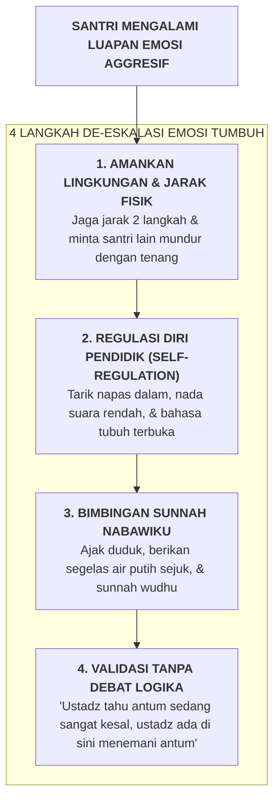

# SUB-BAB 6.2: PROTOKOL DE-ESKALASI KRISIS EMOSI SANTRI (*NON-VIOLENT CRISIS INTERVENTION*)

---

## 1. Menghadapi Ledakan Amarah: Dari Konfrontasi Menuju De-Eskalasi

Tatkala seorang santri mengalami luapan amarah yang meledak (*emotional crisis / acting out*)—seperti berteriak, melempar barang, atau menantang ustadz—kesalahan paling umum yang dilakukan pembina adalah **ikut terpancing emosi dan berteriak lebih keras untuk menundukkan santri secara paksa**. 

Tindakan konfrontatif ini justru menuangkan bensin ke dalam api (*Crisis Escalation*), memicu respon bertahan hidup ekstrem (*Fight-or-Flight*) yang dapat berujung pada cedera fisik.

Ekosistem TUMBUH melatih setiap staf dengan **Protokol De-Eskalasi Krisis Tanpa Kekerasan (*Non-Violent Crisis De-escalation Protocol*)**: [^1]

---

## 2. Sunnah Nabawiyyah dalam Meredakan Amarah

Protokol de-eskalasi modern berpadu selaras dengan tuntunan agung Rasulullah SAW dalam meredakan amarah:

1. **Merubah Posisi Fisik (*Change of Posture*)**:
   > **إِذَا غَضِبَ أَحَدُكُمْ وَهُوَ قَائِمٌ فَلْيَجْلِسْ، فَإِنْ ذَهَبَ عَنْهُ الْغَضَبُ وَإِلَّا فَلْيَضْطَجِعْ**
   > *"Apabila salah seorang di antara kalian marah dalam keadaan berdiri, hendaklah ia duduk. Jika amarahnya telah reda (maka cukuplah), namun jika belum, hendaklah ia berbaring."* (HR. Abu Dawud no. 4782, hadits shahih) [^2]
2. **Membasahi Tubuh dengan Air (*Thermal Cooling through Wudhu*)**:
   > **إِنَّ الْغَضَبَ مِنَ الشَّيْطَانِ، وَإِنَّ الشَّيْطَانَ خُلِقَ مِنَ النَّارِ، وَإِنَّمَا تُطْفَأُ النَّارُ بِالْمَاءِ، فَإِذَا غَضِبَ أَحَدُكُمْ فَلْيَتَوَضَّأْ**
   > *"Sesungguhnya amarah itu berasal dari setan, dan sesungguhnya setan itu diciptakan dari api, dan sesungguhnya api itu hanyalah dapat dipadamkan dengan air. Maka apabila salah seorang di antara kalian marah, hendaklah ia berwudhu."* (HR. Abu Dawud no. 4784) [^3]

Dengan menerapkan bimbingan Nabawi dan de-eskalasi yang tenang, ketegangan emosi mereda dalam hitungan menit tanpa meninggalkan luka fisik atau trauma batin.

---

### 📚 Catatan Kaki & Referensi Akademik:

[^1]: Crisis Prevention Institute. (2020). *Nonviolent Crisis Intervention Training Manual*. Milwaukee, WI: CPI.
[^2]: Abu Dawud, Sulaiman bin al-Asy'ats. (2009). *Sunan Abi Dawud*. Ditahqiq oleh Syu'aib al-Arna'uth. Beirut: Dar ar-Risalah al-'Alamiyyah, Kitab *al-Adab*, Hadits no. 4782.
[^3]: Abu Dawud, Sulaiman bin al-Asy'ats. (2009). *Sunan Abi Dawud*, Hadits no. 4784.
