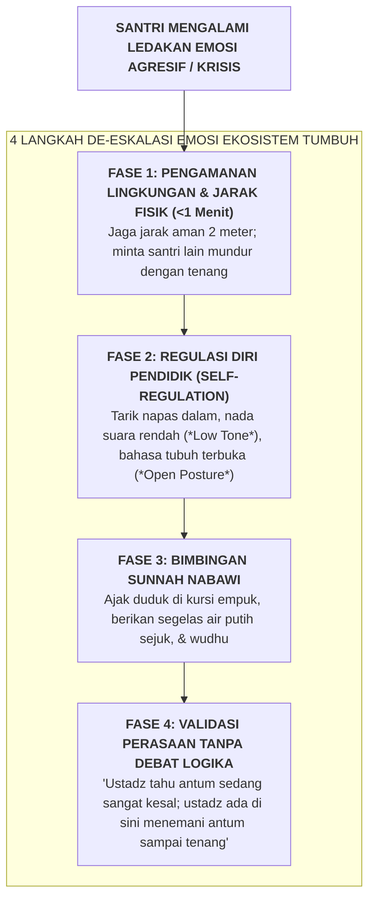

# SUB-BAB 6.2: PROTOKOL DE-ESKALASI KRISIS EMOSI SANTRI (*NON-VIOLENT CRISIS INTERVENTION*)

---

## 1. Menghadapi Ledakan Emosi: Menolak Konfrontasi yang Memperparah Krisis

Tatkala seorang remaja santri mengalami luapan amarah yang meledak (*Emotional Crisis / Acute Behavioral Escalation*)—seperti berteriak histeris, melempar barang, memukul dinding, atau menantang ustadz secara agresif—kesalahan paling fatal yang sering dilakukan oleh pembina konvensional adalah **ikut terpancing emosi dan membalas dengan bentakan yang lebih keras atau penaklukan fisik paksa**. [^1]

Dalam neurobiologi krisis, tatkala seorang manusia berada dalam kondisi *Fight-or-Flight*, *Prefrontal Cortex* (pusat logika dan penalaran) telah mengalami mati fungsi sementara (*Amygdala Hijack*). Mendebat santri dengan logika atau membentaknya pada fase ini sama saja dengan menyiramkan bensin ke dalam kobaran api.

Ekosistem TUMBUH melatih seluruh pendidik dengan **Protokol De-Eskalasi Krisis Tanpa Kekerasan (*Nonviolent Crisis De-escalation Protocol*)**:

---

## 2. Keagungan Sunnah Nabawiyyah dalam Menjinakkan Amarah

Protokol intervensi krisis modern terbukti bersesuaian sempurna dengan tuntunan Rasulullah SAW dalam meredakan amarah: [^2]

### 🪑 1. Mengubah Posisi Postur Tubuh (*Postural Transition*)
Rasulullah SAW bersabda:
> **إِذَا غَضِبَ أَحَدُكُمْ وَهُوَ قَائِمٌ فَلْيَجْلِسْ، فَإِنْ ذَهَبَ عَنْهُ الْغَضَبُ وَإِلَّا فَلْيَضْطَجِعْ**
> *"Apabila salah seorang di antara kalian marah dalam keadaan berdiri, hendaklah ia duduk. Jika amarahnya telah reda (maka cukuplah), namun jika belum reda, hendaklah ia berbaring."* (HR. Abu Dawud no. 4782, hadits shahih)
*Secara biomekanik, transisi dari berdiri ke posisi duduk atau berbaring menurunkan tekanan darah dan mengurangi tonus otot motorik agresi.*

### 💧 2. Menurunkan Suhu Tubuh Melalui Air Wudhu (*Thermal Cooling*)
Rasulullah SAW bersabda:
> **إِنَّ الْغَضَبَ مِنَ الشَّيْطَانِ، وَإِنَّ الشَّيْطَانَ خُلِقَ مِنَ النَّارِ، وَإِنَّمَا تُطْفَأُ النَّارُ بِالْمَاءِ، فَإِذَا غَضِبَ أَحَدُكُمْ فَلْيَتَوَضَّأْ**
> *"Sesungguhnya amarah itu berasal dari setan, dan sesungguhnya setan itu diciptakan dari api, dan sesungguhnya api itu hanyalah dapat dipadamkan dengan air. Maka apabila salah seorang di antara kalian marah, hendaklah ia berwudhu."* (HR. Abu Dawud no. 4784)

---

## 3. Frasa Verbal Terlarang vs Frasa Penenang De-Eskalasi

| Frasa Terlarang (Memperparah Ledakan Emosi) | Frasa Penenang De-Eskalasi Ekosistem TUMBUH |
| :--- | :--- |
| ❌ *"Kamu ini keras kepala sekali! Jangan berani-berani menantang ustadz!"* | ✅ *"Ustadz melihat antum sedang sangat tertekan saat ini. Mari kita duduk bersama sejenak di Bilik Sakinah."* |
| ❌ *"Diam kamu! Jangan banyak alasan! Cepat minta maaf sekarang juga!"* | ✅ *"Antum aman di sini. Tarik napas pelan-pelan bersama ustadz, hembuskan perlahan. Nanti kita bicarakan setelah antum merasa tenang."* |
| ❌ *"Sudah salah, masih mau membela diri! Mau dikeluarkan dari pondok?!"* | ✅ *"Ustadz ingin mendengarkan cerita antum, tapi saat ini mari kita minum air putih ini terlebih dahulu."* |

Dengan teknik de-eskalasi yang tenang dan berwibawa ini, luapan krisis amarah santri dapat dijinakkan dalam waktu kurang dari 15 menit tanpa kekerasan fisik dan tanpa meninggalkan luka trauma.

---

### 📚 Catatan Kaki & Referensi Akademik:

[^1]: Crisis Prevention Institute. (2020). *Nonviolent Crisis Intervention Training Manual*. Milwaukee, WI: CPI.
[^2]: Abu Dawud, Sulaiman bin al-Asy'ats. (2009). *Sunan Abi Dawud*. Ditahqiq oleh Syu'aib al-Arna'uth. Beirut: Dar ar-Risalah al-'Alamiyyah, Kitab *al-Adab*, Hadits no. 4782 & no. 4784.
[^3]: Siegel, D. J., & Bryson, T. P. (2011). *The Whole-Brain Child: 12 Revolutionary Strategies to Nurture Your Child's Developing Mind*. New York: Delacorte Press.
