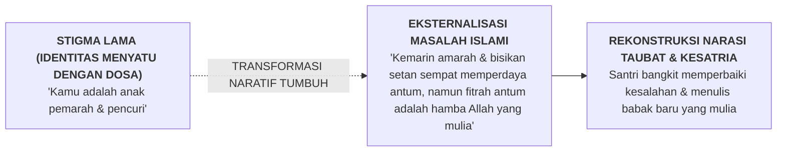
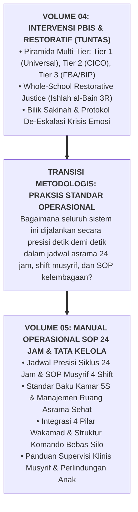

# SUB-BAB 6.3: INTEGRASI TERAPI NARATIF ISLAMI & JEMBATAN KE VOLUME 05

---

## 1. Terapi Naratif Islami: Memisahkan Manusia dari Kesalahannya

Setelah kondisi emosi santri tenang di Bilik Sakinah, konselor BK memfasilitasi sesi **Konseling Terapi Naratif Islami (*Islamic Narrative Therapy*)**. [^1]

Prinsip dasar terapi naratif menetapkan: **"The person is not the problem; the problem is the problem" (Manusia bukanlah masalah; masalah itulah yang menjadi masalahnya)**.

Konselor membimbing santri merenungkan pintu taubat yang senantiasa terbuka lebar:

> **قُلْ يَا عِبَادِيَ الَّذِينَ أَسْرَفُوا عَلَىٰ أَنفُسِهِمْ لَا تَقْنَطُوا مِن رَّحْمَةِ اللَّهِ ۚ إِنَّ اللَّهَ يَغْفِرُ الذُّنُوبَ جَمِيعًا**
> 
> *"Katakanlah: Wahai hamba-hamba-Ku yang melampaui batas terhadap diri mereka sendiri! Janganlah kamu berputus asa dari rahmat Allah. Sesungguhnya Allah mengampuni dosa-dosa semuanya."* (QS. Az-Zumar [39]: 53) [^2]

Dengan mengubah narasi batinnya, santri tidak lagi memandang dirinya sebagai "produk gagal", melainkan sebagai seorang penuntut ilmu yang sedang berhijrah menuju kemuliaan akhlak.

---

## 2. Jembatan Konseptual Menuju Manual Operasional 24 Jam (Volume 05)

Dengan rampungnya pembahasan intervensi PBIS dan keadilan restoratif dalam **Buku Panduan Volume 04**, seluruh pilar filosofis, taksonomi kapasitas, asesmen, dan sistem perbaikan perilaku telah tuntas dirumuskan secara komprehensif:

Pertanyaan operasional terakhir yang menyempurnakan seluruh seri buku panduan ini adalah:
* *Bagaimana pembagian jam kerja dan serah terima (handover) 4 shift musyrif berjalan mulus tanpa celah kekosongan pengawasan?*
* *Bagaimana SOP harian dari jam 03:30 dini hari hingga 22:00 malam dijalankan secara konsisten oleh seluruh staf?*
* *Bagaimana tata kelola kelembagaan dan audit penjaminan mutu berkala dipastikan berjalan prima?*

Seluruh panduan teknis operasional hulu-ke-hilir ini dibedah tuntas dalam volume pamungkas: **[Volume 05: Manual Operasional, SOP 24 Jam, & Tata Kelola Lembaga](file:///c:/xampp/htdocs/tumbuh/BOOK%20Series%202/Volume-05-Manual-Operasional-SOP-24Jam-dan-Tata-Kelola)**.

---

### 📚 Catatan Kaki & Referensi Akademik:

[^1]: White, M., & Epston, D. (1990). *Narrative Means to Therapeutic Ends*. New York: W. W. Norton & Company, hlm. 38–75.
[^2]: Tafsir Ibnu Katsir. (2000). *Tafsir Al-Qur'an al-'Azhim*. Riyadh: Dar Thayyibah, Jilid VII, hlm. 105–108.
