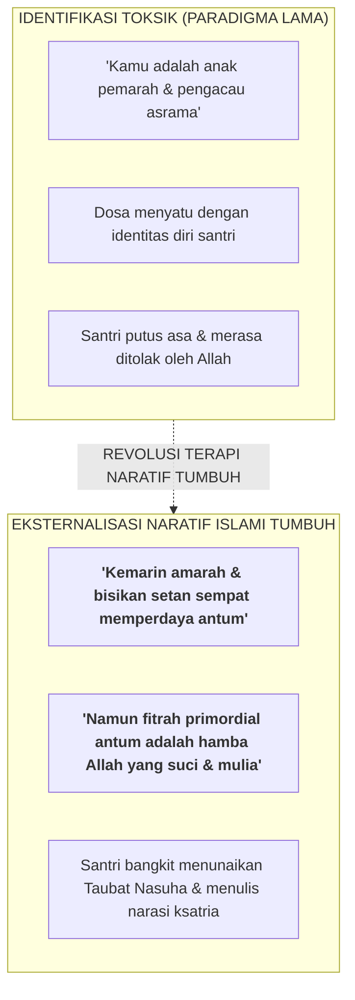
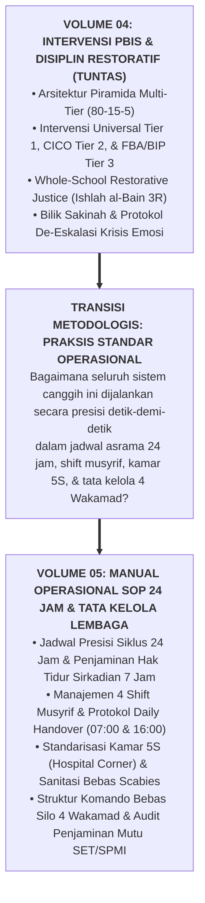

# SUB-BAB 6.3: INTEGRASI TERAPI NARATIF ISLAMI & JEMBATAN KE VOLUME 05

---

## 1. Terapi Naratif Islami: Memisahkan Identitas Manusia dari Dosanya

Setelah kestabilan fisiologis santri pulih di Bilik Sakinah, proses bimbingan dilanjutkan melalui sesi konseling mendalam berbasis **Terapi Naratif Islami (*Islamic Narrative Therapy & Identity Deconstruction*)**. [^1]

Prinsip dasar terapi naratif menetapkan aksioma emas: **"The person is not the problem; the problem is the problem" (Manusia bukanlah masalahnya; masalah itulah yang menjadi masalahnya)**.

Dalam paradigma lama yang menghakimi, santri yang berbuat salah diidentifikasikan secara mutlak dengan dosanya (*Total Identification with Sin*): *"Kamu adalah anak pemalas, pembohong, dan pencuri"*. Pelabelan ini menenggelamkan harga diri anak ke dalam rasa putus asa.

Terapi naratif Islami melakukan **Eksternalisasi Masalah Berbasis Tauhid**:

---

## 2. Landasan Turats: Pintu Taubat yang Senantiasa Terbuka Lebar

Konselor BK membimbing santri merenungkan ayat-ayat harapan dan rahmat Allah yang tiada bertepi: [^2]

> **قُلْ يَا عِبَادِيَ الَّذِينَ أَسْرَفُوا عَلَىٰ أَنفُسِهِمْ لَا تَقْنَطُوا مِن رَّحْمَةِ اللَّهِ ۚ إِنَّ اللَّهَ يَغْفِرُ الذُّنُوبَ جَمِيعًا ۚ إِنَّهُ هُوَ الْغَفُورُ الرَّحِيمُ**
> 
> *"Katakanlah: Wahai hamba-hamba-Ku yang melampaui batas terhadap diri mereka sendiri! Janganlah kamu berputus asa dari rahmat Allah. Sesungguhnya Allah mengampuni dosa-dosa semuanya. Sesungguhnya Dialah Yang Maha Pengampun lagi Maha Penyayang."* (QS. Az-Zumar [39]: 53)

Dengan merekonstruksi narasi batinnya (*Rewriting the Life Narrative*), santri tidak lagi memandang dirinya sebagai orang yang gagal, melainkan sebagai seorang penuntut ilmu yang sedang berhijrah dari kekhilafan menuju derajat ketaqwaan yang lebih tinggi.

---

## 3. Jembatan Metodologis Menuju Manual Operasional 24 Jam (Volume 05)

Dengan tuntasnya perumusan sistem intervensi PBIS Multi-Tier dan Keadilan Restoratif dalam **Buku Panduan Volume 04**, seluruh kerangka teoretis, filosofis, kapasitas adab, instrumen asesmen, dan penanganan krisis telah selesai dirumuskan secara sempurna:

Pertanyaan operasional terakhir yang menyempurnakan seluruh seri buku panduan ini adalah:
* *Bagaimana ritme harian dijalankan dari jam 03:30 dini hari hingga 22:00 malam tanpa kelelahan?*
* *Bagaimana pembagian 4 shift musyrif dan SOP serah terima berjalan mulus?*
* *Bagaimana audit kepatuhan penjaminan mutu SPMI dipastikan berjalan lestari?*

Seluruh panduan teknis operasional hulu-ke-hilir ini dibedah secara tuntas dalam volume pamungkas: **[Volume 05: Manual Operasional, SOP 24 Jam, & Tata Kelola Lembaga](file:///c:/xampp/htdocs/tumbuh/BOOK%20Series%202/Volume-05-Manual-Operasional-SOP-24Jam-dan-Tata-Kelola)**.

---

### 📚 Catatan Kaki & Referensi Akademik:

[^1]: White, M., & Epston, D. (1990). *Narrative Means to Therapeutic Ends*. New York: W. W. Norton & Company, hlm. 38–82.
[^2]: Tafsir Ibnu Katsir. (2000). *Tafsir Al-Qur'an al-'Azhim*. Riyadh: Dar Thayyibah, Jilid VII, hlm. 105–110.
[^3]: Sugai, G., & Horner, R. H. (2006). A promising approach for expanding and sustaining school-wide positive behavior support. *School Psychology Review*, 35(2), 245–259.
