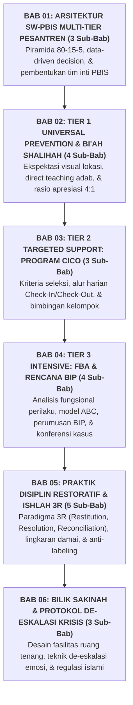

# BUKU PANDUAN VOLUME 04: PEDOMAN INTERVENSI BERJENJANG PBIS & PRAKTIK RESTORATIF DI ASRAMA
## *Implementasi SW-PBIS Multi-Tier (Tier 1-3), Program CICO, FBA/BIP, dan Lingkaran Restoratif Ishlah al-Bain*

---

**Nomor Panduan**: `BOOK-SERIES-2/VOL-04/2026`  
**Sasaran Pembaca**: Tim Pengasuhan Asrama, Musyrif/Musyrifah, Guru Bimbingan Konseling (BK), Tim Penegak Disiplin, Kepala Madrasah, dan Tim Advokasi Santri  
**Dewan Pakar Pengkaji**: Pakar PBIS, Pakar Arsitektur PBIS Restoratif, Pakar Kuratif Restoratif, Pakar Bimbingan Konseling, dan Pakar Perlindungan Anak  

---

## 🧭 PETA STRUKTUR & DISTRIBUSI BAB VOLUME 04 (6 BAB ORGANIK)

---

## 📚 DAFTAR LENGKAP BAB DAN SUB-BAB VOLUME 04

### 🏛️ [Bab 01: Arsitektur SW-PBIS Multi-Tier di Pesantren (3 Sub-Bab)](file:///c:/xampp/htdocs/tumbuh/BOOK%20Series%202/Volume-04-Intervensi-PBIS-dan-Disiplin-Restoratif/Bab-01-Arsitektur-PBIS-Multi-Tier)
* **Sub-Bab 1.1**: Mengapa Model Multi-Tier Lebih Efektif Dibandingkan Sanksi Retributif
* **Sub-Bab 1.2**: Proporsi Piramida Perilaku 80-15-5 dalam Ekosistem Asrama
* **Sub-Bab 1.3**: Pembentukan & Alur Kerja Tim Inti PBIS (Wakamad Kesiswaan, BK, & Musyrif Senior)

### 🛡️ [Bab 02: Tier 1 Universal Prevention & Bi'ah Shalihah (4 Sub-Bab)](file:///c:/xampp/htdocs/tumbuh/BOOK%20Series%202/Volume-04-Intervensi-PBIS-dan-Disiplin-Restoratif/Bab-02-Tier-1-Universal-Prevention)
* **Sub-Bab 2.1**: Perumusan 3–5 Nilai Inti Asrama & Matriks Ekspektasi Perilaku
* **Sub-Bab 2.2**: Pemasangan Nudges Visual & Petunjuk Adab di Lokasi Fisik Asrama
* **Sub-Bab 2.3**: Pengajaran Adab Eksplisit (*Model $\rightarrow$ Practice $\rightarrow$ Reinforce*)
* **Sub-Bab 2.4**: Pembudayaan Pujian Spesifik & Rasio Emas Apresiasi 4:1

### 🤝 [Bab 03: Tier 2 Targeted Support: Program CICO (3 Sub-Bab)](file:///c:/xampp/htdocs/tumbuh/BOOK%20Series%202/Volume-04-Intervensi-PBIS-dan-Disiplin-Restoratif/Bab-03-Tier-2-Program-CICO)
* **Sub-Bab 3.1**: Kriteria Identifikasi Santri Penerima Layanan Pendampingan Tier 2
* **Sub-Bab 3.2**: Operasional Harian Kartu Check-In Pagi & Check-Out Sore (CICO)
* **Sub-Bab 3.3**: Bimbingan Kelompok Keterampilan Sosial (*Social Skills Groups*) & Komunikasi Orang Tua

### 🔬 [Bab 04: Tier 3 Intensive Intervention: FBA & Rencana BIP (4 Sub-Bab)](file:///c:/xampp/htdocs/tumbuh/BOOK%20Series%202/Volume-04-Intervensi-PBIS-dan-Disiplin-Restoratif/Bab-04-Tier-3-FBA-dan-BIP)
* **Sub-Bab 4.1**: *Functional Behavior Assessment* (FBA): Menemukan Fungsi & Pemicu Perilaku
* **Sub-Bab 4.2**: Analisis Rantai Anteseden - Perilaku - Konsekuensi (*Model ABC*)
* **Sub-Bab 4.3**: Penyusunan Rencana Intervensi Perilaku Individual (*Behavior Intervention Plan - BIP*)
* **Sub-Bab 4.4**: Tata Laksana Konferensi Kasus Multidisiplin (Kiai, BK, Walas, Musyrif, Psikolog)

### 🕊️ [Bab 05: Praktik Disiplin Restoratif & Kerangka Ishlah 3R (5 Sub-Bab)](file:///c:/xampp/htdocs/tumbuh/BOOK%20Series%202/Volume-04-Intervensi-PBIS-dan-Disiplin-Restoratif/Bab-05-Disiplin-Restoratif-dan-Ishlah-3R)
* **Sub-Bab 5.1**: Pergeseran Paradigma: Dari "Menghukum Pelaku" Menuju "Memulihkan Keadaan"
* **Sub-Bab 5.2**: Tiga Pilar Restoratif: *Restitution* (Ganti Rugi), *Resolution* (Solusi), & *Reconciliation* (Ishlah)
* **Sub-Bab 5.3**: Panduan 5 Pertanyaan Kunci Fasilitasi Lingkaran Restoratif (*Restorative Circles*)
* **Sub-Bab 5.4**: Reintegrasi Sosial Santri Pasca-Konflik Tanpa Stigmatisasi Toksik
* **Sub-Bab 5.5**: Penanganan Khusus Kasus Perundungan (*Bullying*) dengan Pendekatan Restoratif Terpimpin

### 🌸 [Bab 06: Bilik Sakinah & Protokol De-Eskalasi Krisis (3 Sub-Bab)](file:///c:/xampp/htdocs/tumbuh/BOOK%20Series%202/Volume-04-Intervensi-PBIS-dan-Disiplin-Restoratif/Bab-06-Bilik-Sakinah-dan-Deeskalasi)
* **Sub-Bab 6.1**: Standar Desain Fasilitas & Sarana Fisik Bilik Sakinah
* **Sub-Bab 6.2**: Protokol 4 Langkah De-Eskalasi Krisis Emosional Santri
* **Sub-Bab 6.3**: Latihan Regulasi Diri Islami & Transisi Aman Menuju Dialog Mediasi
