# SUB-BAB 1.1: RITME SIRKADIAN SANTRI: PEMETAAN JADWAL 03:30 DINI HARI S/D 22:00 MALAM

---

## 1. Menyelaraskan Biologi Remaja dengan Disiplin Spiritual Islam

Jadwal harian di sebuah pondok pesantren berasrama bukanlah sekadar susunan jam kegiatan yang kaku di atas papan pengumuman, melainkan **arsitektur pengkondisian biologis, psikologis, dan spiritual yang membentuk pola dasar kehidupan santri (*Circadian Architecture of Habit Formation*)**. [^1]

Dalam sistem pesantren tradisional tanpa tata kelola sirkadian, jadwal harian sering kali mengalami disritmia parah: santri diwajibkan bangun pukul 03:00 untuk qiyamul lail, namun kegiatan musyawarah kamar atau setoran hafalan malam berlarut-larut hingga pukul 00:30 tengah malam. Akibatnya, santri mengalami kekurangan tidur kronis (*Chronic Sleep Deprivation*), mengalami "mati rasa emosional", mudah meledak marah, dan tertidur lelap di saat guru madrasah mengajar di kelas pagi.

Ekosistem TUMBUH merancang **Jadwal Presisi Siklus 24 Jam** yang menyelaraskan tuntunan ibadah Turats Nabawi dengan konsensus neurosains perkembangan otak remaja (*Adolescent Neurobiology*):

```mermaid
flowchart TD
    subgraph RitmeSirkadian24Jam["SIKLUS 24 JAM EKOSISTEM TUMBUH PESANTREN"]
        Fajar["<b>FASE 1: KEBANGKITAN SPIRITUAL FAJAR (03:30 - 06:30)</b><br/>Bangun tenang, Qiyamul Lail sukarela, Subuh jamaah, Ma'tsurat, & Tahfidz"]
        
        TransisiPagi["<b>FASE 2: OPERASIONAL 5S & TRANSISI MADRASAH (06:30 - 07:15)</b><br/>Sarapan bergizi, kerapian kamar 5S, & Daily Handover 1"]
        
        MadrasahPagi["<b>FASE 3: KBM FORMAL MADRASAH SESI PAGI (07:15 - 12:00)</b><br/>Puncak kognisi analitis (Matematika, Sains, Nahwu-Shorof, HOTS)"]
        
        DzuhurQailulah["<b>FASE 4: SHOLAT DZUHUR, MAKAN SIANG, & QAILULAH (12:00 - 13:15)</b><br/>Restorasi neurotransmiter otak lewat 30-45 menit tidur siang"]
        
        MadrasahSiang["<b>FASE 5: KBM FORMAL MADRASAH SESI SIANG (13:15 - 15:30)</b><br/>Pembelajaran interaktif, seni khat, literasi, & laboratorium"]
        
        AsharSore["<b>FASE 6: TRANSISI SORE & AKTIVITAS FISIK (15:30 - 18:00)</b><br/>Ashar jamaah, Daily Handover 2, olahraga terarah, & mandi sore"]
        
        MaghribIsya["<b>FASE 7: HALAQAH TURATS & MAKAN MALAM (18:00 - 20:00)</b><br/>Maghrib jamaah, tadabbur Al-Qur'an, kajian kitab, Isya' jamaah, & makan"]
        
        MudzakarahTidur["<b>FASE 8: MUDZAKARAH, MUHASABAH, & TIDUR LELAP (20:00 - 03:30)</b><br/>Belajar mandiri kamar, muhasabah adab, doa tidur, lampu padam jam 21:45"]
    end

    Fajar --> TransisiPagi --> MadrasahPagi --> DzuhurQailulah --> MadrasahSiang --> AsharSore --> MaghribIsya --> MudzakarahTidur --> Fajar
```

---

## 2. Matriks Rinci Jadwal Presisi Siklus 24 Jam Ekosistem TUMBUH

Setiap jam dan menit dirancang presisi untuk mengeliminasi "waktu kosong tak terawasi (*unstructured idle time*)" yang menjadi sarang terjadinya konflik dan perundungan, tanpa menimbulkan kelelahan berlebih pada santri: [^2]

| Rentang Jam | Alokasi Waktu | Aktivitas Utama Santri | Penanggung Jawab | Lokasi Aktivitas | Standar Capaian Adab / Fisik |
| :--- | :---: | :--- | :--- | :--- | :--- |
| **03:30 - 04:15** | 45 Menit | Bangun fajar santun, thaharah, wudhu, Qiyamul Lail mandiri sukarela. | Musyrif Shift 1 | Kamar & Masjid | Bangun tanpa teriakan/siraman air; langkah tenang menuju masjid. |
| **04:15 - 05:30** | 75 Menit | Sholat Subuh berjamaah, zikir Al-Ma'tsurat Kubra, & kultum fajar. | Imam Rawatib & Musyrif | Masjid Utama | Kerapian shaf rapat lurus; thuma'ninah dalam sholat dan wirid. |
| **05:30 - 06:30** | 60 Menit | Halaqah Tahfidz & Tahsin Al-Qur'an (Sesi Talaqqi Pagi). | Ustadz Halaqah | Masjid & Serambi | Setoran hafalan baru (*Ziyadah*) dengan makharijul huruf fasih. |
| **06:30 - 07:00** | 30 Menit | Sarapan pagi sehat & piket kamar 5S (Sapu, Pel, Kasur Hospital Corner). | Musyrif Shift 1 | Ruang Makan & Kamar | Makan tertib tangan kanan; kasur kencang rapi tanpa kerutan. |
| **07:00 - 07:15** | 15 Menit | **Daily Handover 1**: Serah terima santri dari Asrama ke Madrasah. | Koordinator Musyrif & Guru | Ruang Pimpinan | Pertukaran logbook data kesehatan santri dan kesiapan KBM. |
| **07:15 - 12:00** | 285 Menit | KBM Formal Madrasah Sesi Pagi (4 Jam Pelajaran @45 Menit + Istirahat). | Wakamad Kurikulum & Guru | Gedung Madrasah | Fokus kognitif optimal; interaksi aktif HOTS bebas stres toksik. |
| **12:00 - 12:30** | 30 Menit | Sholat Dzuhur berjamaah & makan siang bergizi seimbang. | Guru Piket & Musyrif Shift 2 | Masjid & Ruang Makan | Antre makanan tertib (*no cutting lines*); adab makan Islami. |
| **12:30 - 13:15** | 45 Menit | **Sunnah Qailulah**: Istirahat tidur siang sejenak di kamar asrama. | Musyrif Shift 2 | Kamar Asrama | Lampu padam, kamar hening total, restorasi daya tahan otak. |
| **13:15 - 15:30** | 135 Menit | KBM Formal Madrasah Sesi Siang (3 Jam Pelajaran @45 Menit). | Guru Madrasah | Gedung Madrasah | Pembelajaran aplikatif, laboratorium bahasa/IPA, studi kepustakaan. |
| **15:30 - 16:00** | 30 Menit | Sholat Ashar berjamaah & zikir ba'da sholat. | Guru Piket & Musyrif Shift 3 | Masjid Utama | Transisi tenang dari jam madrasah menuju jam asrama. |
| **16:00 - 16:15** | 15 Menit | **Daily Handover 2**: Serah terima santri dari Madrasah ke Asrama. | Koordinator Guru & Musyrif | Kantor Pengasuhan | Serah terima catatan KBM siang dan pemantauan tugas rumah. |
| **16:15 - 17:30** | 75 Menit | Olahraga terarah (Panahan, Futsal, Silat, Berenang) & Klub Minat Bakat. | Instruktur & Musyrif Shift 3 | Lapangan & Aula | Pelepasan hormon endorfin; pembentukan jasmani bugar (*Qawiyyul Jism*). |
| **17:30 - 18:00** | 30 Menit | Mandi sore bersih, wudhu, & persiapan pakaian busana muslim rapi. | Musyrif Shift 3 | Sanitasi Asrama | Antrean mandi tertib rasio 1:5; pakaian bersih wangi menyambut Maghrib. |
| **18:00 - 19:15** | 75 Menit | Sholat Maghrib berjamaah & Halaqah Kajian Kitab Turats Klasik. | Asatidz Senior & Mudir | Masjid Utama | Membaca kitab gundul bermakna pesantren (*Gandul / Sorogan*). |
| **19:15 - 20:00** | 45 Menit | Sholat Isya' berjamaah & makan malam bersama. | Musyrif Shift 4 | Masjid & Ruang Makan | Bersyukur atas rezeki; ukhuwah hangat antar-kawan sekamar. |
| **20:00 - 21:15** | 75 Menit | **Mudzakarah Malam Terbimbing**: Mengulang pelajaran & tugas esok. | Musyrif Shift 4 & Mentor J4 | Meja Belajar Kamar | Belajar mandiri tenang; penguatan konsep pelajaran madrasah. |
| **21:15 - 21:45** | 30 Menit | Muhasabah Kamar, Cek Kerapian Sandal Rak, Baca Surat Al-Mulk, & Doa. | Ketua Kamar & Musyrif Shift 4 | Kamar Tidur | Evaluasi adab harian dengan kasih sayang; penyucian hati sebelum tidur. |
| **21:45 - 03:30** | 345 Menit | **Hak Tidur Lelap Santri**: 5 Jam 45 Menit tidur malam nyenyak (*REM*). | Musyrif Shift 4 (Patroli) | Kamar Asrama | Lampu dipadamkan; suasana senyap total; pemulihan sistem saraf. |

---

## 3. Landasan Turats: Manajemen Waktu Imam Al-Ghazali (*Tartib al-Aurad*)

Imam Al-Ghazali dalam *Ihya' 'Ulumiddin* (Kitab *Tartib al-Aurad wa Tafshil Ihya' al-Lail*) menegaskan bahwa waktu seorang penuntut ilmu harus terbagi secara disiplin ke dalam wirid-wirid amalan yang jelas, agar tidak ada waktu yang terbuang dalam kelalaian: [^3]

> **يَنْبَغِي لَكَ أَنْ تُوَزِّعَ أَوْقَاتَكَ، وَتُرَتِّبَ أَوْرَادَكَ، وَتُعَيِّنَ لِكُلِّ وَقْتٍ شُغْلًا لَا تَتَعَدَّاهُ وَلَا تُؤْثِرَ فِيهِ سِوَاهُ، فَإِنَّكَ إِنْ تَرَكْتَ نَفْسَكَ سُدًى أَهْمَلْتَهَا كَمَا تُهْمَلُ الْبَهَائِمُ، وَلَمْ تَدْرِ مَا تَشْتَغِلُ بِهِ فِي كُلِّ وَقْتٍ، ضَاعَتْ عَامَّةُ أَوْقَاتِكَ**
> 
> *"Seyogianya bagimu untuk membagi waktu-waktumu, menyusun urutan wirid (kegiatan)-mu, dan menetapkan pada setiap waktu tugas pekerjaan tertentu yang tidak engkau lampaui dan tidak engkau gantikan dengan urusan lain. Karena sesungguhnya jika engkau membiarkan dirimu bebas begitu saja tanpa aturan—sebagaimana binatang ternak dibiarkan terlantar—dan engkau tidak tahu apa yang harus engkau kerjakan di setiap waktu, niscaya akan lenyaplah sebagian besar usiamu dalam kesia-siaan."*

Jadwal presisi 24 jam Ekosistem TUMBUH menghidupkan kembali wasiat agung Imam Al-Ghazali ini ke dalam format manajemen modern yang menjamin keteraturan hidup santri tanpa membebani daya tahan biologisnya.

---

### 📚 Catatan Kaki & Referensi Akademik:

[^1]: Carskadon, M. A. (2011). Sleep in adolescents: The perfect storm. *Pediatric Clinics of North America*, 58(3), 637–647.
[^2]: Colvin, G. (2004). *Managing the Cycle of Acting-Out Behavior in the Classroom*. Eugene, OR: Behavior Associates, hlm. 45–70.
[^3]: Al-Ghazali, Abu Hamid Muhammad bin Muhammad. (2004). *Ihya' 'Ulumiddin*. Ditahqiq oleh Syaikh Badawi Ahmad Thabanah. Beirut: Dar al-Kutub al-'Ilmiyyah, Jilid I, Kitab *Tartib al-Aurad fi al-Lail wa an-Nahar*, hlm. 380–385.
[^4]: Crowley, S. J., et al. (2018). Circadian rhythms and sleep in adolescent mental health. *Child and Adolescent Psychiatric Clinics of North America*, 27(1), 1–15.
