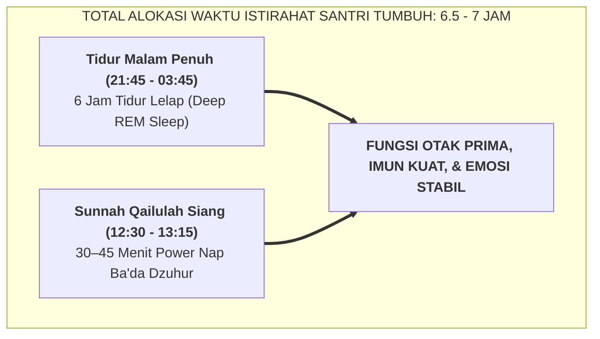

# SUB-BAB 1.2: MENJAGA HAK TIDUR 7 JAM & SUNNAH QAILULAH SIANG

---

## 1. Neurosains Istirahat Remaja: Mengapa Tidur Adalah Hak Asasi Santri?

Riset neurobiologi remaja membuktikan bahwa otak santri yang sedang berkembang membutuhkan waktu tidur minimal **7 hingga 8 jam per hari** untuk menjaga fungsi eksekutif Prefrontal Cortex (PFC), kestabilan emosi, dan konsolidasi memori hafalan Al-Qur'an. [^1]

Di banyak pesantren lama, memangkas jam tidur santri hingga kurang dari 4 jam sering kali dibanggakan sebagai bentuk "tirakat". Padahal secara medis dan pedagogis, deprivasi tidur kronis tersebut:
* Membakar neuron hipokampus, sehingga hafalan yang dihafal semalam menguap di siang hari.
* Memicu stres kortisol tinggi, membuat santri mudah tersinggung dan rentan terlibat perkelahian di asrama.
* Membuat santri tertidur pulas saat guru sedang menjelaskan materi di kelas madrasah.

---

## 2. SOP Penegakan Sunnah *Qailulah* di Asrama

1. Pukul 12:30 setelah sholat Dzuhur dan makan siang, santri kembali ke kamar asrama untuk beristirahat.
2. Musyrif memastikan lampu utama dimatikan dan suasana asrama hening total.
3. Pukul 13:15, musyrif membangunkan santri secara santun untuk persiapan masuk kelas KBM sesi siang.

Istirahat siang singkat ini merestorasi neurotransmiter otak, sehingga santri mengikuti pelajaran siang dengan mata berbinar dan fokus optimal.

---

### 📚 Catatan Kaki & Referensi Akademik:

[^1]: Walker, M. (2017). *Why We Sleep*. New York: Scribner, hlm. 105–132.
[^2]: Ath-Thabarani, Sulaiman bin Ahmad. (1995). *Al-Mu'jam al-Ausath*, Hadits no. 28.
